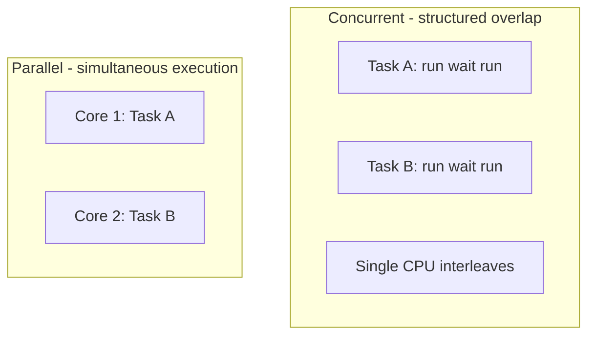

# Concurrency vs Parallelism

## Overview

**Concurrency** is about **dealing with many things at once** in program structure: tasks overlap in time, progress can be interleaved on one CPU, and the system remains responsive while some tasks wait. **Parallelism** is about **doing many things at once** physically: multiple CPUs or cores execute instructions simultaneously.

You can have concurrency without parallelism (single-core time slicing) and parallelism without much concurrent structure (embarrassingly parallel batch jobs). Production systems mix both—async I/O for concurrency, thread pools or SIMD for parallelism.

## Learning Objectives

- Define concurrency and parallelism precisely and cite examples of each alone and combined
- Map program structures (threads, async tasks, processes) to hardware utilization
- Predict when adding "concurrency" improves throughput vs only latency perception
- Explain how Node.js, Python asyncio, and OS threads fit the matrix
- Avoid the interview trap of treating the terms as synonyms

## Prerequisites

- [[01-Computer-Science/04-Processes-and-Execution/Threads|Threads]]
- [[01-Computer-Science/04-Processes-and-Execution/Scheduling Concepts|Scheduling Concepts]]
- [[01-Computer-Science/04-Processes-and-Execution/Context Switching|Context Switching]]

## Difficulty

`beginner`

## Estimated Time

2 hours reading, 2 hours comparative labs

## History

Time-sharing made concurrent **programs** on serial hardware mainstream. Multicore CPUs (2000s) made **parallel** execution cheap at the chip level, exposing a gap: languages designed for sequential thinking needed threads, async I/O, and data-parallel frameworks.

## Problem It Solves

**Concurrency** addresses **waiting**: network, disk, human input. Structure code so one slow operation does not block all work. **Parallelism** addresses **compute limits**: one core cannot finish a large matrix multiply fast enough; split across cores. Confusing them leads to wrong tools—e.g., 1000 threads on one core for CPU work.

## Internal Implementation



| Aspect | Concurrency | Parallelism |
| --- | --- | --- |
| Goal | Manage overlapping tasks | Speed up via simultaneous work |
| Hardware | 1+ CPUs | Requires multiple execution units |
| Typical tools | async/await, event loop, green threads | threads, processes, GPU kernels |
| Risk profile | Logical races, ordering bugs | Same + scaling, contention |

## Mermaid Diagrams

### Structure


### Sequence / Lifecycle

```mermaid
sequenceDiagram
    participant Loop as Event Loop
    participant A as Async Task A
    participant B as Async Task B
    participant IO as Network I/O
    Loop->>A: start fetch
    A->>IO: non-blocking request
    Loop->>B: start fetch
    B->>IO: non-blocking request
    IO-->>A: complete
    Loop->>A: resume callback
    IO-->>B: complete
    Loop->>B: resume callback
```

## Examples

### Minimal Example

Concurrent but not parallel (single-threaded async) — TypeScript:

```typescript
async function fetchAll(urls: string[]) {
  // Overlaps waiting; one thread unless worker pool involved
  return Promise.all(urls.map((u) => fetch(u).then((r) => r.status)));
}
await fetchAll(["https://a.test", "https://b.test"]);
```

Parallel CPU work — Python (`ProcessPoolExecutor` bypasses GIL):

```python
from concurrent.futures import ProcessPoolExecutor

def heavy(n: int) -> int:
    return sum(i * i for i in range(n))

with ProcessPoolExecutor(max_workers=4) as pool:
    results = list(pool.map(heavy, [5_000_000] * 8))
```

### Production-Shaped Example

API gateway pattern ([[07-Backend/README|Backend]]):

- **Concurrent**: async handlers await downstream HTTP/DB (overlap I/O wait)
- **Parallel**: image thumbnail workers in a process pool (CPU-bound isolation)

Node.js defaults: concurrent I/O on one JS thread + parallel libuv thread pool for some blocking ops ([[06-NodeJS/README|Node.js]]).

## Trade-offs

| Dimension | Upside | Downside | When it matters |
| --- | --- | --- | --- |
| Async concurrency | Low memory vs thread-per-request | Callback/async complexity | 10k idle connections |
| Thread parallelism | Simple blocking code on multi-core | Sync primitives, stack cost | Mixed I/O + moderate CPU |
| Process parallelism | Isolation + true CPU parallel (Python) | IPC overhead | CPU-bound ETL |
| Over-subscription | Hides latency | Context switch storms | Wrong for CPU-bound on 1 core |

### When to Use

- **Concurrency** when tasks spend time waiting on I/O or external systems
- **Parallelism** when CPU is the bottleneck and you have multiple cores

### When Not to Use

- Parallel threads/processes for purely I/O-bound work without measurement
- Async for CPU-heavy inner loops without offloading to workers

## Exercises

1. Classify: (a) shell pipeline, (b) GPU matrix multiply, (c) Node HTTP server, (d) `-j8` make.
2. Run CPU-bound work in Python with threads vs processes; explain GIL results.
3. Draw timeline diagrams for two tasks on one core vs two cores.
4. When does `Promise.all` create parallelism vs only concurrent waiting?

## Mini Project

Benchmark the same workload three ways (TS + Python): sequential, async/concurrent I/O, parallel CPU pool. Document which metric improved (throughput, p99, CPU%). Use [[01-Computer-Science/code/README|code labs]] runtime fixtures.

## Portfolio Project

Architecture section for [[01-Computer-Science/projects/Concurrent Runtime and Protocol Workbench/README|Concurrent Runtime and Protocol Workbench]]: explicit concurrency vs parallelism choices per subsystem.

## Interview Questions

1. Define concurrency vs parallelism with a coffee shop analogy that actually works.
2. Is JavaScript concurrent, parallel, both, or neither by default?
3. Why doesn't `threading` always speed up CPU-bound Python?
4. How can a system be concurrent on a single-core machine?
5. When would you add worker processes to a Node service?

### Stretch / Staff-Level

1. A team claims "we need more parallelism" for p99 API latency dominated by DB round-trips—how do you redirect the design discussion?

## Common Mistakes

- Using thread count as a concurrency knob for I/O without measuring
- Expecting `async` to parallelize CPU work on one thread
- Ignoring Amdahl's law when parallelizing partial pipelines
- Conflating **parallel hardware** with **concurrent code structure**

## Best Practices

- Measure wait vs compute time before choosing model
- Separate I/O concurrency from CPU parallelism in architecture docs
- Use bounded pools and backpressure ([[01-Computer-Science/05-Concurrency-Fundamentals/Backpressure and Resource Contention|Backpressure]])
- Hand off runtime specifics to [[06-NodeJS/README|Node.js]] / [[03-Python/README|Python]] after mastering this model

## Summary

Concurrency structures overlapping work; parallelism executes work simultaneously on multiple cores. Async servers exploit concurrency for I/O; process pools and threads exploit parallelism for CPU. Correct systems choose each deliberately rather than maximizing threads or `async` keywords.

## Further Reading

- [[01-Computer-Science/05-Concurrency-Fundamentals/Asynchronous Event-Driven Models|Asynchronous Event-Driven Models]]
- [[01-Computer-Science/04-Processes-and-Execution/Threads|Threads]]
- [[01-Computer-Science/04-Processes-and-Execution/Processes|Processes]]

## Related Notes

- [[01-Computer-Science/05-Concurrency-Fundamentals/Race Conditions|Race Conditions]]
- [[01-Computer-Science/05-Concurrency-Fundamentals/Asynchronous Event-Driven Models|Asynchronous Event-Driven Models]]
- [[06-NodeJS/README|Node.js]]
- [[07-Backend/README|Backend]]
- [[01-Computer-Science/code/README|code labs]]

## Progress Checklist

- [ ] Explained from first principles
- [ ] Drew at least one Mermaid diagram
- [ ] Implemented a minimal version
- [ ] Documented trade-offs and non-goals
- [ ] Completed exercises
- [ ] Practiced interview questions aloud
- [ ] Linked prerequisites and dependents
