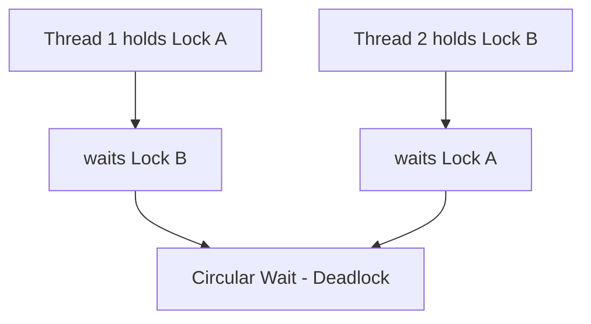
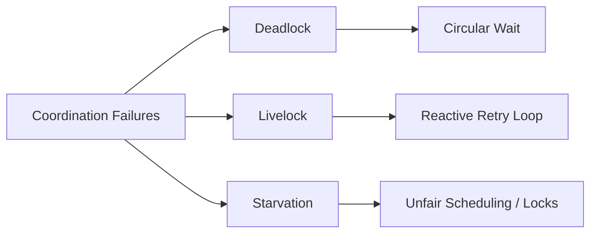
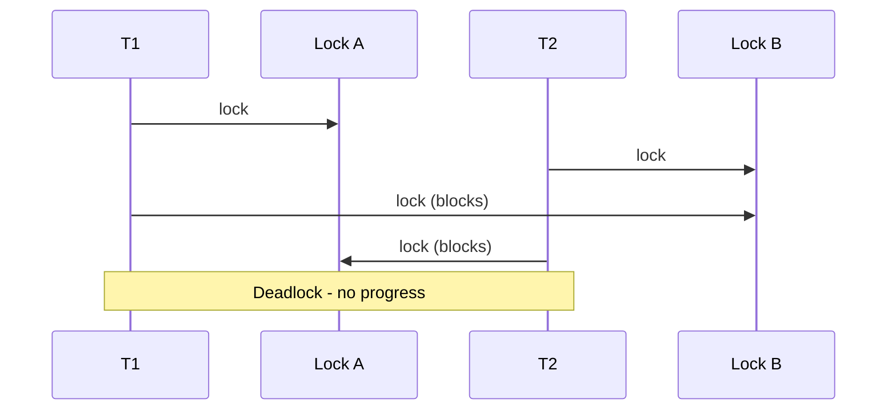

# Deadlocks Livelocks and Starvation

## Overview

**Deadlock** is a state where a set of threads each hold resources and wait on others, forming a cycle—no thread can proceed. **Livelock** is active but unproductive: threads keep changing state in response to each other without making progress (polite collision avoidance). **Starvation** is indefinite denial of progress for some thread despite system activity—often from unfair scheduling or lock preference.

These are distinct failure modes of coordination. Prevention, avoidance, detection, and recovery strategies differ. Labs in [[01-Computer-Science/code/README|code labs]] include intentional deadlock demos.

## Learning Objectives

- State Coffman conditions for deadlock and identify each in code
- Construct and break classic deadlock examples (two mutexes, dining philosophers)
- Distinguish livelock from deadlock and starvation
- Apply lock ordering, timeouts, and try-lock strategies in production
- Relate DB deadlocks to application mutex deadlocks

## Prerequisites

- [[01-Computer-Science/05-Concurrency-Fundamentals/Locks and Critical Sections|Locks and Critical Sections]]
- [[01-Computer-Science/05-Concurrency-Fundamentals/Semaphores and Condition Variables|Semaphores and Condition Variables]]
- [[01-Computer-Science/04-Processes-and-Execution/Scheduling Concepts|Scheduling Concepts]]

## Difficulty

`intermediate`

## Estimated Time

3 hours reading, 3 hours deadlock labs

## History

The deadlock problem was formalized in the 1960s–70s as operating systems introduced blocking locks and resource graphs. Banker's algorithm and lock ordering discipline followed; databases added deadlock detection via wait-for graphs and victim selection.

## Problem It Solves

Recognizing these patterns prevents systems that **freeze silently** (deadlock), **burn CPU achieving nothing** (livelock), or **never serve certain users** (starvation). Production SRE and backend engineers must diagnose them under load—not only in textbooks.

## Internal Implementation

**Coffman conditions** (all four required for deadlock):

1. Mutual exclusion
2. Hold and wait
3. No preemption of held locks
4. Circular wait



**Wait-for graph**: edge T1→T2 if T1 waits for resource held by T2; cycle ⇒ deadlock (detection approach).

**Livelock**: threads retry conflicting actions synchronously—e.g., two people stepping aside the same direction repeatedly.

**Starvation**: low-priority thread never acquires lock because high-priority traffic continuous—fair mutexes or aging mitigate.

## Mermaid Diagrams

### Structure



### Sequence / Lifecycle



## Examples

### Minimal Example

Classic ordered-lock violation — Python:

```python
import threading

lock_a = threading.Lock()
lock_b = threading.Lock()

def worker(first, second, name):
    with first:
        with second:
            print(name, "done")

t1 = threading.Thread(target=worker, args=(lock_a, lock_b, "T1"))
t2 = threading.Thread(target=worker, args=(lock_b, lock_a, "T2"))
t1.start(); t2.start()  # may deadlock
```

Fix: always acquire `(min(id(a),id(b)), max(...))` order.

TypeScript:

```typescript
import { Mutex } from "async-mutex"; // or lab mutex

const a = new Mutex();
const b = new Mutex();

async function worker(first: Mutex, second: Mutex) {
  await first.runExclusive(async () => {
    await second.runExclusive(async () => { /* work */ });
  });
}
// Same ordering discipline required
```

### Production-Shaped Example

Distributed **not** deadlock but analogous: microservice circular RPC waits ([[07-Backend/README|Backend]], [[09-System-Design/README|System Design]]). Mitigate with timeouts, idempotency, sagas.

Database transaction deadlock: Postgres detects cycle, aborts one transaction—application must retry.

```python
# Application-level: always lock rows in primary-key order across transactions
```

## Trade-offs

| Dimension | Upside | Downside | When it matters |
| --- | --- | --- | --- |
| Lock ordering | Prevents circular wait | Requires global discipline | Multi-lock updates |
| try-lock + backoff | Breaks deadlocks | Livelock risk if symmetric | Retries with jitter |
| Detection + kill | Works without strict order | Expensive, abort work | DBMS |
| Fair locks | Reduces starvation | Lower throughput | Long-lived services |

### When to Use

- **Ordering** as default prevention for in-process locks
- **Timeouts** on external waits (network, DB)
- **Detection** where platform provides it (SQL engines)

### When Not to Use

- Ignoring lock hierarchy in growing codebases
- Infinite retry without exponential backoff (livelock)

## Exercises

1. Implement dining philosophers for N=5; compare deadlock vs ordered fork acquisition.
2. Demonstrate livelock with two threads retrying `try_lock` simultaneously without jitter.
3. Show starvation with a non-fair lock under constant high-priority load.
4. Draw wait-for graph for three-thread three-lock deadlock.

## Mini Project

**Deadlock injector + fixer** (TS + Python): reproduce AB-BA deadlock; add global ordering and verify with stress test. Reference [[01-Computer-Science/code/README|code labs]] deadlock demo.

## Portfolio Project

Document deadlock/livelock scenarios and mitigations in [[01-Computer-Science/projects/Concurrency Zoo/README|Concurrency Zoo]] postmortem template.

## Interview Questions

1. Four Coffman conditions—how break each?
2. Deadlock vs livelock vs starvation?
3. Why does lock ordering work?
4. How do databases handle deadlocks?
5. Can deadlocks happen with async/await without threads?

### Stretch / Staff-Level

1. Design a distributed workflow without cyclic synchronous RPC—where do sagas and message queues fit?

## Common Mistakes

- Different lock order in different code paths
- Holding multiple locks while calling unknown code (callbacks)
- Retry storms without randomization → livelock
- Assuming ORMs remove DB deadlock responsibility

## Best Practices

- Establish and document lock hierarchy; enforce in code review
- Use timeouts and circuit breakers at service boundaries
- Retry transactional deadlocks with bounded exponential backoff
- Test with thread sanitizers and chaos delays

## Summary

Deadlocks freeze progress via circular wait; livelocks waste CPU in polite retry loops; starvation denies fairness. Break circular wait with lock ordering, break hold-and-wait with lock-all-at-once patterns sparingly, and use platform detection for databases. Distributed systems need timeout and workflow design—not only mutex discipline.

## Further Reading

- [[01-Computer-Science/05-Concurrency-Fundamentals/Locks and Critical Sections|Locks and Critical Sections]]
- [[08-Databases/README|Databases]] — transaction isolation
- [[09-System-Design/README|System Design]] — sagas, timeouts

## Related Notes

- [[01-Computer-Science/05-Concurrency-Fundamentals/Locks and Critical Sections|Locks and Critical Sections]]
- [[01-Computer-Science/05-Concurrency-Fundamentals/Backpressure and Resource Contention|Backpressure and Resource Contention]]
- [[07-Backend/README|Backend]]
- [[01-Computer-Science/code/README|code labs]]

## Progress Checklist

- [ ] Explained from first principles
- [ ] Drew at least one Mermaid diagram
- [ ] Implemented a minimal version
- [ ] Documented trade-offs and non-goals
- [ ] Completed exercises
- [ ] Practiced interview questions aloud
- [ ] Linked prerequisites and dependents
