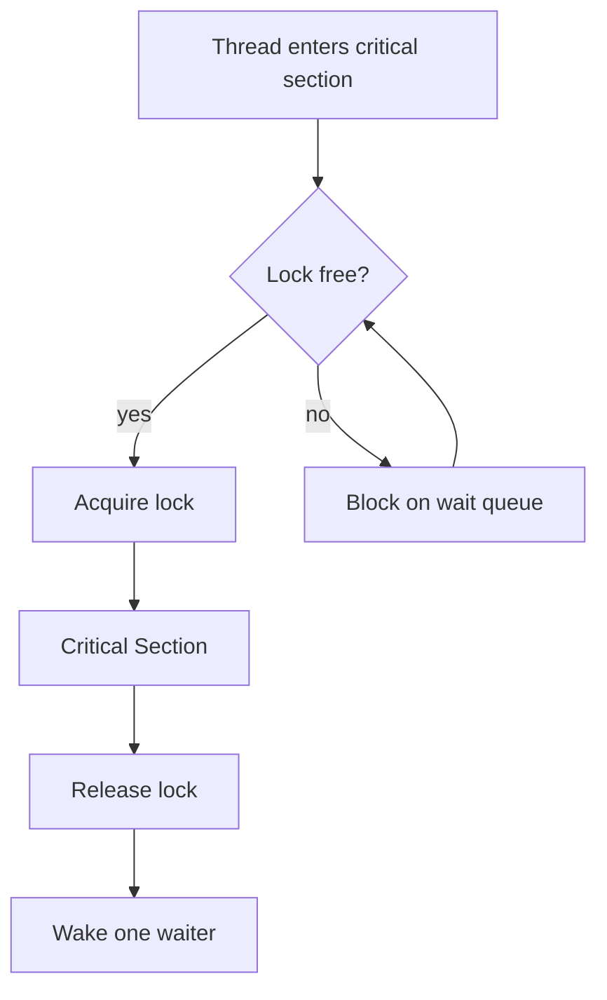
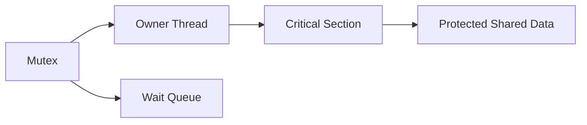
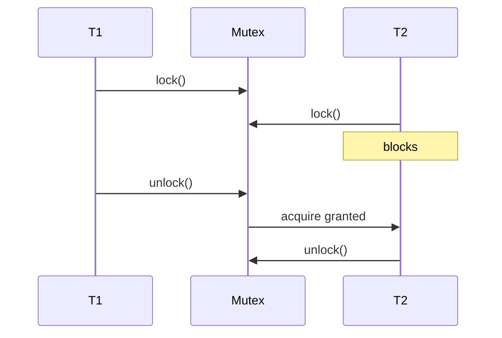

# Locks and Critical Sections

## Overview

A **critical section** is a region of code that accesses shared mutable state and must not execute concurrently with other critical sections on the same data. A **lock** (mutex) enforces **mutual exclusion**: at most one thread holds the lock; others block or fail until it is released. Locks are the default tool for turning racy programs into programs with explicit invariants.

This note covers mutex semantics, reentrancy, lock ordering discipline, and performance pitfalls. Higher-level patterns (RW locks, fine-grained sharding) extend the same principles; runtime-specific APIs appear in [[06-NodeJS/README|Node.js]] and [[03-Python/README|Python]] after you understand the model here.

## Learning Objectives

- Define critical section, mutex, and lock contention
- Implement correct lock-protected shared counters and invariants
- Explain blocking vs try-lock vs spinlock trade-offs
- Apply lock ordering to reduce deadlock risk
- Measure when lock granularity hurts throughput

## Prerequisites

- [[01-Computer-Science/05-Concurrency-Fundamentals/Race Conditions|Race Conditions]]
- [[01-Computer-Science/04-Processes-and-Execution/Threads|Threads]]

## Difficulty

`intermediate`

## Estimated Time

3 hours reading, 3 hours labs

## History

Dijkstra's semaphores (1960s) generalized mutual exclusion; pthread mutexes and Java `synchronized` brought locks into mainstream application code. Lock-free algorithms emerged where mutex latency was unacceptable at scale.

## Problem It Solves

Without locks, shared updates are racy. Locks serialize access so invariants like "balance ≥ 0" or "list links consistent" hold across interleaved execution. They convert timing uncertainty into **blocking waits**—predictable correctness at a performance cost.

## Internal Implementation

Mutex states: **unlocked**, **locked (owner thread)**, optionally **contended queue** in kernel or futex.



**Reentrant mutex**: same thread may acquire twice (nested calls). **Non-reentrant**: double-lock self-deadlocks.

Spinlock: busy-wait for very short critical sections on multi-core; wastes CPU if hold time long.

## Mermaid Diagrams

### Structure



### Sequence / Lifecycle



## Examples

### Minimal Example

TypeScript (`AsyncMutex` pattern for async critical sections):

```typescript
class AsyncMutex {
  private locked = false;
  private waiters: Array<() => void> = [];

  async acquire(): Promise<Release> {
    if (!this.locked) {
      this.locked = true;
      return () => this.release();
    }
    await new Promise<void>((resolve) => this.waiters.push(resolve));
    return () => this.release();
  }

  private release() {
    const next = this.waiters.shift();
    if (next) next();
    else this.locked = false;
  }
}
type Release = () => void;
```

Python (`threading.Lock`):

```python
import threading

counter = 0
lock = threading.Lock()

def inc():
    global counter
    for _ in range(100_000):
        with lock:
            counter += 1

threads = [threading.Thread(target=inc) for _ in range(4)]
for t in threads: t.start()
for t in threads: t.join()
print(counter)  # 400000
```

### Production-Shaped Example

Per-shard locks in an in-memory cache ([[07-Backend/README|Backend]]):

```python
from threading import RLock

class ShardedCache:
    def __init__(self, shards: int = 64):
        self.shards = [({"data": {}}, RLock()) for _ in range(shards)]

    def _shard(self, key: str):
        return self.shards[hash(key) % len(self.shards)]

    def get(self, key: str):
        bucket, lock = self._shard(key)
        with lock:
            return bucket["data"].get(key)
```

Reduces contention vs one global mutex.

## Trade-offs

| Dimension | Upside | Downside | When it matters |
| --- | --- | --- | --- |
| Correctness | Clear mutual exclusion | Contention serializes | Hot shared counters |
| Coarse lock | Simple | Low parallelism | Low write rates |
| Fine-grained | Higher parallelism | Complexity, deadlock risk | Large in-memory stores |
| Spinlock | Low latency short CS | CPU burn if misused | Kernel/adapters |

### When to Use

- Short critical sections protecting invariants on shared mutable structures
- When atomics cannot express compound invariants (multi-field updates)

### When Not to Use

- As default for all shared reads (consider RW locks or immutability)
- Holding locks across I/O (blocks all other waiters)
- When message passing gives clearer ownership

## Exercises

1. Fix the race demo in [[01-Computer-Science/05-Concurrency-Fundamentals/Race Conditions|Race Conditions]] with a mutex in TS and Python.
2. Demonstrate self-deadlock with a non-reentrant lock called recursively.
3. Design lock granularity for a 10M-entry hash map with 90% reads.
4. Measure throughput vs thread count for a lock-protected counter.

## Mini Project

Implement **reader-writer lock** (TS + Python) with tests for concurrent readers and exclusive writers. Compare to plain mutex under read-heavy load.

## Portfolio Project

Integrate sharded locking into [[01-Computer-Science/projects/Concurrency Zoo/README|Concurrency Zoo]] bounded buffer lab.

## Interview Questions

1. What is a critical section?
2. Why should you avoid holding locks during I/O?
3. Mutex vs spinlock?
4. What makes a lock reentrant?
5. How does lock sharding reduce contention?

### Stretch / Staff-Level

1. When would you choose lock-free structures over mutexes despite complexity?

## Common Mistakes

- Locking on wrong object (distinct `Integer` instances in Java-style bugs)
- Forgotten unlock on exception paths (use RAII / `with` / `defer`)
- Giant critical sections killing parallelism
- Using locks in async code without an async-aware mutex (event loop blocking)

## Best Practices

- Keep critical sections minimal; no network/disk under lock
- Establish global lock ordering for multiple locks
- Prefer `with lock:` / scoped guards
- Log lock wait time in diagnostics for hot paths

## Summary

Locks define critical sections where shared invariants are restored. Mutexes trade potential parallelism for deterministic correctness by blocking waiters. Production code chooses lock granularity deliberately, avoids I/O under lock, and combines ordering discipline with sharding or higher-level abstractions when contention appears.

## Further Reading

- [[01-Computer-Science/05-Concurrency-Fundamentals/Semaphores and Condition Variables|Semaphores and Condition Variables]]
- [[01-Computer-Science/05-Concurrency-Fundamentals/Deadlocks Livelocks and Starvation|Deadlocks Livelocks and Starvation]]
- [[01-Computer-Science/05-Concurrency-Fundamentals/Atomics and Memory Ordering|Atomics and Memory Ordering]]

## Related Notes

- [[01-Computer-Science/05-Concurrency-Fundamentals/Race Conditions|Race Conditions]]
- [[01-Computer-Science/05-Concurrency-Fundamentals/Deadlocks Livelocks and Starvation|Deadlocks Livelocks and Starvation]]
- [[01-Computer-Science/code/README|code labs]]
- [[06-NodeJS/README|Node.js]]
- [[07-Backend/README|Backend]]

## Progress Checklist

- [ ] Explained from first principles
- [ ] Drew at least one Mermaid diagram
- [ ] Implemented a minimal version
- [ ] Documented trade-offs and non-goals
- [ ] Completed exercises
- [ ] Practiced interview questions aloud
- [ ] Linked prerequisites and dependents
