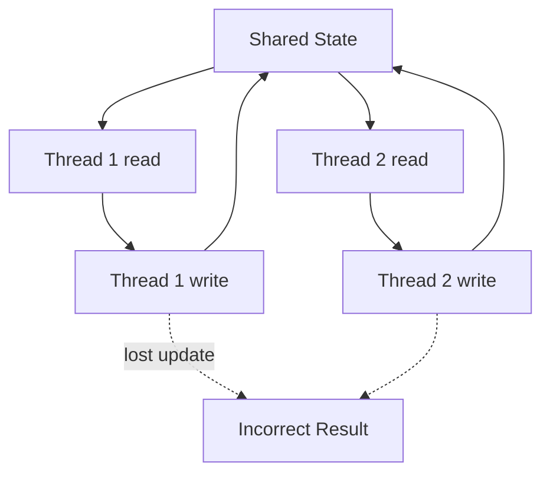
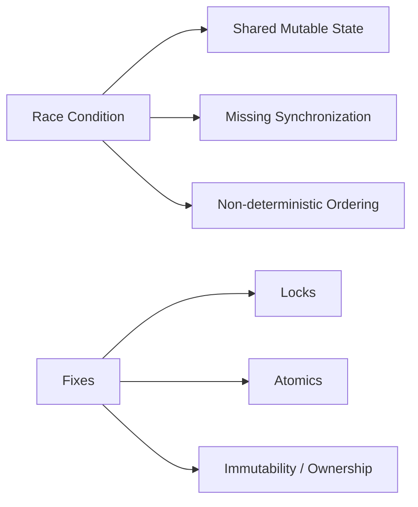
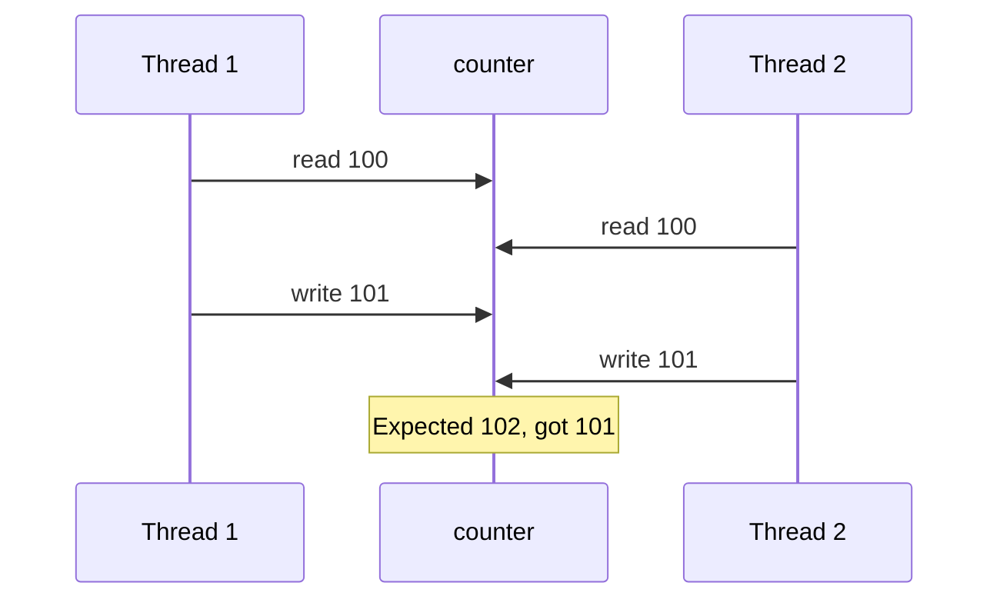

# Race Conditions

## Overview

A **race condition** occurs when the correctness of a program depends on the **relative timing** of concurrent operations—typically unsynchronized reads and writes to shared mutable state. A **data race** (stricter term in memory models) is concurrent access to the same memory location where at least one access is a write and no synchronization orders them—often undefined behavior in C/C++ and a correctness bug everywhere else.

Races are **Heisenbugs**: they disappear under debuggers because timing changes. This note builds detection intuition and prevention patterns; labs live in [[01-Computer-Science/code/README|code labs]] `runtime` race demos.

## Learning Objectives

- Distinguish race conditions from data races and benign races
- Identify read-modify-write sequences that are non-atomic at language level
- Reproduce and stabilize a race with controlled threading
- Apply fixes: mutex, atomics, immutability, message passing
- Relate races to production incidents (double spend, lost updates, torn reads)

## Prerequisites

- [[01-Computer-Science/05-Concurrency-Fundamentals/Concurrency vs Parallelism|Concurrency vs Parallelism]]
- [[01-Computer-Science/04-Processes-and-Execution/Threads|Threads]]
- [[01-Computer-Science/03-Memory-and-Addressing/Pointers References and Aliasing|Pointers References and Aliasing]]

## Difficulty

`intermediate`

## Estimated Time

3 hours reading, 3 hours labs

## History

As soon as systems shared memory between interrupt handlers, batch jobs, and threads, ordering bugs appeared. Formal memory models (C11, Java JMM, C++11) were standardized partly to define when races constitute undefined behavior vs defined concurrent semantics.

## Problem It Solves

Understanding races is prerequisite to **correct** shared-memory programs. Without a model, developers assume `counter++` is atomic or that "it works on my machine" implies safety. Races cause financial ledger errors, duplicated job processing, corrupted indexes, and security vulnerabilities (TOCTOU).

## Internal Implementation

Non-atomic increment compiles to load → add → store:

```text
Thread A: LOAD counter → 5
Thread B: LOAD counter → 5
Thread A: STORE 6
Thread B: STORE 6   // lost update; expected 7
```



**TOCTOU** (time-of-check-time-of-use): check permission on path, attacker swaps file, use opens wrong target—classic race across syscalls ([[10-Linux/README|Linux]] security ops extend this).

## Mermaid Diagrams

### Structure



### Sequence / Lifecycle



## Examples

### Minimal Example

TypeScript (Worker Threads sharing ArrayBuffer — intentional race):

```typescript
import { Worker, isMainThread, workerData } from "node:worker_threads";

if (isMainThread) {
  const buf = new SharedArrayBuffer(4);
  const view = new Int32Array(buf);
  const workers = Array.from({ length: 4 }, () =>
    new Worker(new URL(import.meta.url), { workerData: { buf } })
  );
  await Promise.all(workers.map((w) => new Promise((r) => w.on("exit", r))));
  console.log("counter", view[0]); // often < 400000
} else {
  const view = new Int32Array(workerData.buf);
  for (let i = 0; i < 100_000; i++) view[0] = view[0] + 1; // RMW race
}
```

Python:

```python
import threading

counter = 0

def inc():
    global counter
    for _ in range(100_000):
        counter += 1  # not atomic in CPython bytecode

threads = [threading.Thread(target=inc) for _ in range(4)]
for t in threads: t.start()
for t in threads: t.join()
print(counter)  # << 400000
```

Fixed with lock — see [[01-Computer-Science/05-Concurrency-Fundamentals/Locks and Critical Sections|Locks and Critical Sections]].

### Production-Shaped Example

Cache stampede / lost inventory update in [[07-Backend/README|Backend]]:

```typescript
// Anti-pattern: check-then-act on shared cache without lock
async function getOrFetch(key: string) {
  if (cache.has(key)) return cache.get(key); // TOCTOU window
  const value = await expensiveFetch(key);
  cache.set(key, value); // duplicate fetches possible
  return value;
}
```

Use singleflight, mutex, or transactional store.

## Trade-offs

| Dimension | Upside | Downside | When it matters |
| --- | --- | --- | --- |
| No sync | Maximum raw speed | Incorrect | Never for shared writes |
| Locks | Clear invariants | Deadlock, contention | General mutable state |
| Atomics | Fine-grained counters | Limited composability | Metrics, ref counts |
| Immutability | No write races | Allocation / copying | Functional pipelines |

### When to Use

- Prevention always beats detection in production
- Stress tests + thread sanitizers during development

### When Not to Use

- "Hope" as a strategy—races do not self-heal at scale

## Exercises

1. Explain why `counter += 1` is three operations, not one.
2. Write a race on a lazy-initialized singleton; fix with DCL and discuss why DCL needs atomics in some languages.
3. Identify shared state in your web app's global module scope.
4. Reproduce [[01-Computer-Science/code/README|code labs]] race demo; fix with mutex in both TS and Python.

## Mini Project

**Race gallery**: implement bank transfer, counter, and check-then-act bugs (TS + Python); document observed outcomes over 100 runs; add fixes and verify determinism.

## Portfolio Project

Add a "race regression suite" to [[01-Computer-Science/projects/Concurrency Zoo/README|Concurrency Zoo]] run under CI with expected post-fix invariants.

## Interview Questions

1. Define race condition vs data race.
2. Why are races hard to reproduce?
3. Is this safe? `if (map.has(k)) map.set(k, map.get(k)+1)`
4. How would you debug a once-a-week race in production?
5. What is TOCTOU? Give a filesystem example.

### Stretch / Staff-Level

1. Explain why double-checked locking failed historically in Java and what `volatile`/atomics changed.

## Common Mistakes

- Assuming small critical sections "don't need" locks
- Fixing races with sleeps or random delays
- Sharing mutable singletons across async callbacks without serialization
- Ignoring races in "read-mostly" caches under write bursts

## Best Practices

- Minimize shared mutable state; prefer ownership transfer
- Protect invariants with locks or atomics explicitly
- Use race detectors in CI (TS strict mode won't catch threads; use stress tests)
- Log version counters or use compare-and-swap for optimistic updates

## Summary

Race conditions make outcomes depend on scheduling luck: lost updates, torn reads, and TOCTOU vulnerabilities follow from unsynchronized shared mutation. Correctness requires identifying shared state, shrinking critical sections, and choosing locks, atomics, or immutability deliberately—then proving fixes with stress tests, not single runs.

## Further Reading

- [[01-Computer-Science/05-Concurrency-Fundamentals/Locks and Critical Sections|Locks and Critical Sections]]
- [[01-Computer-Science/05-Concurrency-Fundamentals/Atomics and Memory Ordering|Atomics and Memory Ordering]]
- [[01-Computer-Science/09-Correctness-and-Reliability/Invariants Assertions and Contracts|Invariants Assertions and Contracts]]

## Related Notes

- [[01-Computer-Science/05-Concurrency-Fundamentals/Locks and Critical Sections|Locks and Critical Sections]]
- [[01-Computer-Science/04-Processes-and-Execution/Threads|Threads]]
- [[06-NodeJS/README|Node.js]] — single-thread assumption vs workers
- [[07-Backend/README|Backend]]
- [[01-Computer-Science/code/README|code labs]]

## Progress Checklist

- [ ] Explained from first principles
- [ ] Drew at least one Mermaid diagram
- [ ] Implemented a minimal version
- [ ] Documented trade-offs and non-goals
- [ ] Completed exercises
- [ ] Practiced interview questions aloud
- [ ] Linked prerequisites and dependents
