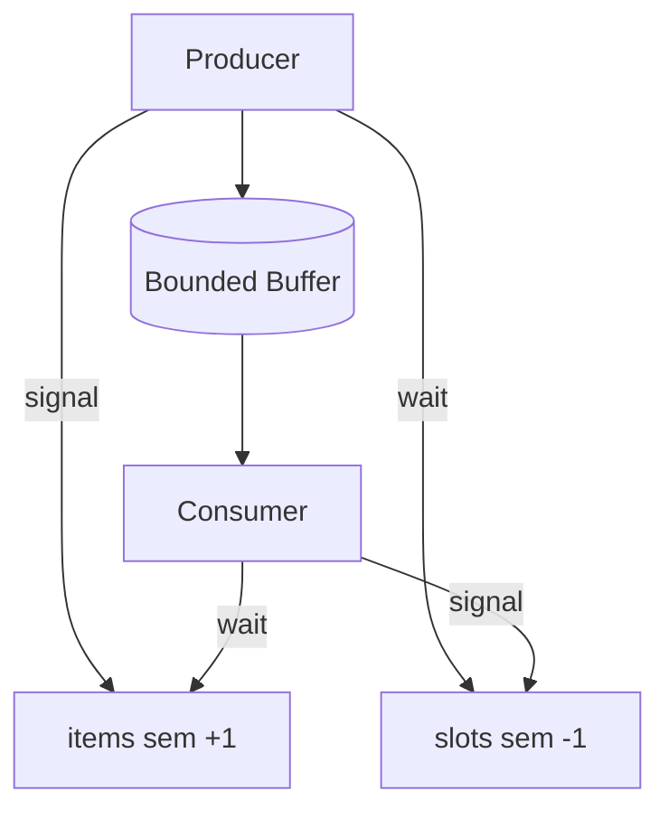
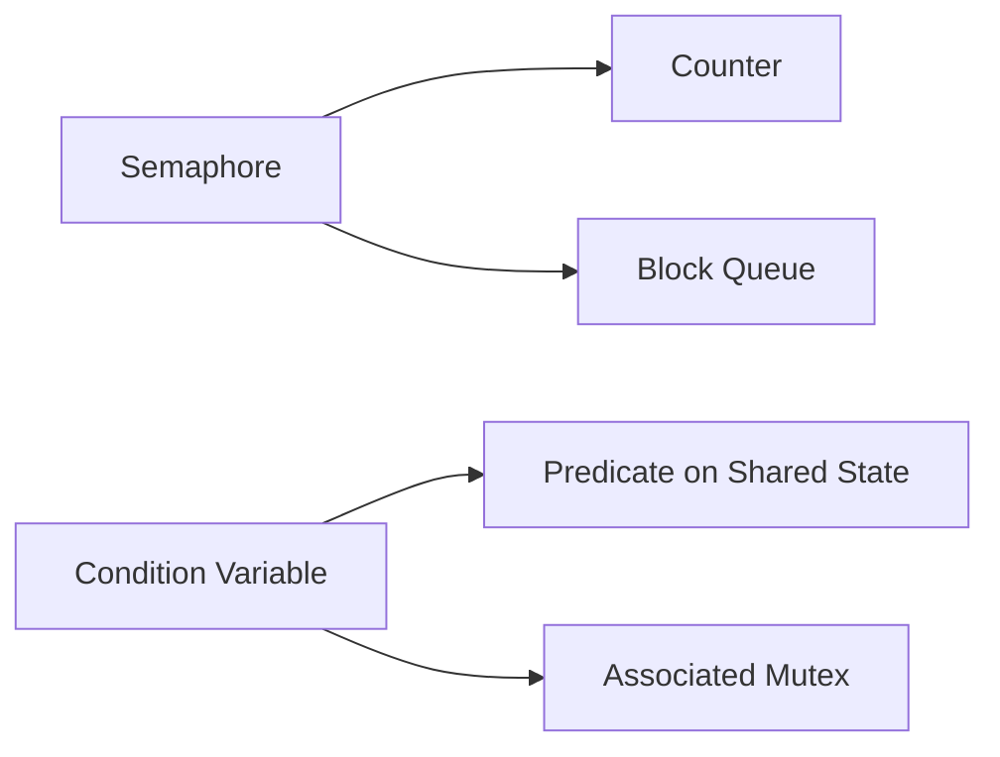
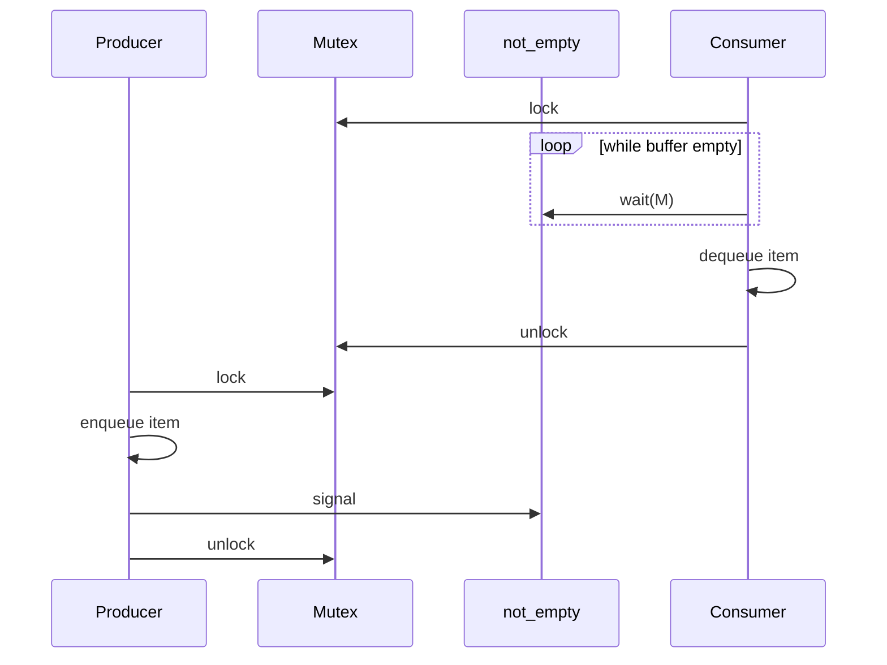

# Semaphores and Condition Variables

## Overview

**Semaphores** maintain a non-negative counter: `wait` (P/acquire) decrements and blocks if zero; `signal` (V/release) increments and may wake a waiter. **Condition variables** let threads **wait for a predicate** on shared state while atomically releasing an associated mutex, then re-acquire before proceeding. Together they implement producer–consumer queues, thread pools, and backpressure without busy-waiting.

Mutexes guard invariants; semaphores and CVs **coordinate phases** ("buffer has space", "job available"). Implementations in [[01-Computer-Science/code/README|code labs]] `runtime` include bounded buffers in TS and Python.

## Learning Objectives

- Distinguish binary vs counting semaphores and typical use cases
- Implement producer–consumer with semaphores and with mutex + condition variable
- State the mandatory `while` (not `if`) loop when waiting on CVs
- Explain spurious wakeups and lost wakeups without proper pairing
- Map semaphores to rate limiting and pool sizing in backend services

## Prerequisites

- [[01-Computer-Science/05-Concurrency-Fundamentals/Locks and Critical Sections|Locks and Critical Sections]]
- [[01-Computer-Science/05-Concurrency-Fundamentals/Race Conditions|Race Conditions]]

## Difficulty

`intermediate`

## Estimated Time

4 hours reading, 4 hours bounded-buffer labs

## History

Dijkstra introduced semaphores (1963) for cooperating sequential processes. Condition variables appeared in Mesa and pthreads to wait for complex predicates under mutex protection—cleaner than encoding all logic in semaphore counts alone.

## Problem It Solves

Mutex alone cannot efficiently express:

- "Block until buffer non-empty"
- "Allow at most N concurrent DB connections"
- "Worker sleeps until task arrives"

Busy-waiting wastes CPU; semaphores/CVs park threads until conditions hold.

## Internal Implementation

**Counting semaphore**: atomic counter + wait queue.

**Condition variable**: must be used with mutex; `wait(mutex)` atomically unlocks mutex and sleeps; on wakeup re-lock mutex and re-check predicate.



**Mesa vs Hoare semantics**: most OS use Mesa—signaler does not hand off immediately; waiters re-check predicate after wakeup.

## Mermaid Diagrams

### Structure



### Sequence / Lifecycle



## Examples

### Minimal Example

Python (`threading.Semaphore` bounded pool):

```python
import threading, time

pool = threading.Semaphore(3)  # max 3 concurrent

def job(n: int):
    with pool:
        print(f"start {n}")
        time.sleep(0.2)
        print(f"end {n}")

threads = [threading.Thread(target=job, args=(i,)) for i in range(10)]
for t in threads: t.start()
for t in threads: t.join()
```

TypeScript (manual counting semaphore for async):

```typescript
class Semaphore {
  private permits: number;
  private queue: Array<() => void> = [];
  constructor(n: number) { this.permits = n; }
  async acquire(): Promise<void> {
    if (this.permits > 0) { this.permits--; return; }
    await new Promise<void>((r) => this.queue.push(r));
    this.permits--;
  }
  release(): void {
    this.permits++;
    const next = this.queue.shift();
    if (next) next();
  }
}
```

### Production-Shaped Example

Bounded buffer + CV pattern ([[07-Backend/README|Backend]] job queue):

```python
import threading
from collections import deque

class BoundedQueue:
    def __init__(self, capacity: int):
        self._buf: deque = deque()
        self._mutex = threading.Lock()
        self._not_full = threading.Condition(self._mutex)
        self._not_empty = threading.Condition(self._mutex)
        self._capacity = capacity

    def put(self, item):
        with self._mutex:
            while len(self._buf) >= self._capacity:
                self._not_full.wait()
            self._buf.append(item)
            self._not_empty.notify()

    def get(self):
        with self._mutex:
            while not self._buf:
                self._not_empty.wait()
            item = self._buf.popleft()
            self._not_full.notify()
            return item
```

## Trade-offs

| Dimension | Upside | Downside | When it matters |
| --- | --- | --- | --- |
| Semaphore | Simple counting limits | Harder for compound predicates | Connection caps |
| Condition var | Express arbitrary predicates | Easy to misuse without while-loop | Queues, barriers |
| vs Busy-wait | CPU efficient | Kernel wakeups | High wait times |
| vs Channel | Low-level control | More boilerplate | Custom runtimes |

### When to Use

- **Counting semaphore**: limit parallelism (DB pool, disk slots)
- **CV + mutex**: wait until structured predicate true (queue non-empty)

### When Not to Use

- CV without mutex pairing (undefined behavior)
- `if` instead of `while` on predicate (missed signals / spurious wakeups)

## Exercises

1. Implement bounded buffer with two semaphores (`items`, `slots`) and one mutex.
2. Show lost wakeup if consumer uses `if not buf: wait()` and producer signals once for two items.
3. Model HTTP max-concurrency with semaphore; measure latency under overload.
4. Port bounded buffer lab from [[01-Computer-Science/code/README|code labs]] to both languages.

## Mini Project

**Producer–consumer stress test** (TS + Python): multiple producers/consumers, capacity 10, verify item count conservation and no deadlock over 1M items.

## Portfolio Project

Add semaphore-gated connection pool to [[01-Computer-Science/projects/Concurrency Zoo/README|Concurrency Zoo]] with metrics on wait time.

## Interview Questions

1. Binary vs counting semaphore?
2. Why `while` not `if` with condition variables?
3. Implement bounded buffer with semaphores—how many and which?
4. What is spurious wakeup?
5. Semaphore vs mutex—can one replace the other?

### Stretch / Staff-Level

1. Design a fair semaphore that avoids writer starvation in a read-heavy buffer.

## Common Mistakes

- Signaling without holding mutex when required by predicate (pattern-dependent)
- Forgetting to notify after state change
- Using semaphore counts to encode multiple conditions (becomes unreadable)
- `notify` one waiter when all must recheck broadcast scenario

## Best Practices

- Always document predicate protected by CV
- Prefer `notify_all` when multiple waiters may proceed or predicate complex
- Expose semaphore wait metrics as early overload signal
- Connect to [[01-Computer-Science/05-Concurrency-Fundamentals/Backpressure and Resource Contention|Backpressure]] in APIs

## Summary

Semaphores count resources and throttle parallelism; condition variables block until mutex-guarded predicates hold, with mandatory recheck loops after wakeup. Producer–consumer and connection pools are the canonical patterns—correctness depends on pairing waits and signals with the right mutex scope and avoiding lost wakeups.

## Further Reading

- [[01-Computer-Science/05-Concurrency-Fundamentals/Backpressure and Resource Contention|Backpressure and Resource Contention]]
- [[01-Computer-Science/05-Concurrency-Fundamentals/Deadlocks Livelocks and Starvation|Deadlocks Livelocks and Starvation]]

## Related Notes

- [[01-Computer-Science/05-Concurrency-Fundamentals/Locks and Critical Sections|Locks and Critical Sections]]
- [[01-Computer-Science/04-Processes-and-Execution/Interprocess Communication Fundamentals|Interprocess Communication Fundamentals]]
- [[07-Backend/README|Backend]]
- [[01-Computer-Science/code/README|code labs]]

## Progress Checklist

- [ ] Explained from first principles
- [ ] Drew at least one Mermaid diagram
- [ ] Implemented a minimal version
- [ ] Documented trade-offs and non-goals
- [ ] Completed exercises
- [ ] Practiced interview questions aloud
- [ ] Linked prerequisites and dependents
