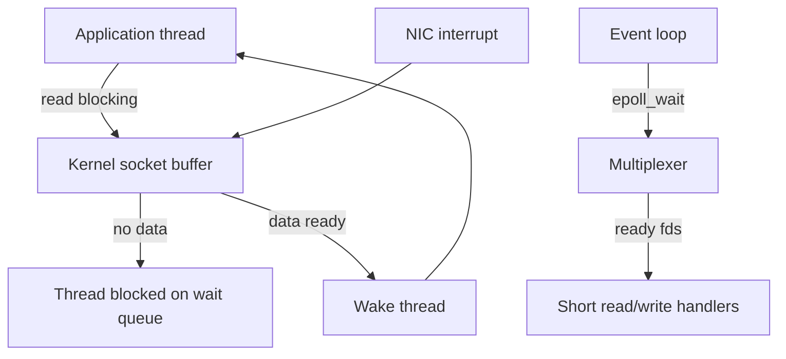
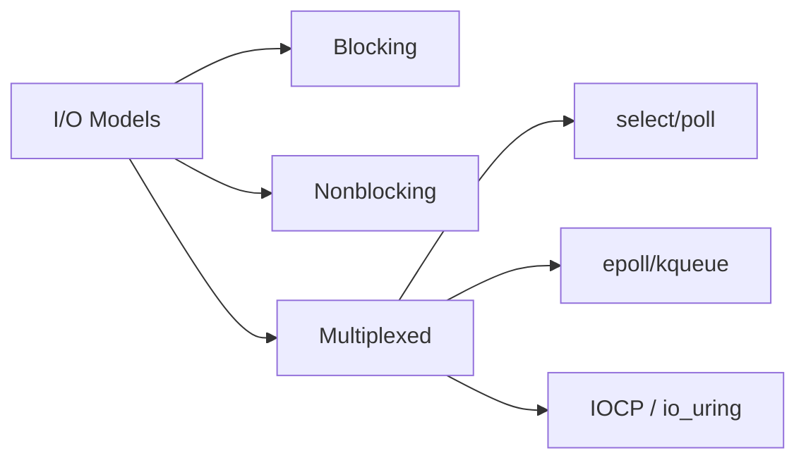

# Blocking Nonblocking and Multiplexed IO

## Overview

I/O models describe how a thread interacts with the kernel when reading or writing a file descriptor (file, socket, pipe). **Blocking I/O** suspends the calling thread until data is ready. **Nonblocking I/O** returns immediately with `EAGAIN`/`EWOULDBLOCK` when no data is available. **Multiplexed I/O** (`select`, `poll`, `epoll`, `kqueue`, IOCP) lets one thread wait on many descriptors and dispatch work when any becomes ready.

These are not "async frameworks" — they are syscall-level contracts between user space and the kernel scheduler.

## Learning Objectives

- Distinguish blocking, nonblocking, and multiplexed I/O at the syscall boundary
- Explain why a single thread can serve thousands of sockets with `epoll` but not with blocking reads
- Implement a minimal event loop that handles partial reads and backpressure
- Choose an I/O model given connection count, latency targets, and CPU budget

## Prerequisites

- [[01-Computer-Science/04-Processes-and-Execution/System Calls|System Calls]]
- [[01-Computer-Science/05-Concurrency-Fundamentals/Asynchronous Event-Driven Models|Asynchronous Event-Driven Models]]
- [[01-Computer-Science/07-Networking-Fundamentals/Sockets Programming Model|Sockets Programming Model]]

## Difficulty

`intermediate`

## Estimated Time

3–4 hours reading; 4–6 hours lab (event loop + echo server)

## History

Early Unix servers used one thread (or process) per connection with blocking sockets — simple but memory-heavy at scale. The C10K problem (handling ~10,000 concurrent clients) drove `select`/`poll`, then scalable readiness APIs (`epoll`, `kqueue`) and completion-based models (IOCP, Linux `io_uring`). Node.js popularized single-threaded multiplexed I/O for web workloads.

## Problem It Solves

Without multiplexing, either you block threads wastefully or you spin in tight loops polling descriptors. Multiplexed I/O lets one thread sleep until *some* descriptor is ready, then run short handlers — the foundation of high-concurrency servers and runtimes like Node and nginx.

## Internal Implementation

When you `read()` a blocking socket with no data, the kernel marks the thread **blocked**, removes it from the run queue, and wakes it when packets arrive (soft interrupt → socket buffer → wait queue wakeup). Nonblocking sockets skip the sleep: the syscall returns `-1` with `errno = EAGAIN`.

Multiplexers maintain interest sets: "tell me when fd 7 is readable." The kernel merges network/device events into a ready list; `epoll_wait` returns without scanning all fds on each call (edge-triggered mode reduces repeated notifications but requires draining buffers completely).



## Mermaid Diagrams

### Structure



### Sequence / Lifecycle

```mermaid
sequenceDiagram
    participant Loop as Event loop
    participant Epoll as epoll_wait
    participant Sock as Socket fd
    Loop->>Epoll: wait(timeout)
    Note over Epoll: thread sleeps
    Sock-->>Epoll: packet arrives (readable)
    Epoll-->>Loop: fd 7 READ ready
    Loop->>Sock: read (nonblocking)
    Sock-->>Loop: bytes or EAGAIN
```

## Examples

### Minimal Example

TypeScript (Node `net` — nonblocking under the hood, callback when readable):

```typescript
import net from "node:net";

const server = net.createServer((socket) => {
  socket.on("data", (chunk) => socket.write(chunk)); // echo
});
server.listen(9000);
```

Python (explicit nonblocking + `select`):

```python
import select, socket

srv = socket.socket()
srv.setsockopt(socket.SOL_SOCKET, socket.SO_REUSEADDR, 1)
srv.bind(("127.0.0.1", 9000))
srv.listen(128)
srv.setblocking(False)
clients: dict[int, socket.socket] = {}

while True:
    rlist, _, _ = select.select([srv, *clients.values()], [], [], 1.0)
    for fd in rlist:
        if fd is srv:
            conn, _ = srv.accept()
            conn.setblocking(False)
            clients[conn.fileno()] = conn
        else:
            try:
                data = fd.recv(4096)
                if not data:
                    del clients[fd.fileno()]
                    fd.close()
                else:
                    fd.send(data)
            except BlockingIOError:
                pass
```

### Production-Shaped Example

Production servers combine: nonblocking fds, edge-triggered epoll, bounded read buffers, write interest when send buffer full, idle timeouts, and metrics on `epoll_wait` latency. See [[01-Computer-Science/code/README|code labs]] (`runtime` lab).

## Trade-offs

| Dimension | Upside | Downside | When it matters |
| --- | --- | --- | --- |
| Performance | One thread, many connections; fewer context switches | Handler must not block CPU or disk | Chat, API gateways, proxies |
| Complexity | Blocking code is linear | Event loops need state machines for partial I/O | Teams without async discipline |
| Operability | Predictable memory vs thread-per-conn | Harder stack traces; callback/refactor pain | High fan-in services |

### When to Use

- Thousands of mostly idle connections (HTTP keep-alive, WebSockets)
- Latency-sensitive proxy/gateway tiers
- Runtimes that already embed an event loop (Node, asyncio proactor on Windows)

### When Not to Use

- CPU-bound work on the same thread without offloading
- Simple CLI tools with one input stream
- When thread-per-request + blocking I/O meets SLA with simpler code

## Exercises

1. Measure thread count and RSS for 1,000 idle keep-alive connections: blocking thread pool vs single `select` loop.
2. Implement edge-triggered echo: if you stop reading before EAGAIN, explain stuck-connection behavior.
3. Add a 30s idle timer per client without scanning all fds every second (hint: timer wheel or earliest deadline).

## Mini Project

Build a **multiplexed echo server** with per-connection read buffers, partial writes, and a `/stats` admin TCP port reporting active connections. Implement in TS and Python; compare lines of code and p99 latency under 500 concurrent clients.

## Portfolio Project

Extend [[01-Computer-Science/projects/Concurrent Runtime and Protocol Workbench/README|Concurrent Runtime and Protocol Workbench]] with configurable I/O backend (blocking pool vs epoll/select) and benchmark harness.

## Interview Questions

1. What happens to your thread when `read()` blocks on an empty TCP socket?
2. Why can `select` degrade with high fd numbers even when few are active?
3. Edge-triggered vs level-triggered epoll: when would you choose each?

### Stretch / Staff-Level

1. Design an HTTP server that never blocks the event loop on disk I/O or DNS — what threads, queues, and cancellation do you need?

## Common Mistakes

- Calling blocking DNS or filesystem APIs inside an event-loop thread
- Forgetting to handle partial writes on nonblocking sockets
- Using level-triggered epoll without draining, causing busy loops

## Best Practices

- Keep handlers short; offload CPU work to thread pools
- Always handle `EINTR` and `EAGAIN` explicitly in C/Rust; know your wrapper's behavior in TS/Python
- Expose queue depth and event-loop lag as metrics

## Summary

Blocking I/O trades thread simplicity for scalability limits. Nonblocking I/O returns control immediately but pushes waiting logic to user space. Multiplexed I/O lets one thread monitor many descriptors efficiently — the core pattern behind modern concurrent network services. Production success depends on never blocking the loop, handling partial I/O, and measuring tail latency under load.

## Further Reading

- Stevens, *UNIX Network Programming*, Volume 1 (I/O multiplexing chapters)
- Linux `man 7 epoll`, `man 2 select`
- Dan Kegel, "The C10K problem"

## Related Notes

- [[01-Computer-Science/07-Networking-Fundamentals/Sockets Programming Model|Sockets Programming Model]]
- [[01-Computer-Science/07-Networking-Fundamentals/TCP|TCP]]
- [[01-Computer-Science/05-Concurrency-Fundamentals/Backpressure and Resource Contention|Backpressure and Resource Contention]]
- [[01-Computer-Science/code/README|code labs]]
- [[06-NodeJS/README|Node.js]] — event-loop runtime
- [[10-Linux/README|Linux]] — epoll tuning and strace

## Progress Checklist

- [ ] Explained from first principles
- [ ] Drew at least one Mermaid diagram
- [ ] Implemented a minimal version
- [ ] Documented trade-offs and non-goals
- [ ] Completed exercises
- [ ] Practiced interview questions aloud
- [ ] Linked prerequisites and dependents
