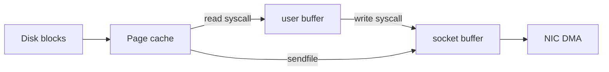
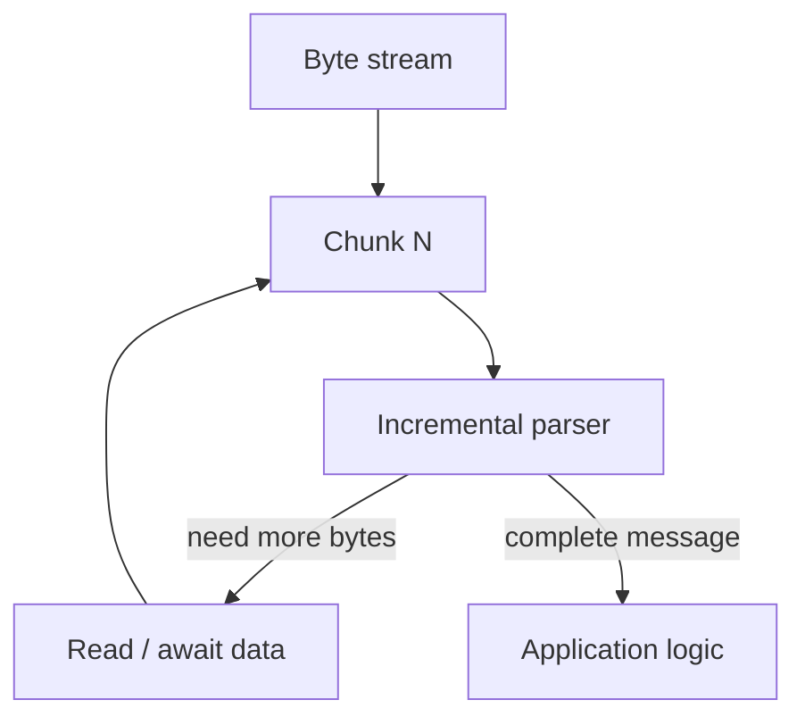
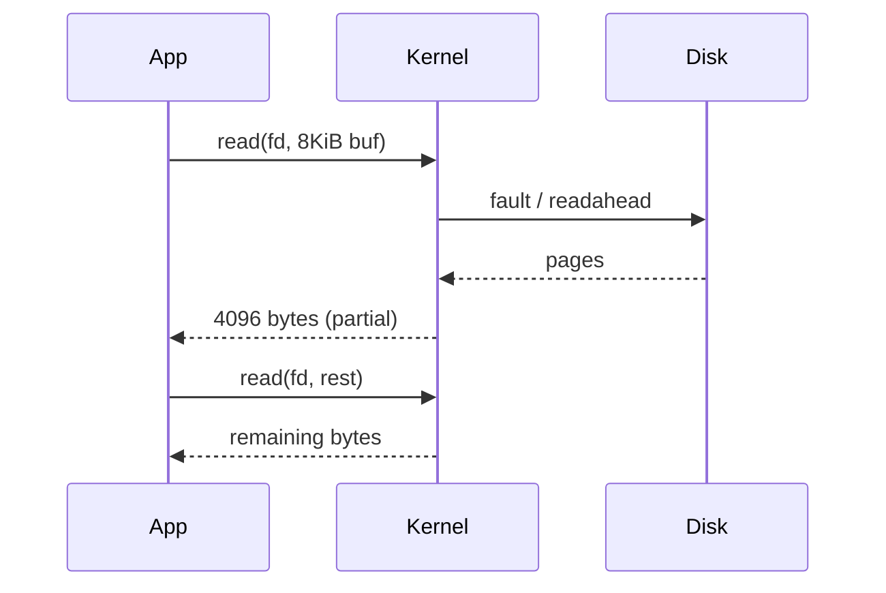

# Buffers Streams and Zero Copy

## Overview

Data rarely moves in one syscall from disk to wire. It passes through **buffers**: user-space arrays, stdio streams, kernel socket buffers, and page cache pages. A **stream** is an ordered byte sequence consumed incrementally — file read, TCP bytestream, HTTP body. **Zero-copy** techniques avoid redundant copies between kernel and user space (`sendfile`, `splice`, `mmap` + `write`, TLS offload) when semantics allow.

Optimizing I/O without understanding buffer boundaries leads to hidden copies, latency spikes, and memory bloat.

## Learning Objectives

- Trace bytes from disk → page cache → socket buffer → NIC
- Size user buffers for syscall amortization vs memory footprint
- Explain when zero-copy helps and when TLS/encryption forces copies
- Implement streaming parsers that handle partial chunks

## Prerequisites

- [[01-Computer-Science/06-IO-and-Persistence/Files as Abstractions|Files as Abstractions]]
- [[01-Computer-Science/03-Memory-and-Addressing/Memory Hierarchy Trade-offs|Memory Hierarchy Trade-offs]]

## Difficulty

`intermediate`

## Estimated Time

3 hours reading; 3–4 hours lab (streaming HTTP body + benchmark)

## History

Stdio buffering (1970s) reduced syscall overhead for line-oriented programs. Network stacks always buffered because MTU ≠ message size. Zero-copy APIs (`sendfile` Linux 2.2, `splice`) addressed web server's disk-to-socket paths. Modern languages expose streams (Node.js, Java NIO, Python io module) as idiomatic interfaces.

## Problem It Solves

Syscalls are expensive relative to memcpy at small sizes; unbuffered read/write loops waste CPU. Copying the same page user→kernel→user doubles memory bandwidth — critical at 10 Gbps+. Streams unify "unknown length" data (TCP, chunked HTTP) with backpressure.

## Internal Implementation

**User buffer**: typically 4 KiB–64 KiB per read. Each `read()` may copy from page cache into user buffer. **Socket send buffer**: kernel queues bytes until ACKed (TCP). **`sendfile(out_fd, in_fd)`**: kernel transfers page cache pages to socket without user-space buffer. **`mmap`**: maps file pages into address space; access faults populate TLB; may still copy on write to socket unless zero-copy path exists.

Partial reads/writes are normal on nonblocking fds and pipes — loops must accumulate.



## Mermaid Diagrams

### Structure



### Sequence / Lifecycle



## Examples

### Minimal Example

TypeScript — accumulate until delimiter:

```typescript
import net from "node:net";

function createLineReader(onLine: (line: string) => void) {
  let buf = "";
  return (chunk: Buffer) => {
    buf += chunk.toString("utf8");
    let idx: number;
    while ((idx = buf.indexOf("\n")) >= 0) {
      onLine(buf.slice(0, idx));
      buf = buf.slice(idx + 1);
    }
  };
}
```

Python — binary stream read exact length:

```python
def read_exact(stream, n: int) -> bytes:
    parts = []
    while n > 0:
        chunk = stream.read(n)
        if not chunk:
            raise EOFError("short read")
        parts.append(chunk)
        n -= len(chunk)
    return b"".join(parts)
```

### Production-Shaped Example

Static file server path: `open` → `sendfile` (or Node `fs.createReadStream().pipe(res)` which uses efficient kernel paths when possible). Add: `Content-Length`, range requests, backpressure when `write` returns false, abort on client disconnect. TLS terminates zero-copy benefits — see [[01-Computer-Science/07-Networking-Fundamentals/TLS Concepts|TLS Concepts]].

## Trade-offs

| Dimension | Upside | Downside | When it matters |
| --- | --- | --- | --- |
| Performance | Larger buffers → fewer syscalls | Memory per connection; latency for first byte | CDN, file servers |
| Complexity | Streams handle partial data | Parser state machines required | Protocol gateways |
| Operability | Zero-copy visible in `perf`/flamegraphs | TLS and transformation break assumptions | High bandwidth egress |

### When to Use

- File-to-network static content
- Streaming API responses and log tailing
- Pipelines where producer rate ≠ consumer rate (backpressure)

### When Not to Use

- Small messages where syscall cost is noise
- When you must inspect/transform every byte in user space (compression, auth tagging)

## Exercises

1. Benchmark 1 GiB file send: 512 B vs 64 KiB user buffers — plot throughput.
2. Implement HTTP/1.0 response with `Content-Length`; handle client closing mid-body.
3. Explain why `buf += chunk` in a hot loop is problematic in TS — refactor to Buffer list.

## Mini Project

**Streaming framed protocol**: length-prefix frames over TCP, dual TS/Python, property tests for random chunk boundaries splitting frames.

## Portfolio Project

Integrate zero-copy static asset path and buffer-pool allocator into the protocol workbench; compare CPU at 1 Gbps with/without TLS.

## Interview Questions

1. Why do TCP reads often return less than the requested buffer size?
2. What does zero-copy mean if TLS still encrypts in user space?
3. How does backpressure propagate in a `readStream.pipe(writeStream)` chain?

### Stretch / Staff-Level

1. Design a buffer pool for a proxy handling 100k connections without GC churn in a managed runtime.

## Common Mistakes

- Assuming one `read()` fills the buffer
- Unbounded in-memory aggregation of streaming bodies (OOM)
- String concatenation for binary protocols

## Best Practices

- Use byte buffers / bytearray for binary; decode at boundaries
- Cap maximum frame/body size before parsing
- Monitor send buffer saturation and write blocked time

## Summary

Buffers amortize syscall cost; streams model partially available data over time. Zero-copy avoids redundant moves between kernel subsystems when data is not transformed in user space. Production network code must handle partial I/O, enforce backpressure, and know where copies reappear (TLS, compression). Labs: [[01-Computer-Science/code/README|code labs]] `runtime` and `framing`.

## Further Reading

- Linux `man 2 sendfile`, `man 2 splice`
- Node.js stream documentation (backpressure)
- *Systems Performance* — memory and I/O chapters

## Related Notes

- [[01-Computer-Science/06-IO-and-Persistence/Blocking Nonblocking and Multiplexed IO|Blocking Nonblocking and Multiplexed IO]]
- [[01-Computer-Science/07-Networking-Fundamentals/HTTP as a Protocol|HTTP as a Protocol]]
- [[01-Computer-Science/07-Networking-Fundamentals/TLS Concepts|TLS Concepts]]
- [[01-Computer-Science/code/README|code labs]]

## Progress Checklist

- [ ] Explained from first principles
- [ ] Drew at least one Mermaid diagram
- [ ] Implemented a minimal version
- [ ] Documented trade-offs and non-goals
- [ ] Completed exercises
- [ ] Practiced interview questions aloud
- [ ] Linked prerequisites and dependents
