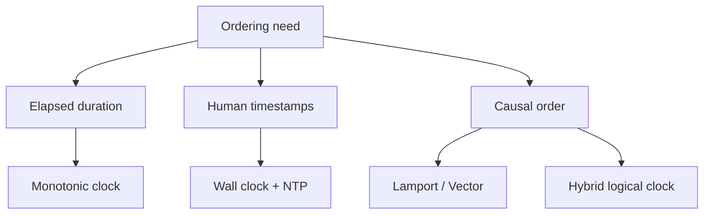
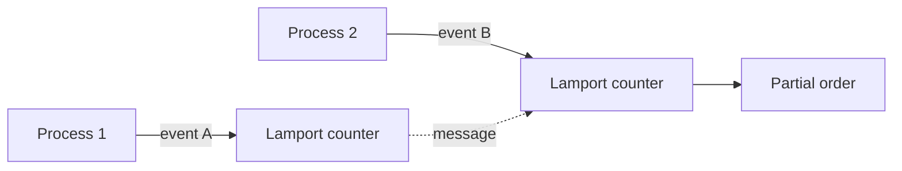

# Clocks Time and Ordering

## Overview

**Time** in computer systems is not one thing. **Wall-clock time** (`2026-07-21T14:00:00Z`) can jump backward after NTP adjustment. **Monotonic clocks** (`CLOCK_MONOTONIC`) measure elapsed duration but are not comparable across machines. **Logical ordering** (Lamport timestamps, vector clocks) captures causality without trusting synchronized physical clocks.

Distributed systems cannot infer "happened before" from timestamps alone — a foundation for [[09-System-Design/README|System Design]] and database isolation.

## Learning Objectives

- Choose wall vs monotonic vs logical clocks for metrics, TTLs, and timeouts
- Explain why `Date.now()` is unsafe for measuring elapsed time and sometimes for ordering
- Sketch Lamport and vector clock rules for causal events
- Identify clock skew impact on lease expiration and distributed locks

## Prerequisites

- [[01-Computer-Science/04-Processes-and-Execution/Processes|Processes]]
- [[01-Computer-Science/05-Concurrency-Fundamentals/Race Conditions|Race Conditions]]

## Difficulty

`advanced`

## Estimated Time

3 hours reading; 2 hours exercises (skew simulation)

## History

Lamport (1978) defined "happened-before" for distributed systems without assuming sync clocks. Google Spanner (2012) uses TrueTime (GPS + atomic) with bounded uncertainty — expensive. Most services use NTP (ms–s skew) plus logical IDs for ordering.

## Problem It Solves

Programs need durations (timeouts), deadlines, and event ordering. Physical clocks drift and jump; multi-node logs sorted by timestamp lie about causality. Explicit clock semantics prevent subtle bugs in caching, replication, and security (token expiry).

## Internal Implementation

**NTP** steers wall clock gradually (slew) or steps abruptly. **TSC** (timestamp counter) is fast but was historically unsynchronized across cores — modern OS may stabilize. **Hybrid Logical Clocks** (HLC) combine physical time with logical counter for readable roughly-sorted IDs.

Happened-before: if A and B touch same memory in one process, or send/receive on a channel, order is defined. Concurrent events are incomparable — timestamps cannot resolve them reliably.



## Mermaid Diagrams

### Structure



### Sequence / Lifecycle

```mermaid
sequenceDiagram
    participant A as Node A
    participant B as Node B
    A->>A: write x=1 (t=100)
    B->>B: write x=2 (t=99 wall skew)
    Note over A,B: Wall time says B first; causality unknown without sync protocol
    A->>B: msg with Lamport ts
    B->>B: update local Lamport max+1
```

## Examples

### Minimal Example

TypeScript — always measure duration with monotonic:

```typescript
const start = performance.now(); // monotonic in modern Node/browsers
await work();
console.log(`elapsed ms=${performance.now() - start}`);
// Do NOT use Date.now() for benchmark duration
```

Python:

```python
import time

start = time.monotonic()
# ... work ...
print(f"elapsed={time.monotonic() - start:.3f}s")
# time.time() is wall clock — can jump
```

### Production-Shaped Example

Lease with **fencing token**: monotonic counter incremented at each grant; storage rejects writes with stale token even if wall-clock lease appears valid after skew.

```python
class LeaseStore:
    def __init__(self):
        self.fence = 0
        self.holder = None

    def grant(self, client: str) -> int:
        self.fence += 1
        self.holder = client
        return self.fence

    def write(self, client: str, token: int, data: bytes) -> bool:
        if client != self.holder or token < self.fence:
            return False  # stale lease
        # apply write
        return True
```

## Trade-offs

| Dimension | Upside | Downside | When it matters |
| --- | --- | --- | --- |
| Performance | Monotonic reads are cheap | Vector clocks grow with nodes | Wide event tracing |
| Complexity | Wall clock human-readable | Skew breaks naive TTL/sort | Multi-region logs |
| Operability | NTP fixes drift slowly | Leap seconds, VM time jump | Billing, auth expiry |

### When to Use

- Monotonic: timeouts, latency histograms, rate limit windows
- Wall + UTC: user-visible timestamps (always store timezone/UTC)
- Logical: debugging causality, CRDTs, ordered event logs without strong sync

### When Not to Use

- Wall clock for cross-node "happened before" without sync bounds
- System clock for crypto expiry without leeway ([[18-Security/README|Security]])

## Exercises

1. Simulate 500 ms clock skew: show two nodes disagree on event order sorted by timestamp.
2. Implement Lamport timestamps for three processes exchanging messages; verify happened-before implies timestamp order.
3. Audit a codebase for `Date.now()` in timeout logic — classify safe vs unsafe.

## Mini Project

**Causal logger**: processes emit events with vector clocks; merge into partial-order visualization (Graphviz/Mermaid export).

## Portfolio Project

Add hybrid timestamps to workbench distributed simulation; inject NTP step and measure false ordering rate.

## Interview Questions

1. Monotonic vs wall clock — when would you use each?
2. Can two events have the same Lamport timestamp yet be concurrent?
3. Why do distributed locks need fencing tokens?

### Stretch / Staff-Level

1. Explain TrueTime's `commit wait` and its latency cost — when is it worth it?

## Common Mistakes

- Using wall clock for performance measurement
- Assuming UUID v4 time-sortable
- TTL leases without skew margin or fencing

## Best Practices

- Store UTC; convert at display
- Document clock source in metrics (NTP sync status)
- Use logical sequence for primary ordering; wall time as hint only

## Summary

Physical clocks measure civil time and drift; monotonic clocks measure elapsed intervals on one machine; logical clocks capture causality across machines. Production bugs arise when code conflates them — especially in timeouts, logging, and distributed coordination. Deeper distributed time and consistency live in [[09-System-Design/README|System Design]]; database snapshot isolation in [[08-Databases/README|Databases]].

## Further Reading

- Lamport, "Time, Clocks, and the Ordering of Events in a Distributed System"
- Google Spanner paper (TrueTime)
- *DDIA* — ordering and timestamps chapter

## Related Notes

- [[01-Computer-Science/06-IO-and-Persistence/Durability and Crash Consistency|Durability and Crash Consistency]]
- [[01-Computer-Science/09-Correctness-and-Reliability/Failure Modes and Fault Models|Failure Modes and Fault Models]]
- [[09-System-Design/README|System Design]] — distributed latency and ordering
- [[01-Computer-Science/code/README|code labs]]

## Progress Checklist

- [ ] Explained from first principles
- [ ] Drew at least one Mermaid diagram
- [ ] Implemented a minimal version
- [ ] Documented trade-offs and non-goals
- [ ] Completed exercises
- [ ] Practiced interview questions aloud
- [ ] Linked prerequisites and dependents
