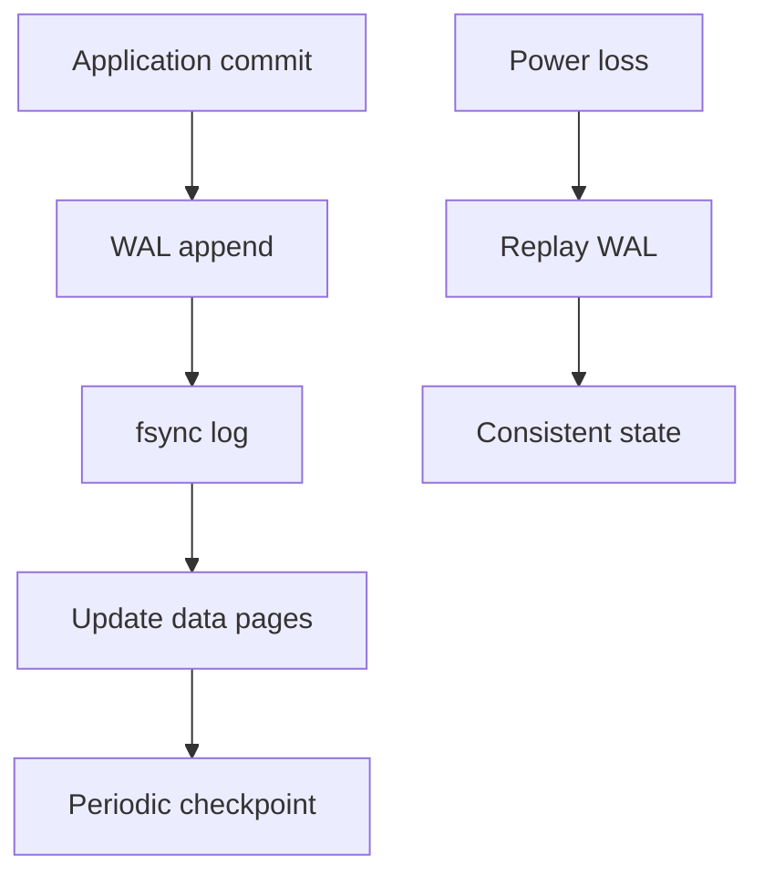
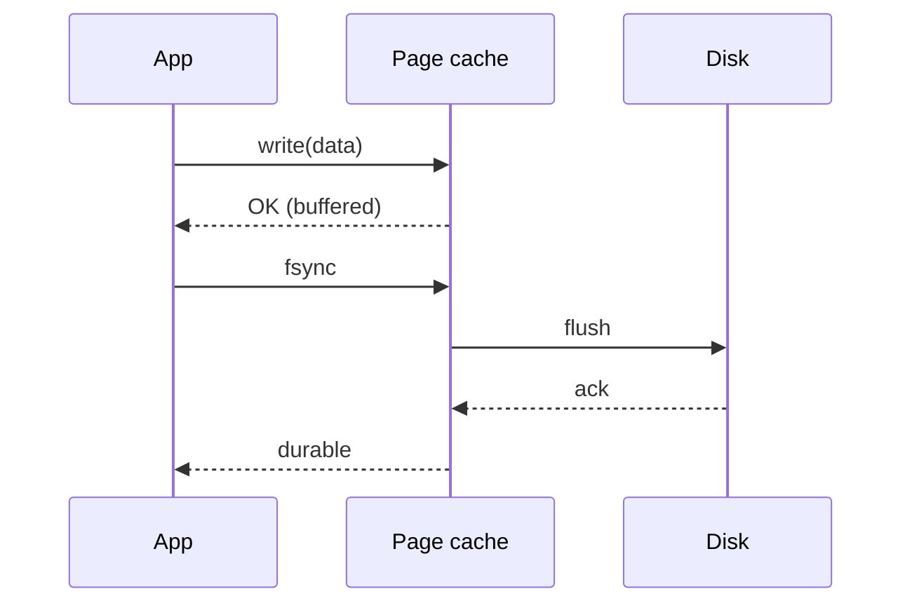

# Durability and Crash Consistency

## Overview

**Durability** means committed data survives power loss. **Crash consistency** means after restart, storage reflects a coherent state — not torn writes, half-updated metadata, or orphan blocks. Applications interact with **page cache**: `write()` may return before bits hit disk. Boundaries are `fsync`/`fdatasync`, `msync` for mmap, and filesystem-specific guarantees.

Databases push durability further with write-ahead logs (WAL), doublewrite buffers, and checkpointing — hand off to [[08-Databases/README|Databases]] for production depth.

## Learning Objectives

- Explain the gap between `write()` return and durable storage
- Compare single-file update strategies: in-place, journal, copy-on-write, temp+rename
- Define idempotency and replay for recovery after crash
- Recognize fsync latency as a tail-latency driver in sync replication

## Prerequisites

- [[01-Computer-Science/06-IO-and-Persistence/Files as Abstractions|Files as Abstractions]]
- [[01-Computer-Science/06-IO-and-Persistence/Clocks Time and Ordering|Clocks Time and Ordering]]

## Difficulty

`advanced`

## Estimated Time

4 hours reading; 4–6 hours mini project (WAL segment)

## History

Early filesystems assumed rare crashes; ext2 could corrupt on power loss. Journaling (ext3, 2001) and copy-on-write (ZFS, btrfs) traded metadata complexity for recoverability. Database WAL predates them (System R, 1970s). SSDs added FTL wear leveling — durability semantics still end at flush commands.

## Problem It Solves

Without explicit durability boundaries, "success" responses lie: clients believe data is safe when it exists only in RAM. Crash consistency protocols define which states are legal after reboot and how to replay or roll back.

## Internal Implementation

**Writeback cache**: dirty pages flushed asynchronously by `pdflush`/kernel threads. **`fsync(fd)`**: orders persistence for that file's data and usually metadata. **Torn page**: storage sector partially written (512 B–4 KiB mismatch with app page size). **Atomic rename** on same filesystem: new inode visible or old remains — not both.

WAL pattern: append log record → fsync log → apply to data pages → checkpoint. Recovery replays log from last consistent checkpoint.



## Mermaid Diagrams

### Structure

```mermaid
flowchart LR
    Durability[Durability] --> AppPolicy[Application fsync policy]
    Durability --> FS[Filesystem journal/COW]
    Durability --> DB[WAL + replication]
    AppPolicy --> SingleFile[temp + rename]
    DB --> Handoff[[08-Databases/README|Databases]]
```

### Sequence / Lifecycle



## Examples

### Minimal Example

TypeScript:

```typescript
import { open, write, fsync, close } from "node:fs/promises";

async function durableAppend(path: string, line: string) {
  const fh = await open(path, "a");
  await write(fh, line + "\n");
  await fh.sync(); // fsync equivalent
  await fh.close();
}
```

Python:

```python
import os

def durable_append(path: str, line: str) -> None:
    fd = os.open(path, os.O_WRONLY | os.O_APPEND | os.O_CREAT, 0o644)
    os.write(fd, (line + "\n").encode())
    os.fsync(fd)
    os.close(fd)
```

### Production-Shaped Example

Config update pattern:

```python
import os, tempfile

def atomic_replace(path: str, data: bytes) -> None:
    dir_name = os.path.dirname(path) or "."
    fd, tmp = tempfile.mkstemp(dir=dir_name)
    try:
        os.write(fd, data)
        os.fsync(fd)
        os.replace(tmp, path)
        dir_fd = os.open(dir_name, os.O_DIRECTORY)
        os.fsync(dir_fd)  # persist directory entry on some FS
        os.close(dir_fd)
    finally:
        os.close(fd)
```

## Trade-offs

| Dimension | Upside | Downside | When it matters |
| --- | --- | --- | --- |
| Performance | Buffered writes fast | fsync serializes disk; high ms spikes | Sync API design |
| Complexity | temp+rename simple for one file | Multi-file invariants need WAL | Config, sqlite, ledger |
| Operability | Clear commit points | SSD/HDD/fs-specific behavior | On-call data loss incidents |

### When to Use

- Financial commits, audit logs, idempotency keys
- Single-file config/state with atomic replace
- Embedded stores (SQLite) with explicit transaction API

### When Not to Use

- Ephemeral cache where recomputation is cheap
- When a database already owns consistency ([[08-Databases/README|Databases]])

## Exercises

1. Kill -9 a writer mid-append; classify tail corruption vs clean truncate.
2. Benchmark commits/sec with fsync every write vs group commit batch of 100.
3. Write invariants for a two-file update; show crash violating them without WAL.

## Mini Project

**Mini WAL**: append-only log with record types `PUT key value`, `DELETE key`, checkpoint marker; recovery rebuilds in-memory map; crash injection tests.

## Portfolio Project

Durable command log for the concurrent workbench with snapshot + replay; document fsync policy and measured p99 commit latency.

## Interview Questions

1. Does `write()` returning mean data is on disk?
2. Why temp-file + rename + fsync for config updates?
3. What is a torn write and how do databases mitigate it?

### Stretch / Staff-Level

1. Compare durability of single-region fsync vs quorum replication in [[09-System-Design/README|System Design]] — when does each fail?

## Common Mistakes

- Calling `flush()` on language streams without fsync
- Renaming without fsync on file and directory
- Assuming cross-file atomicity from filesystem

## Best Practices

- One clear "commit" API that fsyncs or delegates to DB transaction
- Crash-recovery tests in CI (kill -9, power-loss simulators where available)
- Document RPO/RTO for each durable component

## Summary

Durability requires explicit flush boundaries; crash consistency requires legal states and recovery rules. Page cache makes `write()` fast but misleading. Production systems use WAL, atomic rename, and database transactions — each with fsync cost and tail latency. Deep persistence belongs in [[08-Databases/README|Databases]]; here you learn the file-level primitives those systems build on.

## Further Reading

- SQLite write-ahead logging documentation
- *DDIA* Ch. 3 — storage and retrieval
- Linux `man 2 fsync`, `man 2 sync_file_range`

## Related Notes

- [[01-Computer-Science/06-IO-and-Persistence/Files as Abstractions|Files as Abstractions]]
- [[01-Computer-Science/06-IO-and-Persistence/Clocks Time and Ordering|Clocks Time and Ordering]]
- [[08-Databases/README|Databases]] — WAL, replication, isolation
- [[01-Computer-Science/code/README|code labs]] — `framing` checksum records

## Progress Checklist

- [ ] Explained from first principles
- [ ] Drew at least one Mermaid diagram
- [ ] Implemented a minimal version
- [ ] Documented trade-offs and non-goals
- [ ] Completed exercises
- [ ] Practiced interview questions aloud
- [ ] Linked prerequisites and dependents
