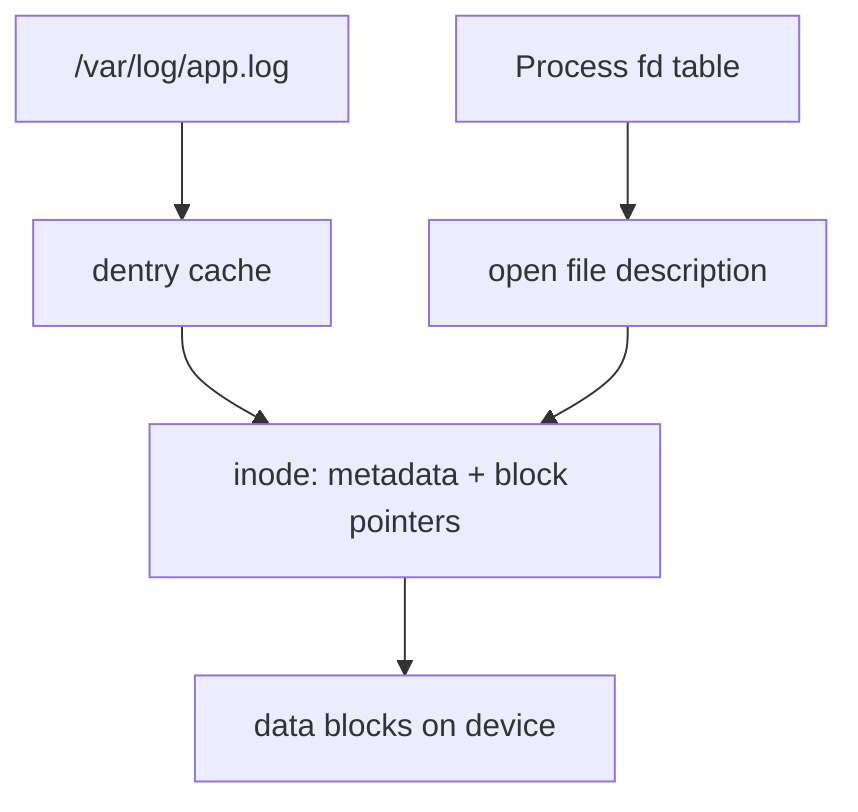
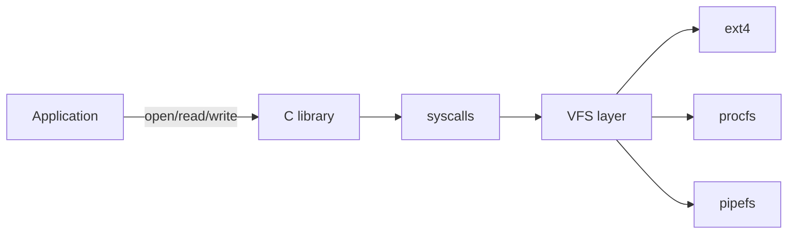
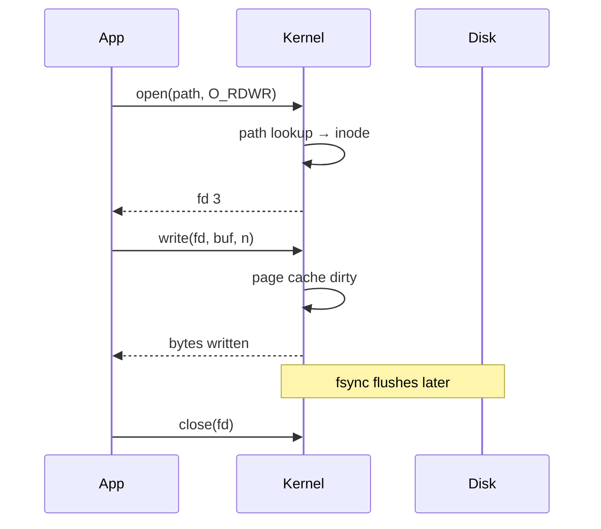

# Files as Abstractions

## Overview

A **file** in Unix-like systems is not merely "bytes on disk." It is a kernel-mediated **byte stream** accessed through a small integer **file descriptor** (fd). The Virtual File System (VFS) unifies regular files, directories, pipes, sockets, and devices behind `open`, `read`, `write`, `close`, and `seek`. Pathnames resolve to **inodes** (metadata + data block pointers); processes hold independent **open file descriptions** (offset, flags) that may share an inode.

Understanding this separation explains append behavior, hard links, deleted-but-open files, and why "save" is not one atomic syscall.

## Learning Objectives

- Map pathnames → dentry → inode → data blocks
- Explain how file descriptors, open file tables, and inode tables differ
- Predict behavior of `write`, `rename`, and `unlink` under crash and concurrency
- Use file abstractions correctly for logs, configs, and IPC

## Prerequisites

- [[01-Computer-Science/04-Processes-and-Execution/System Calls|System Calls]]
- [[01-Computer-Science/03-Memory-and-Addressing/Virtual Memory|Virtual Memory]]

## Difficulty

`intermediate`

## Estimated Time

2–3 hours reading; 2 hours exercises (strace/lsof experiments)

## History

Early OSes exposed device-specific record formats. Unix (1970s) unified I/O via fds and "everything is a file," simplifying pipes and redirection. The VFS layer (1980s–90s) let Linux mount ext4, procfs, and NFS with one API. Windows uses handles with a different model but similar stream abstraction in the C runtime.

## Problem It Solves

Programs need a stable interface to persistent and inter-process byte channels without knowing whether backing store is SSD, network FS, or memory. Fds plus a small syscall set enable shell redirection, logging, and socket uniformity.

## Internal Implementation

**Path resolution**: walk directory inodes; each directory maps names → inode numbers. **Inode** stores mode, ownership, timestamps, size, and block map (direct + indirect blocks). **Fd table** (per process) points to **open file description** (offset, access mode, status flags). Two fds from `dup` share offset; two opens of same path may not.

Regular file reads block until data is paged in; writes may go to page cache first (see [[01-Computer-Science/06-IO-and-Persistence/Durability and Crash Consistency|Durability and Crash Consistency]]).



## Mermaid Diagrams

### Structure



### Sequence / Lifecycle



## Examples

### Minimal Example

TypeScript (Node fs promises):

```typescript
import { open, read, close } from "node:fs/promises";

const fh = await open("sample.txt", "r");
const buf = Buffer.alloc(64);
const { bytesRead } = await fh.read(buf, 0, 64, 0);
await fh.close();
console.log(buf.subarray(0, bytesRead).toString());
```

Python:

```python
with open("sample.txt", "rb") as f:
    chunk = f.read(64)
print(chunk)
```

### Production-Shaped Example

Log rotation with append-only writes, `O_APPEND` so concurrent writers share kernel offset atomically, and explicit `fsync` policy for audit logs:

```python
import os

fd = os.open("/var/log/app.log", os.O_WRONLY | os.O_APPEND | os.O_CREAT, 0o644)
os.write(fd, b"2026-07-21T12:00:00Z event=login user=42\n")
os.fsync(fd)  # durability boundary — see durability note
os.close(fd)
```

## Trade-offs

| Dimension | Upside | Downside | When it matters |
| --- | --- | --- | --- |
| Performance | Page cache accelerates reads | Surprise memory use; flush semantics unclear | High-throughput logs |
| Complexity | Uniform fd API | Path vs fd confusion; Windows differences | Cross-platform tools |
| Operability | `lsof`, `strace` debuggable | Network FS latency opaque | Incidents on NFS/EFS |

### When to Use

- Sequential logs, config files, local artifact storage
- Pipes and unix domain sockets for same-host IPC
- Memory-mapped files for read-heavy workloads (with care)

### When Not to Use

- Fine-grained structured queries → use a database ([[08-Databases/README|Databases]])
- Large shared mutable state without locking → use DB or object store with versioning
- Latency-sensitive cross-region data → not a local file problem

## Exercises

1. Open the same file twice; write via fd A, read offset via fd B — explain offset independence.
2. `unlink` a file while a process keeps it open; continue writing — where do bytes go?
3. Use `strace -e openat,write,fsync` on a program and annotate each syscall's effect on cache vs disk.

## Mini Project

Implement a **append-only commit log** file format: length-prefixed records, checksum per record, recovery scanner that skips partial tail record after crash.

## Portfolio Project

Add durable log segment management to the workbench project with rotation, fsync policy flags, and recovery tests.

## Interview Questions

1. What is the difference between an inode and a file descriptor?
2. Why does `O_APPEND` matter for multi-process logging?
3. A process still writes successfully after the file was unlinked — explain.

### Stretch / Staff-Level

1. Compare crash behavior of `rename` overwrite vs writing temp file + `fsync` + `rename` for config updates.

## Common Mistakes

- Assuming `write()` durability without `fsync`
- Using file locking inconsistently across Linux/macOS/Windows
- Treating directories as safely writable without atomic rename patterns

## Best Practices

- Use temp-file + fsync + atomic rename for config snapshots
- Document fsync intervals for any file claiming durability
- Separate hot log volumes from data volumes in production

## Summary

Files are kernel objects exposing byte streams through descriptors. Pathnames resolve to inodes; open state tracks offsets separately. Production file I/O requires understanding page cache, append semantics, and which syscalls form durability boundaries — topics deepened in [[01-Computer-Science/06-IO-and-Persistence/Durability and Crash Consistency|Durability and Crash Consistency]] and [[08-Databases/README|Databases]].

## Further Reading

- Linux `man 2 open`, `man 7 inode`, `man 2 rename`
- *Operating Systems: Three Easy Pieces*, persistence chapters
- [[10-Linux/04-Filesystems-Disks-and-IO/ext4 and XFS Operational Differences|ext4 and XFS Operational Differences]] for ext4/XFS ops

## Related Notes

- [[01-Computer-Science/06-IO-and-Persistence/Durability and Crash Consistency|Durability and Crash Consistency]]
- [[01-Computer-Science/06-IO-and-Persistence/Buffers Streams and Zero Copy|Buffers Streams and Zero Copy]]
- [[01-Computer-Science/04-Processes-and-Execution/System Calls|System Calls]]
- [[08-Databases/README|Databases]] — when files are not enough
- [[01-Computer-Science/code/README|code labs]]

## Progress Checklist

- [ ] Explained from first principles
- [ ] Drew at least one Mermaid diagram
- [ ] Implemented a minimal version
- [ ] Documented trade-offs and non-goals
- [ ] Completed exercises
- [ ] Practiced interview questions aloud
- [ ] Linked prerequisites and dependents
