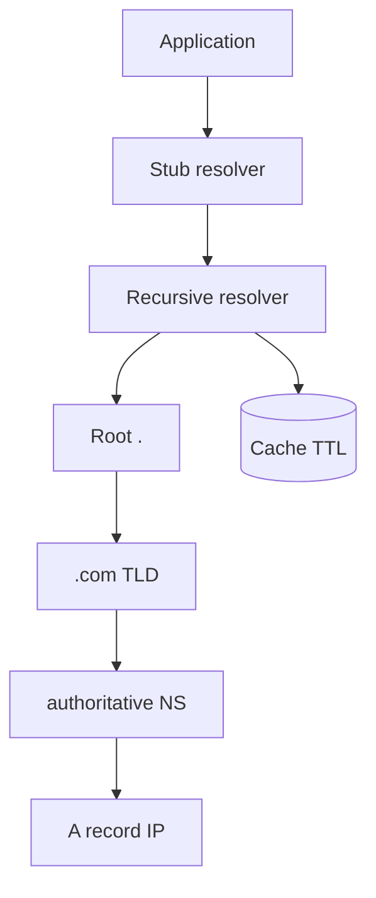
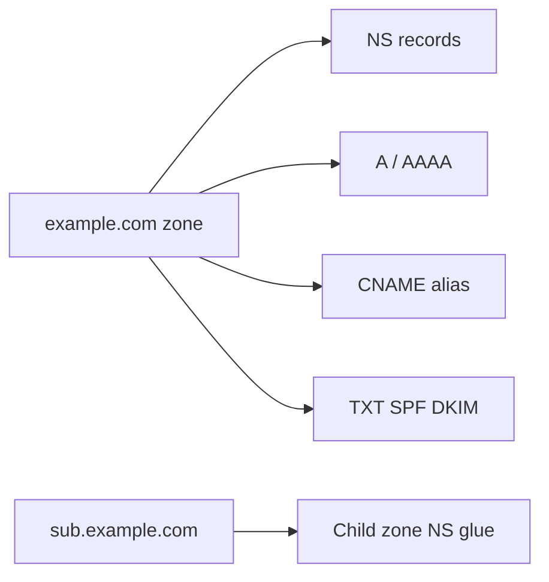
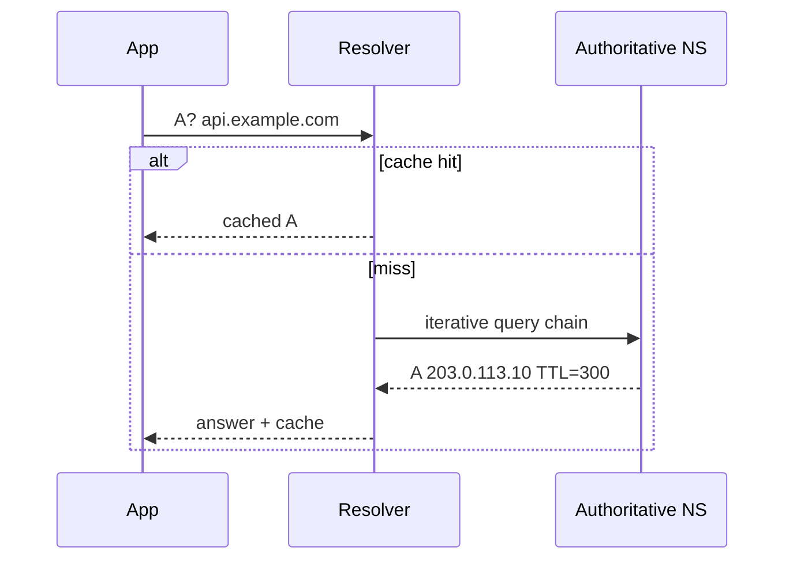

# DNS Fundamentals

## Overview

**DNS** maps human-readable names (`api.example.com`) to records: **A/AAAA** (addresses), **CNAME** (alias), **MX** (mail), **TXT** (verification), **NS** (delegation), **SRV**, etc. Resolution is hierarchical: root → TLD → authoritative nameserver. **Resolvers** (stub resolver in OS, recursive resolver at ISP/8.8.8.8/1.1.1.1) cache answers keyed by **TTL**.

DNS is a distributed database optimized for read-heavy, eventually consistent updates — not a real-time config service.

## Learning Objectives

- Trace recursive vs iterative resolution
- Explain TTL, caching, and negative caching (NXDOMAIN)
- Choose record types for common deployment patterns
- Recognize DNS as control plane (email auth, ACME, service discovery) and attack surface

## Prerequisites

- [[01-Computer-Science/07-Networking-Fundamentals/UDP|UDP]]
- [[01-Computer-Science/07-Networking-Fundamentals/TCP|TCP]]

## Difficulty

`intermediate`

## Estimated Time

3 hours reading; 1 hour survey exercises (dig traces)

## History

HOSTS.TXT (single file) did not scale. DNS (1983, Mockapetris) replaced it with hierarchy and caching. DNSSEC (2005+) adds authenticity; adoption remains partial. Cloud providers integrate DNS with anycast and health-checked routing.

## Problem It Solves

Humans and TLS certificates use names; IP addresses change. DNS decouples stable names from mutable infrastructure endpoints with delegated administration per zone.

## Internal Implementation

**Query flow**: app calls `getaddrinfo` → stub resolver → recursive resolver if cache miss → iterative queries from root hints → authoritative NS returns answer → cached until TTL expires.

**UDP 53** default; **TCP 53** for large responses/truncation. **EDNS0** enables larger payloads. **Round-robin** and **low TTL** enable crude failover; clients may ignore TTL floor.



## Mermaid Diagrams

### Structure



### Sequence / Lifecycle



## Examples

### Minimal Example

Survey with standard tools:

```bash
dig +trace api.example.com A
dig api.example.com AAAA
dig example.com NS
dig -x 203.0.113.10   # PTR reverse
```

TypeScript (Node resolver — survey, not custom DNS server):

```typescript
import { promises as dns } from "node:dns";

const addrs = await dns.resolve4("example.com");
console.log(addrs);
```

Python:

```python
import socket
print(socket.getaddrinfo("example.com", 443, proto=socket.IPPROTO_TCP))
```

### Production-Shaped Example

Blue/green deploy: lower TTL to 60s **before** cutover (plan ahead — old TTL still cached). Use **CNAME** to LB, not multiple A for app logic. **Split-horizon** internal vs external views for VPC. Operational depth: [[18-Security/README|Security]] (DNS hijacking), [[11-AWS/README|AWS]] Route53.

## Trade-offs

| Dimension | Upside | Downside | When it matters |
| --- | --- | --- | --- |
| Performance | Aggressive caching reduces load | Stale records after failover | Incidents, migrations |
| Complexity | Delegation scales orgs | Split brain, dangling NS | Multi-team domains |
| Operability | Universal tooling | Propagation delay misunderstood | "We changed DNS why no fix?" |

### When to Use

- Naming public and internal services
- TLS certificate validation (ACME DNS-01)
- Email authentication records

### When Not to Use

- Sub-second service discovery inside cluster (use SD mesh/etcd)
- Storing secrets in TXT records
- Strong consistency requirements without extra layer

## Exercises

1. Run `dig +trace` for a domain; list each hop and authority.
2. Given TTL 3600, explain worst-case client staleness after IP change.
3. Design records for: apex domain, www redirect, API subdomain, mail.

## Mini Project

**DNS cache simulator**: ingest timestamped queries with TTL; answer hits/misses; visualize stale reads during failover scenario.

## Portfolio Project

Document DNS runbook for workbench deploy: TTL plan, health checks, rollback.

## Interview Questions

1. Recursive vs authoritative resolver?
2. CNAME at zone apex — why problematic?
3. How does DNS relate to TLS certificate validation?

### Stretch / Staff-Level

1. Compare DNS-based global load balancing vs Anycast vs GeoDNS — failure modes?

## Common Mistakes

- Changing DNS expecting instant global effect
- CNAME chains and loops
- Ignoring negative caching duration

## Best Practices

- Runbook TTL lowering before migrations
- Monitor resolver latency and NXDOMAIN spikes
- Enable DNSSEC where provider supports; understand limits

## Summary

DNS is the Internet's naming layer: hierarchical zones, cached queries, record types pointing to infrastructure. It enables stable URLs and certificate identities but propagates slowly and caches aggressively — design failover and security assuming stale resolvers exist worldwide. Operations detail continues in [[18-Security/README|Security]] and cloud tracks.

## Further Reading

- RFC 1034, RFC 1035
- Cloudflare Learning Center — DNS
- `dig` / `drill` man pages

## Related Notes

- [[01-Computer-Science/07-Networking-Fundamentals/UDP|UDP]]
- [[01-Computer-Science/07-Networking-Fundamentals/TLS Concepts|TLS Concepts]]
- [[01-Computer-Science/07-Networking-Fundamentals/HTTP as a Protocol|HTTP as a Protocol]]
- [[07-Backend/README|Backend]] — service URLs and health
- [[01-Computer-Science/code/README|code labs]]

## Progress Checklist

- [ ] Explained from first principles
- [ ] Drew at least one Mermaid diagram
- [ ] Implemented a minimal version
- [ ] Documented trade-offs and non-goals
- [ ] Completed exercises
- [ ] Practiced interview questions aloud
- [ ] Linked prerequisites and dependents
