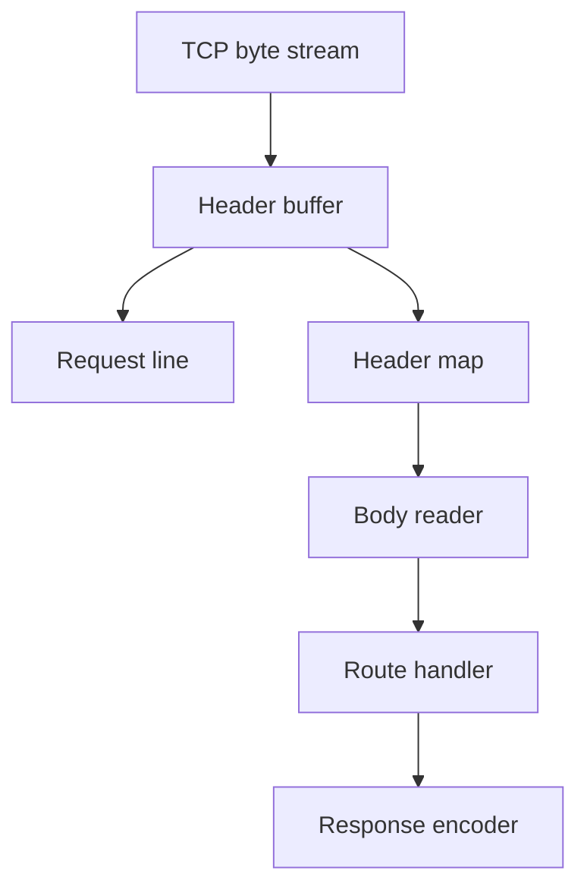
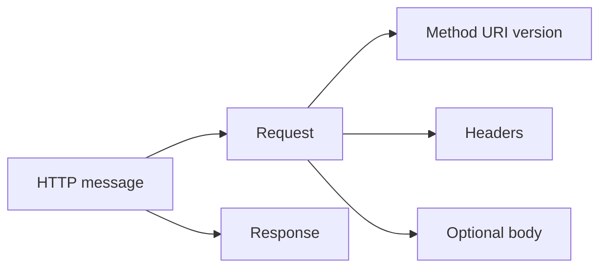
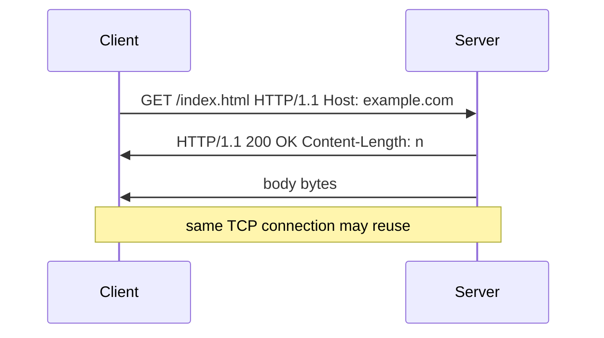

# HTTP as a Protocol

## Overview

**HTTP** is an application-layer **request/response** protocol over TCP (or QUIC for HTTP/3). Messages consist of start line (`GET /path HTTP/1.1`), headers (key: value), blank line, optional body. **Methods** (GET, POST, PUT, PATCH, DELETE, HEAD, OPTIONS) express intent; **status codes** (2xx success, 4xx client error, 5xx server error) classify outcomes. **HTTP/1.1** uses text headers and persistent connections; **HTTP/2** multiplexes binary frames; **HTTP/3** uses QUIC.

This note covers protocol mechanics — product API design lives in [[07-Backend/README|Backend]].

## Learning Objectives

- Parse HTTP/1.1 requests manually from a TCP byte stream
- Explain idempotency and safety of common methods
- Describe connection reuse, Content-Length, chunked encoding, and timeouts
- Contrast HTTP/1.1 head-of-line blocking vs HTTP/2 streams

## Prerequisites

- [[01-Computer-Science/07-Networking-Fundamentals/TCP|TCP]]
- [[01-Computer-Science/07-Networking-Fundamentals/Sockets Programming Model|Sockets Programming Model]]

## Difficulty

`intermediate`

## Estimated Time

4 hours reading; 4 hours dual-language parser lab

## History

HTTP/0.9 (1991) single GET. HTTP/1.0 added headers and POST. HTTP/1.1 (1997) keep-alive, Host header, chunked transfer. HTTP/2 (2015) binary multiplexing. HTTP/3 (2022) QUIC transport. REST (Fielding) popularized resource-oriented usage patterns — not a separate protocol.

## Problem It Solves

Interoperable hypermedia and APIs across languages and organizations need a text-friendly, cacheable, extensible application protocol decoupled from HTML specifically.

## Internal Implementation

**Parsing**: accumulate bytes until `\r\n\r\n`, parse headers case-insensitively, determine body length via `Content-Length` or `Transfer-Encoding: chunked`. **Persistence**: default keep-alive on 1.1 — multiple requests per TCP connection. **Pipelining** rarely used; HOL blocking led to domain sharding then HTTP/2.

**Caching**: `Cache-Control`, `ETag`, `If-None-Match` — validators prevent stale data.



## Mermaid Diagrams

### Structure



### Sequence / Lifecycle



## Examples

### Minimal Example

TypeScript — manual HTTP/1.0 GET over socket:

```typescript
import net from "node:net";

function httpGet(host: string, path: string): Promise<string> {
  return new Promise((resolve, reject) => {
    let raw = "";
    const sock = net.createConnection({ host, port: 80 }, () => {
      sock.write(`GET ${path} HTTP/1.0\r\nHost: ${host}\r\n\r\n`);
    });
    sock.on("data", (c) => (raw += c.toString("utf8")));
    sock.on("end", () => resolve(raw));
    sock.on("error", reject);
  });
}
```

Python — minimal parser core:

```python
def parse_request_head(data: bytes) -> tuple[str, str, dict[str, str], int]:
    header_end = data.find(b"\r\n\r\n")
    if header_end < 0:
        raise ValueError("incomplete headers")
    head = data[:header_end].decode("iso-8859-1")
    lines = head.split("\r\n")
    method, path, _version = lines[0].split(" ", 2)
    headers: dict[str, str] = {}
    for line in lines[1:]:
        k, v = line.split(":", 1)
        headers[k.strip().lower()] = v.strip()
    body_start = header_end + 4
    return method, path, headers, body_start
```

### Production-Shaped Example

Tiny server: enforce max header size, request timeout, return 400 on bad syntax, 413 on oversized body, structured access logs (method, path, status, duration). Map routes — product patterns in [[07-Backend/README|Backend]]. Full lab: [[01-Computer-Science/code/README|code labs]] `runtime` HTTP parser.

## Trade-offs

| Dimension | Upside | Downside | When it matters |
| --- | --- | --- | --- |
| Performance | Keep-alive amortizes TCP | HOL on lossy links (H1) | Mobile APIs |
| Complexity | Human-readable | Parsing edge cases abundant | Security gateways |
| Operability | Universal tooling | Version/cipher stack complex with TLS | Edge debugging |

### When to Use

- Browser-facing and public APIs (often with TLS)
- Cacheable document transfer
- Webhooks and integrations

### When Not to Use

- Ultra-low-latency internal RPC needing streaming both ways — consider gRPC/QUIC ([[07-Backend/README|Backend]])
- Binary telemetry at firehose rates — custom UDP/Kafka

## Exercises

1. Implement parser returning method, path, headers; test chunked body decoding.
2. Classify methods: safe/idempotent matrix for GET/POST/PUT/DELETE/PATCH.
3. Explain why duplicate `Content-Length` headers are dangerous.

## Mini Project

**HTTP/1.0 static file server** with directory traversal protection, MIME map, and 405 on wrong methods — TS + Python parity tests.

## Portfolio Project

Extend workbench HTTP module to HTTP/1.1 keep-alive and basic `Connection: close` handling.

## Interview Questions

1. Difference between HTTP and HTTPS at protocol level?
2. How do you message-boundary HTTP on a TCP stream?
3. 401 vs 403 vs 404 — protocol semantics?

### Stretch / Staff-Level

1. Design rate limiting that respects `Retry-After` and idempotent retries.

## Common Mistakes

- Assuming one read equals one HTTP message
- Ignoring `Host` header in virtual hosting
- POST retry without idempotency keys

## Best Practices

- Set timeouts on entire request parse + handler
- Limit header and body sizes early
- Use structured status codes; problem details (RFC 7807) at API layer

## Summary

HTTP frames application semantics on reliable transport: parsed messages with methods, status, headers, and bodies. Production servers must handle streaming parse, keep-alive, and abuse limits before frameworks add routing and auth — product concerns in [[07-Backend/README|Backend]], implementation in [[01-Computer-Science/code/README|code labs]].

## Further Reading

- RFC 9110 (HTTP semantics)
- RFC 9112 (HTTP/1.1)
- MDN HTTP documentation

## Related Notes

- [[01-Computer-Science/07-Networking-Fundamentals/TLS Concepts|TLS Concepts]]
- [[01-Computer-Science/07-Networking-Fundamentals/Latency Bandwidth Throughput and Tail Latency|Latency Bandwidth Throughput and Tail Latency]]
- [[07-Backend/README|Backend]] — REST design, middleware, frameworks
- [[01-Computer-Science/code/README|code labs]] — `runtime`

## Progress Checklist

- [ ] Explained from first principles
- [ ] Drew at least one Mermaid diagram
- [ ] Implemented a minimal version
- [ ] Documented trade-offs and non-goals
- [ ] Completed exercises
- [ ] Practiced interview questions aloud
- [ ] Linked prerequisites and dependents
