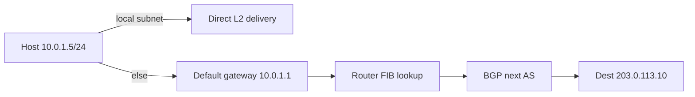
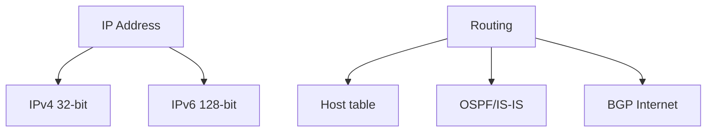
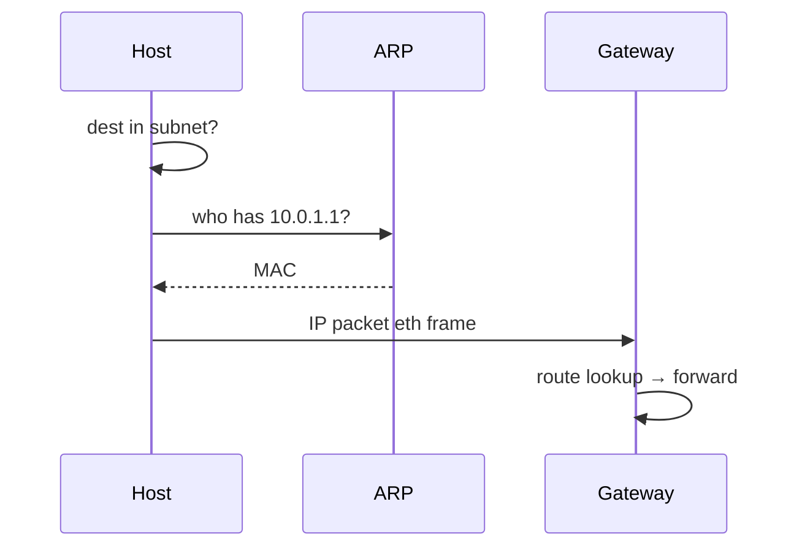

# IP Addressing and Routing

## Overview

**IP addresses** identify interfaces on an internetwork. **IPv4** uses 32-bit addresses (e.g., `203.0.113.10`); **IPv6** uses 128-bit addresses with simplified header and larger address space. **CIDR** (`/24`, `/64`) defines prefix-based subnets. **Routing** selects next-hop paths: host routes, default gateway, interior (OSPF) and exterior (**BGP**) protocols between autonomous systems.

IP is **best-effort**: packets may reorder, duplicate, or drop — reliability is TCP's job.

## Learning Objectives

- Convert between CIDR notation, netmask, and usable host ranges
- Explain longest-prefix match in a routing table
- Distinguish private vs public address space and NAT's role
- Trace path from laptop to server through ARP, gateway, and BGP (conceptually)

## Prerequisites

- [[01-Computer-Science/07-Networking-Fundamentals/Layered Network Models|Layered Network Models]]

## Difficulty

`intermediate`

## Estimated Time

3 hours reading; 2 hours subnetting exercises

## History

IPv4 (1981) exhausted public space by 2010s — NAT prolonged life. CIDR (1993) replaced classful A/B/C. IPv6 (1998+) adds address space and removes NAT dependency in theory; dual-stack remains common. BGP (1989) scales Internet inter-domain routing despite well-known misconfiguration incidents.

## Problem It Solves

Global delivery needs hierarchical addressing so routers aggregate prefixes instead of per-host tables. Subnets localize broadcast domains (IPv4 ARP) and administrative boundaries in datacenters and VPCs.

## Internal Implementation

**Host send decision**: if dest is on local subnet (mask match), ARP/NDP resolves MAC; else packet to default gateway MAC with dest IP unchanged. **Router**: decrements TTL, longest-prefix match on FIB, forward to next hop. **NAT** rewrites src IP/port on egress and maintains conntrack table — breaks end-to-end unless paired with protocols designed for it.



## Mermaid Diagrams

### Structure



### Sequence / Lifecycle



## Examples

### Minimal Example

CIDR calculation:

```text
Network: 192.168.10.0/26
Mask:    255.255.255.192  (64 addresses)
Hosts:   192.168.10.1 – 192.168.10.62
Broadcast: 192.168.10.63
```

Check local subnet (Python):

```python
import ipaddress

net = ipaddress.ip_network("10.0.1.0/24")
host = ipaddress.ip_address("10.0.1.50")
print(host in net)  # True
```

TypeScript (Node):

```typescript
import { isIPv4 } from "node:net";

function parseCidr(cidr: string): { base: string; prefix: number } {
  const [base, prefix] = cidr.split("/");
  if (!isIPv4(base)) throw new Error("invalid");
  return { base, prefix: Number(prefix) };
}
```

### Production-Shaped Example

VPC design: public subnets (/24) with IGW, private app subnets, DB subnets without internet route, **security groups** (stateful) vs **NACLs** (stateless). Document which routes use NAT gateway vs VPC endpoints — ops detail in [[11-AWS/README|AWS]] / [[10-Linux/05-Networking-Stack-and-Host-Firewall/Interfaces Addressing and Routing Tables|Interfaces Addressing and Routing Tables]].

## Trade-offs

| Dimension | Upside | Downside | When it matters |
| --- | --- | --- | --- |
| Performance | Route aggregation scales | Hot potato routing suboptimal | Cross-region latency |
| Complexity | CIDR flexible | NAT breaks inbound servers | Home lab vs production |
| Operability | BGP well understood | Mis-announce can leak routes | Global outages |

### When to Use

- Subnet planning before deploying services
- Understanding timeout vs unreachable (ICMP)
- Debugging asymmetric routing

### When Not to Use

- Application-level service discovery (use DNS + LB)
- Assuming IP == identity ([[18-Security/README|Security]])

## Exercises

1. Split `10.0.0.0/16` into four equal subnets — list CIDRs and host ranges.
2. Given routing table entries, apply longest-prefix match for dest IP.
3. Explain why two hosts with same private IP in different VPCs can coexist.

## Mini Project

**Route simulator**: ingest CSV of prefix→next_hop; answer lookup queries; unit test longest-prefix edge cases.

## Portfolio Project

Simulate multi-hop network in workbench with configurable loss and asymmetric routes; measure TCP behavior.

## Interview Questions

1. Difference between 10.0.0.0/8 and 10.0.0.0/24?
2. What happens when TTL hits zero?
3. Why does the Internet use BGP despite security weaknesses?

### Stretch / Staff-Level

1. Design Anycast for a global API — how do routing and health checks interact?

## Common Mistakes

- Off-by-one subnet/host count (/31, /32 special cases)
- Forgetting return path in asymmetric routing
- Confusing ARP cache with routing table

## Best Practices

- Document CIDR plans in IaC
- Monitor BGP/session health for multi-homed sites
- Prefer IPv6 dual-stack planning early

## Summary

IP provides global addressing; CIDR enables hierarchical allocation; routing tables forward via longest-prefix match from edge hosts through BGP-speaking core. NAT and cloud VPCs add operational layers but the fundamentals — subnet test, default route, TTL — explain most connectivity failures before you reach TCP or HTTP.

## Further Reading

- RFC 791 (IPv4), RFC 8200 (IPv6)
- RFC 4632 (CIDR)
- *Computer Networking* — network layer chapter

## Related Notes

- [[01-Computer-Science/07-Networking-Fundamentals/UDP|UDP]]
- [[01-Computer-Science/07-Networking-Fundamentals/TCP|TCP]]
- [[01-Computer-Science/07-Networking-Fundamentals/DNS Fundamentals|DNS Fundamentals]]
- [[09-System-Design/README|System Design]] — multi-region routing
- [[01-Computer-Science/code/README|code labs]]

## Progress Checklist

- [ ] Explained from first principles
- [ ] Drew at least one Mermaid diagram
- [ ] Implemented a minimal version
- [ ] Documented trade-offs and non-goals
- [ ] Completed exercises
- [ ] Practiced interview questions aloud
- [ ] Linked prerequisites and dependents
