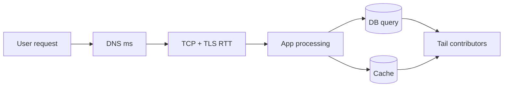
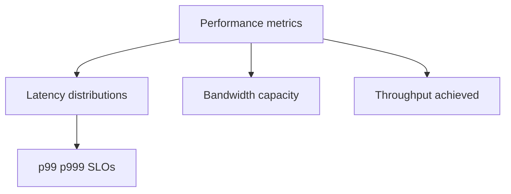
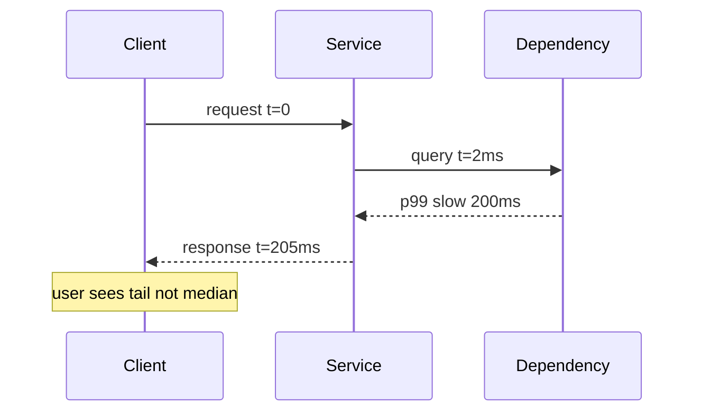

# Latency Bandwidth Throughput and Tail Latency

## Overview

**Latency** is time for one operation (RTT, query ms). **Bandwidth** is maximum data rate of a link (Mbps, Gbps). **Throughput** is achieved data rate in practice (often below bandwidth due to overhead, loss, contention). **Tail latency** (p95, p99, p999) measures slow requests — averages hide user pain at scale.

The **bandwidth-delay product** (BDP = bandwidth × RTT) is bytes in flight needed to saturate a link — central to TCP window tuning and distributed system design in [[09-System-Design/README|System Design]].

## Learning Objectives

- Distinguish latency, bandwidth, and throughput with units
- Compute BDP and relate to TCP window size
- Explain why p99 matters more than mean at high fan-out
- Identify latency stacks: DNS + TCP + TLS + app + queueing

## Prerequisites

- [[01-Computer-Science/07-Networking-Fundamentals/TCP|TCP]]
- [[01-Computer-Science/02-Machine-Model/Measuring Computer Performance|Measuring Computer Performance]]

## Difficulty

`intermediate`

## Estimated Time

2–3 hours reading; 2 hours measurement lab

## History

WAN performance dominated by speed-of-light RTT. Datacenter shift (2000s) exposed tail latency from queueing (HoL, GC pauses). Google "Tail at Scale" (2013) formalized fan-out amplification of slow paths.

## Problem It Solves

Engineers optimize the wrong metric — buying bandwidth when RTT dominates, or mean latency when one slow dependency ruins composite requests. Shared vocabulary enables correct capacity planning and SLO design.

## Internal Implementation

**RTT components**: propagation delay + transmission delay + queueing + processing. **Little's Law** (L = λW): stable system average concurrency = arrival rate × average time in system — links queue depth to latency under load.

**Fan-out**: serial calls add latencies; parallel calls take max(sub latencies) but p99 approximates union of tails — one slow DB replica hurts everyone periodically.



## Mermaid Diagrams

### Structure



### Sequence / Lifecycle



## Examples

### Minimal Example

BDP calculation:

```text
Link: 1 Gbps = 125 MB/s
RTT: 50 ms
BDP = 125e6 * 0.05 ≈ 6.25 MB in flight to fill pipe
```

TypeScript — measure HTTP latency distribution sketch:

```typescript
async function sampleLatencies(url: string, n: number): Promise<number[]> {
  const xs: number[] = [];
  for (let i = 0; i < n; i++) {
    const t0 = performance.now();
    await fetch(url);
    xs.push(performance.now() - t0);
  }
  xs.sort((a, b) => a - b);
  return xs;
}
// p99 index: Math.floor(0.99 * (xs.length - 1))
```

Python:

```python
import time, statistics

def p99(samples: list[float]) -> float:
    s = sorted(samples)
    return s[int(0.99 * (len(s) - 1))]

def timed(fn, n=100):
    xs = []
    for _ in range(n):
        t0 = time.perf_counter()
        fn()
        xs.append(time.perf_counter() - t0)
    return xs
```

### Production-Shaped Example

SLO: p99 < 300 ms for read path. Dashboards split DNS/TCP/TLS/server processing via tracing. Load test reports p50/p95/p99 vs RPS. Mitigations: hedged requests (careful), timeout budgets, circuit breakers — depth in [[09-System-Design/README|System Design]].

## Trade-offs

| Dimension | Upside | Downside | When it matters |
| --- | --- | --- | --- |
| Performance | Higher bandwidth helps bulk | Won't fix RTT-bound small requests | Cross-region |
| Complexity | Percentile SLOs user-aligned | Noisy to measure; need volume | High QPS |
| Operability | Mean easy to compute | Mean misleading | Executive vs SRE metrics |

### When to Use

- Setting capacity and autoscaling triggers
- Choosing region placement and CDN strategy
- Debugging "slow sometimes" reports

### When Not to Use

- Optimizing before measuring ([[01-Computer-Science/09-Correctness-and-Reliability/Observability Fundamentals|Observability]])
- Single-user localhost benchmarks for prod SLO proof

## Exercises

1. Given 10 sequential 5 ms calls vs parallel, compare expected latency.
2. If each service has p99 50 ms independent, estimate p99 for 20 parallel calls (qualitative).
3. Plot histogram from 1000 samples; compare mean vs p99.

## Mini Project

**Latency harness**: CLI hitting URL at configurable RPS; outputs histogram, p50/p95/p99, error rate.

## Portfolio Project

Integrate latency breakdown into workbench load generator; correlate with TCP retransmit counters.

## Interview Questions

1. Latency vs bandwidth — which limits a small API call across the ocean?
2. What is BDP and why care for TCP?
3. Why do microservices care about p99 more than average?

### Stretch / Staff-Level

1. Design timeout budget across 5-hop call graph with partial retry policy.

## Common Mistakes

- Reporting mean only
- Ignoring client-side DNS/TLS in "server latency"
- Confusing throughput (req/s) with bandwidth (bits/s)

## Best Practices

- Define SLOs on percentiles with error budget
- Trace end-to-end; avoid optimizing isolated means
- Load test at target concurrency, not single-thread

## Summary

Latency is delay, bandwidth is capacity, throughput is achieved rate — related but not interchangeable. Tail latency drives user experience at scale because fan-out and queueing amplify rare slow events. Measure distributions, understand BDP, and hand distributed mitigation patterns to [[09-System-Design/README|System Design]].

## Further Reading

- Dean & Barroso, "The Tail at Scale" (CACM 2013)
- *Systems Performance* — latency distributions
- Google SRE Book — SLIs/SLOs

## Related Notes

- [[01-Computer-Science/07-Networking-Fundamentals/TCP|TCP]]
- [[01-Computer-Science/07-Networking-Fundamentals/HTTP as a Protocol|HTTP as a Protocol]]
- [[09-System-Design/README|System Design]] — distributed latency patterns
- [[01-Computer-Science/09-Correctness-and-Reliability/Observability Fundamentals|Observability Fundamentals]]
- [[01-Computer-Science/code/README|code labs]]

## Progress Checklist

- [ ] Explained from first principles
- [ ] Drew at least one Mermaid diagram
- [ ] Implemented a minimal version
- [ ] Documented trade-offs and non-goals
- [ ] Completed exercises
- [ ] Practiced interview questions aloud
- [ ] Linked prerequisites and dependents
