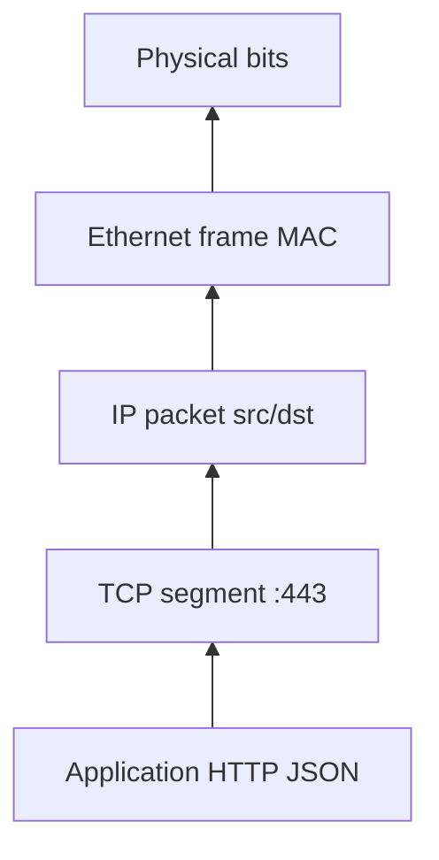
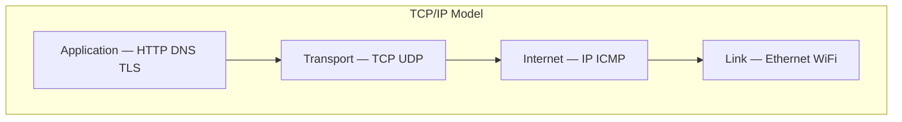
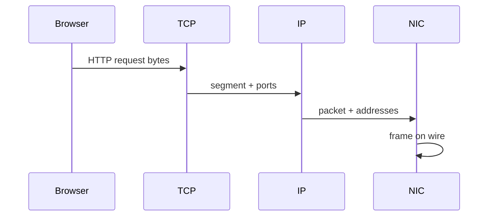

# Layered Network Models

## Overview

Network communication is organized in **layers**, each providing services to the layer above and using services from the layer below. The **TCP/IP model** (link, internet, transport, application) is what the Internet runs. The **OSI model** (7 layers) is a teaching taxonomy. **Encapsulation** wraps application data in transport segments, IP packets, and link frames — each header adds addressing and control metadata.

Layers are conceptual contracts, not always clean boundaries in real stacks (TLS spans transport and application; QUIC re merges layers).

## Learning Objectives

- Map protocols to TCP/IP layers and explain encapsulation on the wire
- Trace a single HTTP request through headers at each layer
- Explain why layering enables replacement (Wi-Fi vs Ethernet) without rewriting apps
- Identify where debugging tools attach (tcpdump, curl, browser devtools)

## Prerequisites

- [[01-Computer-Science/00-Orientation/Abstraction Layers in Computing|Abstraction Layers in Computing]]
- [[01-Computer-Science/01-Information-and-Representation/Bits Bytes and Information|Bits Bytes and Information]]

## Difficulty

`beginner`

## Estimated Time

2 hours reading; 1 hour exercise (packet trace annotation)

## History

ARPANET (1960s–70s) needed interoperable host software. The ISO OSI model (1984) aimed formal standardization but saw heavy protocol proliferation. TCP/IP (1980s) won through deployed implementations (BSD sockets, routers). Modern reality: IP + TCP/UDP + application protocols, with TLS everywhere.

## Problem It Solves

Without layers, every application would embed link-specific routing and retransmission. Layering isolates concerns: apps speak URLs; IP handles global addressing; link handles local delivery. Failures localize — is it DNS, TCP, or HTTP?

## Internal Implementation

Egress path: application buffer → TCP adds ports, seq/ack → IP adds src/dst IP, TTL → link adds MAC addresses → PHY bits. Ingress reverses: demux by ethertype → IP protocol field → TCP port → HTTP parser.

**Multiplexing**: TCP port 443 and 80 share one IP; IP shares one NIC via frames. **MTU** limits IP packet size; fragmentation is discouraged; TCP discovers path MTU.



## Mermaid Diagrams

### Structure



### Sequence / Lifecycle



## Examples

### Minimal Example

Conceptual header stack for `GET /`:

```text
[ Ethernet hdr | IP hdr | TCP hdr | HTTP request text ]
```

Tools peel layers:

```bash
# conceptual — see Linux track for tcpdump depth
curl -v https://example.com/   # application + TLS
ss -tn                         # transport sockets
ip route                       # internet layer
```

### Production-Shaped Example

Incident triage checklist:

1. Application: 5xx, timeout, wrong body → logs, tracing
2. Transport: RST, retransmits → `ss`, metrics
3. Internet: routing blackhole → traceroute, BGP (ops)
4. Link: interface down → NIC stats, cloud network ACL

Cross-link [[07-Backend/README|Backend]] for product-level HTTP debugging.

## Trade-offs

| Dimension | Upside | Downside | When it matters |
| --- | --- | --- | --- |
| Performance | Swap link tech independently | Header overhead; layer violations add copies | Mobile, datacenter |
| Complexity | Clear mental model | OSI vs TCP/IP naming confusion | Interviews, docs |
| Operability | Layer-specific tools | Blame bounces between teams | Outages |

### When to Use

- Teaching and designing protocol stacks
- Scoping debugging and ownership boundaries
- Choosing where to terminate TLS (LB vs app)

### When Not to Use

- As literal implementation map — kernels fuse paths for speed
- Ignoring cross-cutting concerns (observability, security)

## Exercises

1. Draw encapsulation for DNS-over-UDP vs HTTPS — which layers differ?
2. Given symptoms (connection refused vs timed out), map to likely layer.
3. Annotate a pcap screenshot (or sample hex dump) with layer boundaries.

## Mini Project

**Protocol peel tool**: read hex dump, parse Ethernet/IP/TCP headers (fixed offsets for IPv4), print summary — no full stack required.

## Portfolio Project

Add layered packet diagram generator to protocol workbench from captured traces.

## Interview Questions

1. Difference between OSI Layer 4 and TCP/IP transport layer?
2. Where does TLS sit in the models?
3. What information does each layer need to forward a packet?

### Stretch / Staff-Level

1. Why did QUIC move stream multiplexing out of TCP — what layer violation did HTTP/2 over TCP expose?

## Common Mistakes

- Confusing "session/presentation" OSI layers with deployed protocols
- Debugging HTTP before checking TCP/connectivity
- Forgetting ICMP is not TCP

## Best Practices

- Start debugging at the lowest failing layer
- Document which layer your service owns in runbooks
- Use consistent terminology in postmortems

## Summary

Layered models decompose networking into replaceable responsibilities. TCP/IP is the operational Internet stack: application data encapsulated in TCP/UDP, IP, and link frames. Understanding encapsulation and demultiplexing is prerequisite for sockets, routing, and every protocol note that follows.

## Further Reading

- Kurose & Ross, *Computer Networking* — Ch. 1
- RFC 1122 — host requirements
- [[10-Linux/README|Linux]] — tcpdump, nftables

## Related Notes

- [[01-Computer-Science/07-Networking-Fundamentals/IP Addressing and Routing|IP Addressing and Routing]]
- [[01-Computer-Science/07-Networking-Fundamentals/TCP|TCP]]
- [[01-Computer-Science/07-Networking-Fundamentals/UDP|UDP]]
- [[01-Computer-Science/07-Networking-Fundamentals/HTTP as a Protocol|HTTP as a Protocol]]
- [[01-Computer-Science/code/README|code labs]]

## Progress Checklist

- [ ] Explained from first principles
- [ ] Drew at least one Mermaid diagram
- [ ] Implemented a minimal version
- [ ] Documented trade-offs and non-goals
- [ ] Completed exercises
- [ ] Practiced interview questions aloud
- [ ] Linked prerequisites and dependents
