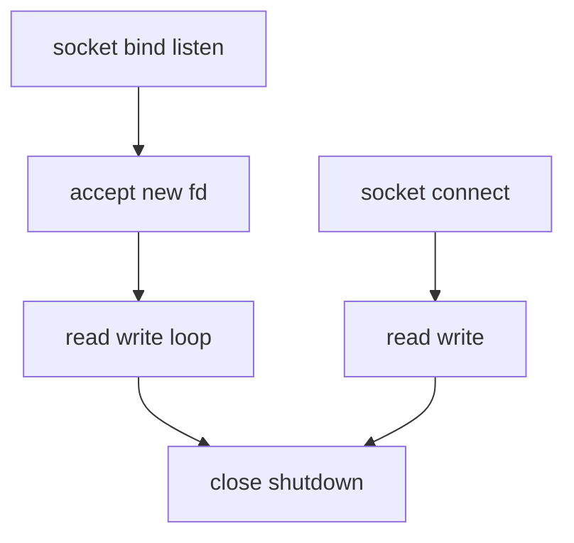
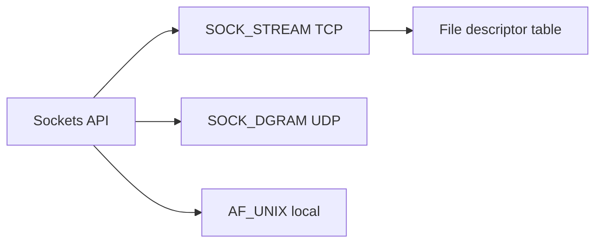
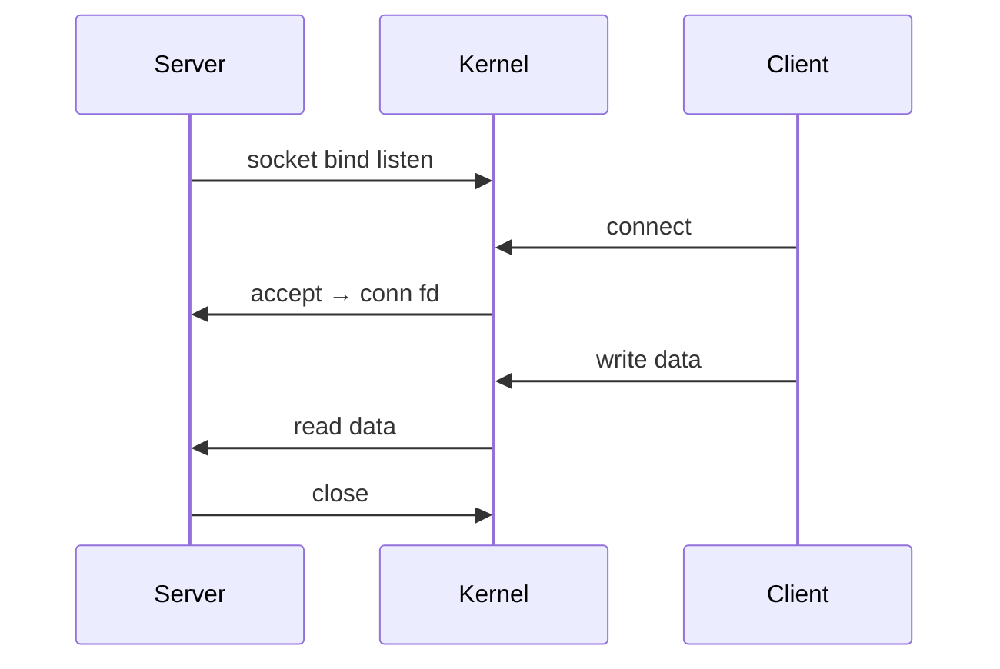

# Sockets Programming Model

## Overview

**Sockets** are the Unix API for network I/O: endpoints identified by `(protocol family, local IP, local port, remote IP, remote port)`. The Berkeley socket lifecycle — `socket` → `bind` → `listen` → `accept` → `read`/`write` → `close` — maps TCP server behavior. UDP uses `sendto`/`recvfrom` without connection setup. Sockets are **file descriptors**, integrating with `select`/`poll`/`epoll`.

Every HTTP client, database driver, and gRPC stack ultimately sits on sockets (or an OS-specific equivalent).

## Learning Objectives

- Implement TCP echo server and client in TypeScript and Python
- Explain listen backlog, `SO_REUSEADDR`, and address already in use
- Handle partial reads and graceful shutdown vs `RST`
- Connect socket API to [[01-Computer-Science/06-IO-and-Persistence/Blocking Nonblocking and Multiplexed IO|I/O models]]

## Prerequisites

- [[01-Computer-Science/07-Networking-Fundamentals/TCP|TCP]]
- [[01-Computer-Science/04-Processes-and-Execution/System Calls|System Calls]]

## Difficulty

`intermediate`

## Estimated Time

3 hours reading; 4 hours dual-language lab

## History

4.2BSD (1983) introduced sockets, unifying TCP, UDP, and Unix domain IPC. Winsock adapted the model for Windows. Language runtimes wrap fds (`net.Socket`, `socket.socket`) but syscall semantics remain.

## Problem It Solves

Applications need a portable interface to endpoints without rewriting kernel TCP. Sockets expose connection setup, byte I/O, and options (timeouts, keepalive, nodelay) uniformly.

## Internal Implementation

Kernel maintains **socket struct**: send/receive buffers, state (TCP FSM), wait queues. `accept` returns **new fd** for each connection sharing listening socket. `connect` may block until handshake completes (or return EINPROGRESS if nonblocking).

Dual-stack: `AF_INET6` socket may accept IPv4-mapped addresses depending on `IPV6_V6ONLY`.



## Mermaid Diagrams

### Structure



### Sequence / Lifecycle



## Examples

### Minimal Example

TypeScript — TCP client:

```typescript
import net from "node:net";

function tcpConnect(host: string, port: number, payload: string): Promise<string> {
  return new Promise((resolve, reject) => {
    const chunks: Buffer[] = [];
    const sock = net.createConnection({ host, port }, () => sock.write(payload));
    sock.on("data", (c) => chunks.push(c));
    sock.on("end", () => resolve(Buffer.concat(chunks).toString("utf8")));
    sock.on("error", reject);
  });
}
```

TypeScript — TCP server:

```typescript
import net from "node:net";

net.createServer((socket) => {
  socket.on("data", (chunk) => socket.write(chunk));
}).listen(9000, "127.0.0.1");
```

Python — TCP client:

```python
import socket

def tcp_roundtrip(host: str, port: int, payload: bytes) -> bytes:
    with socket.create_connection((host, port), timeout=5) as sock:
        sock.sendall(payload)
        sock.shutdown(socket.SHUT_WR)
        return sock.recv(65536)
```

Python — TCP server:

```python
import socket

with socket.socket() as srv:
    srv.setsockopt(socket.SOL_SOCKET, socket.SO_REUSEADDR, 1)
    srv.bind(("127.0.0.1", 9000))
    srv.listen(128)
    conn, _ = srv.accept()
    with conn:
        while data := conn.recv(4096):
            conn.sendall(data)
```

### Production-Shaped Example

Set timeouts, limit idle duration, log peer address, handle `ECONNRESET` without crashing process, use thread pool or event loop for concurrency. Full patterns in [[01-Computer-Science/code/README|code labs]] `runtime` directory.

## Trade-offs

| Dimension | Upside | Downside | When it matters |
| --- | --- | --- | --- |
| Performance | Zero-copy paths available | Thread-per-conn costly | C10K services |
| Complexity | Small API surface | Easy to write subtly broken protocols | Custom RPC |
| Operability | Universal skill | Platform edge cases (WSL, Windows) | Cross-platform apps |

### When to Use

- Building protocols, proxies, game servers
- Learning TCP/UDP behavior hands-on
- Embedding low-level control unavailable in HTTP-only clients

### When Not to Use

- Public product APIs — prefer HTTP/gRPC ([[07-Backend/README|Backend]])
- When managed SDKs suffice

## Exercises

1. Echo server: client sends 1 MiB; verify byte-identical without loading all in memory at once.
2. Demonstrate `SO_REUSEADDR` — restart server immediately after crash.
3. Compare blocking connect timeout vs nonblocking + `select`.

## Mini Project

**Socket workshop**: TCP line protocol `PING` → `PONG`, concurrent clients, stats command — implement TS + Python with shared test vectors.

## Portfolio Project

[[01-Computer-Science/projects/Socket Workshop/README|Socket Workshop]] — extend with TLS wrapper hook point.

## Interview Questions

1. Steps to create a TCP server from scratch?
2. Difference between `close` and `shutdown(SHUT_WR)`?
3. Why might `accept` fail under load?

### Stretch / Staff-Level

1. Design file descriptor limits strategy for 100k idle connections.

## Common Mistakes

- Assuming `read` fills buffer or message boundaries match TCP segments
- Ignoring `EADDRINUSE` on quick restart
- No timeout on blocking operations

## Best Practices

- Framing layer above raw stream (length-prefix or delimiters)
- Centralize socket options (NODELAY, keepalive)
- Test on loopback and LAN with induced latency

## Summary

Sockets are fd-based network endpoints exposing TCP and UDP through a small syscall API. Correct production use requires understanding connection lifecycle, partial I/O, and integration with multiplexed event loops — implemented hands-on in TypeScript and Python via [[01-Computer-Science/code/README|code labs]].

## Further Reading

- Stevens, *UNIX Network Programming*, Volume 1
- Linux `man 2 socket`, `man 2 accept`
- Node.js `net` module docs

## Related Notes

- [[01-Computer-Science/07-Networking-Fundamentals/TCP|TCP]]
- [[01-Computer-Science/06-IO-and-Persistence/Blocking Nonblocking and Multiplexed IO|Blocking Nonblocking and Multiplexed IO]]
- [[01-Computer-Science/07-Networking-Fundamentals/HTTP as a Protocol|HTTP as a Protocol]]
- [[01-Computer-Science/code/README|code labs]] — `runtime`

## Progress Checklist

- [ ] Explained from first principles
- [ ] Drew at least one Mermaid diagram
- [ ] Implemented a minimal version
- [ ] Documented trade-offs and non-goals
- [ ] Completed exercises
- [ ] Practiced interview questions aloud
- [ ] Linked prerequisites and dependents
