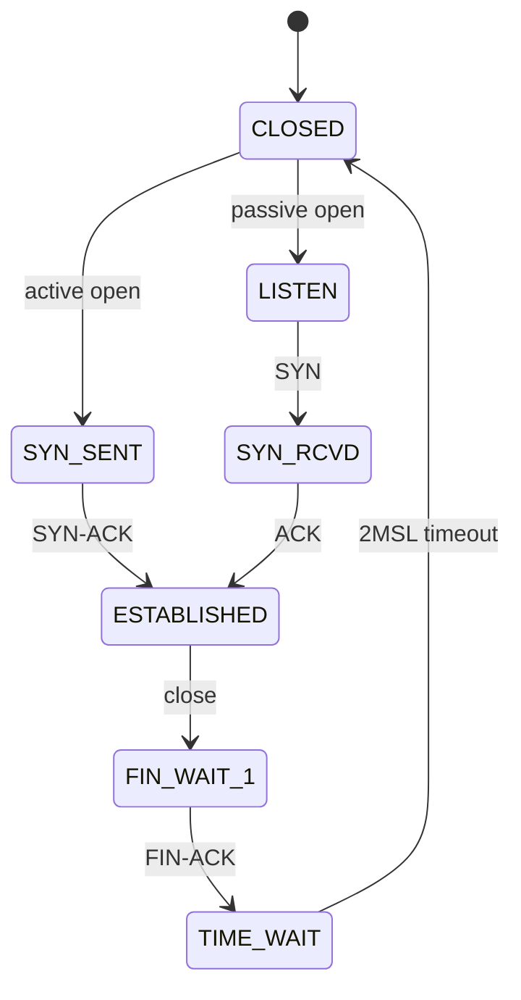
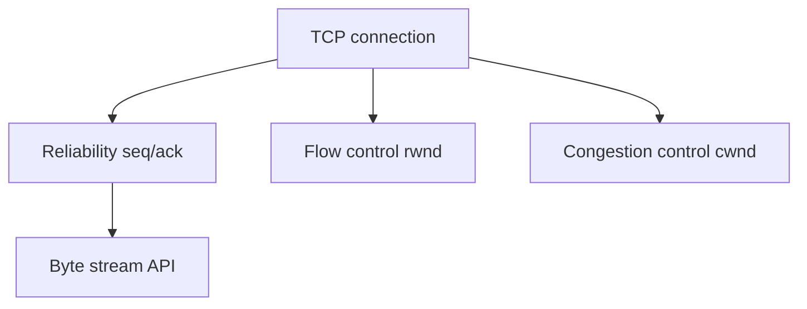
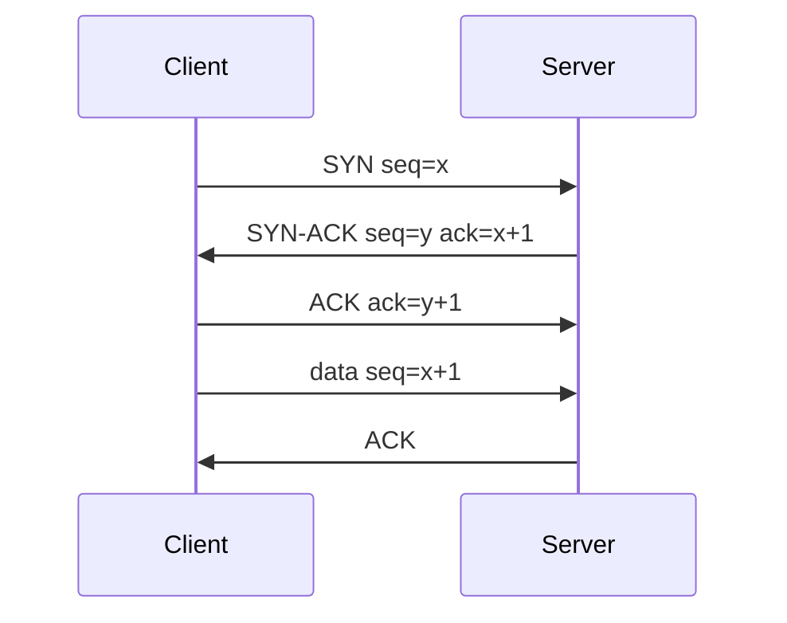

# TCP

## Overview

**TCP** provides **reliable, ordered, byte-stream** delivery between two endpoints identified by `(IP, port)` pairs. Connection setup uses a **three-way handshake** (SYN, SYN-ACK, ACK). Reliability comes from sequence numbers, acknowledgments, retransmissions, and checksums. **Flow control** (rwnd) prevents overwhelming receivers; **congestion control** (Cubic, BBR) shares network capacity.

TCP is the default transport for HTTP/1.1, HTTP/2, databases, and most RPC — know its state machine before blaming "the network."

## Learning Objectives

- Walk through handshake, data transfer, and connection teardown (FIN/ACK)
- Explain sequence/ack numbers and why they are byte-indexed
- Relate RTT, window size, and throughput (bandwidth-delay product)
- Diagnose common failures: SYN flood, RST, half-open, buffer bloat

## Prerequisites

- [[01-Computer-Science/07-Networking-Fundamentals/UDP|UDP]]
- [[01-Computer-Science/06-IO-and-Persistence/Blocking Nonblocking and Multiplexed IO|Blocking Nonblocking and Multiplexed IO]]

## Difficulty

`intermediate`

## Estimated Time

4 hours reading; 3 hours lab (TCP echo + state observation)

## History

TCP/IP specification (1974, Cerf & Kahn). Van Jacobson's congestion algorithms (1988) saved the Internet from collapse during growth. HTTP/2 multiplexing exposed **head-of-line blocking** at TCP layer — motivator for QUIC over UDP.

## Problem It Solves

Applications need a pipe that looks like an infinite ordered byte stream despite packet loss, reordering, and variable delay. TCP hides IP unreliability and adapts send rate to path conditions.

## Internal Implementation

**States**: CLOSED → SYN-SENT/LISTEN → ESTABLISHED → FIN-WAIT/TIME-WAIT/CLOSE-WAIT. **Retransmission**: RTO from smoothed RTT; fast retransmit on 3 duplicate ACKs. **Nagle** coalesces small writes (often disabled for latency). **Keepalive** probes dead peers.

Send path: app `write` → socket send buffer → segments with seq → IP. Receive path: reorder buffer → in-order delivery to app → cumulative ACK.



## Mermaid Diagrams

### Structure



### Sequence / Lifecycle



## Examples

### Minimal Example

TypeScript:

```typescript
import net from "node:net";

net.createServer((socket) => {
  socket.on("data", (chunk) => socket.write(chunk));
}).listen(9000);
```

Python:

```python
import socket

with socket.socket() as srv:
    srv.setsockopt(socket.SOL_SOCKET, socket.SO_REUSEADDR, 1)
    srv.bind(("127.0.0.1", 9000))
    srv.listen(128)
    conn, _ = srv.accept()
    with conn:
        while chunk := conn.recv(4096):
            conn.sendall(chunk)
```

### Production-Shaped Example

HTTP server tuning: `TCP_NODELAY` for small messages, listen backlog vs SYN queue, `SO_REUSEPORT` for multi-process accept, idle timeout + RST on abuse. Measure retransmits with `ss -ti`. Tail latency ties to [[01-Computer-Science/07-Networking-Fundamentals/Latency Bandwidth Throughput and Tail Latency|Latency note]] and [[09-System-Design/README|System Design]].

## Trade-offs

| Dimension | Upside | Downside | When it matters |
| --- | --- | --- | --- |
| Performance | Adapts to bandwidth | HoL blocking across streams | HTTP/2 over lossy mobile |
| Complexity | Stable abstraction | TIME-WAIT, buffer tuning opaque | High connection churn |
| Operability | Rich tooling | Middleboxes break extensions | Corporate proxies |

### When to Use

- Default for request/response and bulk transfer needing reliability
- When you want kernel-managed retransmission

### When Not to Use

- Ultra-low-latency loss-tolerant media (often UDP/RTP)
- When QUIC features needed (0-RTT, migration) — still study TCP first

## Exercises

1. Capture handshake with loopback server; verify seq/ack progression.
2. Compute theoretical throughput: RTT 50 ms, rwnd 64 KiB.
3. Explain why closing with `RST` skips TIME-WAIT — trade-off?

## Mini Project

**TCP chat server**: line-oriented protocol, broadcast to clients, handle partial lines and disconnect cleanup — dual TS/Python in [[01-Computer-Science/code/README|code labs]].

## Portfolio Project

Benchmark workbench TCP echo under configurable loss/latency (`tc netem` on Linux).

## Interview Questions

1. Describe the three-way handshake and why SYN cookies exist.
2. What causes TIME-WAIT and is it always bad?
3. Difference between flow control and congestion control?

### Stretch / Staff-Level

1. How does TCP fair sharing break in datacenter incast — what mitigations exist?

## Common Mistakes

- Equating "connected" with "peer application ready"
- Ignoring partial reads on stream semantics
- One global timeout for connect vs read vs write phases

## Best Practices

- Separate connect/read/write deadlines
- Monitor retransmit rate and RTT per dependency
- Load test with realistic concurrent connection counts

## Summary

TCP turns unreliable IP into an ordered byte stream via connections, sequence numbers, ACKs, and congestion-aware sending. Production debugging requires handshake/teardown states, window dynamics, and distinguishing network loss from application backpressure — before jumping to HTTP or database layers.

## Further Reading

- RFC 9293 (TCP)
- Stevens, *TCP/IP Illustrated*, Volume 1
- Cardwell et al., BBR congestion control

## Related Notes

- [[01-Computer-Science/07-Networking-Fundamentals/UDP|UDP]]
- [[01-Computer-Science/07-Networking-Fundamentals/HTTP as a Protocol|HTTP as a Protocol]]
- [[01-Computer-Science/07-Networking-Fundamentals/Sockets Programming Model|Sockets Programming Model]]
- [[01-Computer-Science/code/README|code labs]] — `runtime`

## Progress Checklist

- [ ] Explained from first principles
- [ ] Drew at least one Mermaid diagram
- [ ] Implemented a minimal version
- [ ] Documented trade-offs and non-goals
- [ ] Completed exercises
- [ ] Practiced interview questions aloud
- [ ] Linked prerequisites and dependents
