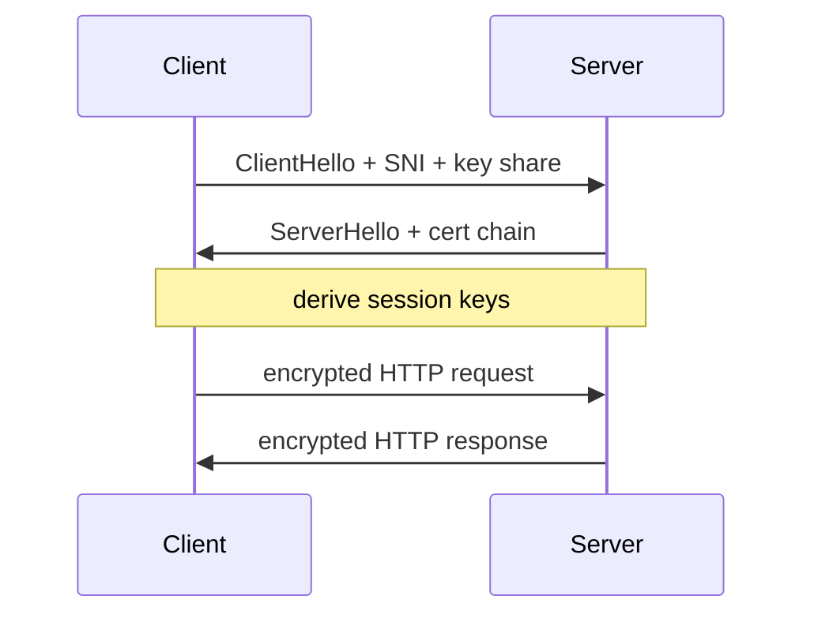
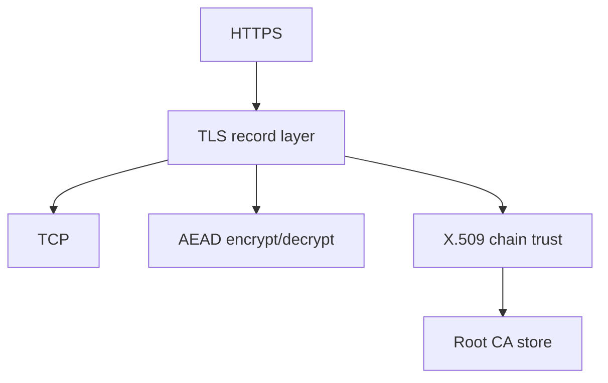
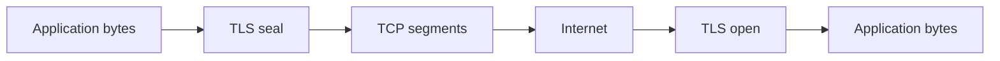

# TLS Concepts

## Overview

**TLS** (Transport Layer Security) provides **confidentiality**, **integrity**, and **server (optional client) authentication** over a TCP (or QUIC) bytestream. A **handshake** negotiates cipher suite, verifies **X.509 certificates** (chain to trusted root CA), and derives session keys. **Record layer** encrypts application data in frames with MAC/AEAD.

TLS sits between TCP and HTTP — `https://` is HTTP over TLS. Operational hardening (cipher policy, cert rotation, mTLS) belongs in [[18-Security/README|Security]]; here we survey mechanisms and trust model.

## Learning Objectives

- Sketch TLS 1.2 vs 1.3 handshake differences (1-RTT, 0-RTT caveats)
- Explain certificate chain validation and SNI
- Identify what TLS does *not* provide (authorization, DDoS protection)
- Relate TLS to observability challenges (encrypted metadata)

## Prerequisites

- [[01-Computer-Science/07-Networking-Fundamentals/TCP|TCP]]
- [[01-Computer-Science/09-Correctness-and-Reliability/Cryptographic Primitives Overview|Cryptographic Primitives Overview]]

## Difficulty

`intermediate`

## Estimated Time

3 hours reading; survey exercises with openssl s_client

## History

SSL 2/3 (1990s Netscape) → TLS 1.0 (1999). POODLE, BEAST, and Heartbleed drove deprecation of weak ciphers. TLS 1.3 (RFC 8446, 2018) simplifies handshake, removes RSA key transport, mandates forward secrecy. Let's Encrypt (2015) democratized HTTPS.

## Problem It Solves

Plain TCP is readable and modifiable by any on-path attacker. TLS encrypts payloads and authenticates peer identity via PKI — enabling secure web, APIs, and database links without app-level crypto for every byte.

## Internal Implementation

**Handshake (1.3 survey)**:

1. ClientHello: supported ciphers, key shares, SNI hostname
2. ServerHello: chosen cipher, cert chain, Finished MAC
3. Derive traffic keys from ECDHE shared secret
4. Application data encrypted as TLS records

**Forward secrecy**: ephemeral ECDHE — past ciphertext safe if long-term key stolen later. **ALPN** negotiates HTTP/1.1 vs h2 during handshake.



## Mermaid Diagrams

### Structure



### Sequence / Lifecycle



## Examples

### Minimal Example

Survey with OpenSSL:

```bash
openssl s_client -connect example.com:443 -servername example.com </dev/null
# Inspect: protocol version, cipher, cert subject, issuer chain
```

Browser devtools → Security tab shows cert validity and cipher.

TypeScript (survey — use library, do not implement crypto):

```typescript
import tls from "node:tls";

const socket = tls.connect({ host: "example.com", port: 443, servername: "example.com" }, () => {
  console.log(socket.getProtocol(), socket.getCipher());
  socket.end();
});
```

Python survey:

```python
import ssl, socket

ctx = ssl.create_default_context()
with socket.create_connection(("example.com", 443)) as sock:
    with ctx.wrap_socket(sock, server_hostname="example.com") as ssock:
        print(ssock.version(), ssock.cipher())
```

### Production-Shaped Example

Terminate TLS at load balancer vs app: key material location, HSTS, cert auto-renew (ACME), cipher suites disallow RSA key transport, OCSP stapling. mTLS for service-to-service — see [[18-Security/README|Security]].

## Trade-offs

| Dimension | Upside | Downside | When it matters |
| --- | --- | --- | --- |
| Performance | TLS 1.3 faster handshake | CPU + latency; no zero-copy | Edge vs origin |
| Complexity | Standard libraries | Cert expiry outages common | On-call |
| Operability | Encrypted privacy | Harder packet inspect | Debugging, WAF |

### When to Use

- Virtually all public HTTP/API traffic
- Any credential or PII over network
- Service mesh internal mTLS for zero-trust

### When Not to Use

- Trusted local-only IPC (still often encrypted in prod)
- Replacing application-level auth

## Exercises

1. Compare cert chain for two domains; identify intermediate vs root.
2. Explain why `CN` alone is insufficient vs **SAN** list.
3. List what changes in tcpdump before/after TLS (payload visibility).

## Mini Project

**TLS survey report**: document handshake steps, cipher, cert expiry, and HSTS header for three sites; diagram trust chain in Mermaid.

## Portfolio Project

Optional TLS termination module for workbench using library — configuration doc only, keys in vault pattern.

## Interview Questions

1. What problem does TLS solve that TCP does not?
2. TLS 1.3 improvements over 1.2?
3. What is SNI and why needed on shared IP?

### Stretch / Staff-Level

1. Trade-offs terminating TLS at CDN vs origin for compliance and logging?

## Common Mistakes

- Expired cert without monitoring
- Disabling cert verification in dev scripts copied to prod
- Confusing TLS with "the app is secure"

## Best Practices

- Automate renewal; alert 30 days before expiry
- Use TLS 1.2+ only; prefer 1.3
- Store private keys in HSM/KMS — [[18-Security/README|Security]]

## Summary

TLS encrypts and authenticates byte streams using negotiated ciphers and PKI-backed certificates. Understanding handshake flow, chain trust, and SNI explains HTTPS failures independent of HTTP logic. Implementation and ops depth continue in [[18-Security/README|Security]] and [[01-Computer-Science/09-Correctness-and-Reliability/Cryptographic Primitives Overview|Cryptographic Primitives]].

## Further Reading

- RFC 8446 (TLS 1.3)
- Mozilla SSL Configuration Generator
- Let's Encrypt documentation

## Related Notes

- [[01-Computer-Science/07-Networking-Fundamentals/HTTP as a Protocol|HTTP as a Protocol]]
- [[01-Computer-Science/09-Correctness-and-Reliability/Cryptographic Primitives Overview|Cryptographic Primitives Overview]]
- [[18-Security/README|Security]] — TLS operations, mTLS, PKI
- [[01-Computer-Science/code/README|code labs]]

## Progress Checklist

- [ ] Explained from first principles
- [ ] Drew at least one Mermaid diagram
- [ ] Implemented a minimal version
- [ ] Documented trade-offs and non-goals
- [ ] Completed exercises
- [ ] Practiced interview questions aloud
- [ ] Linked prerequisites and dependents
