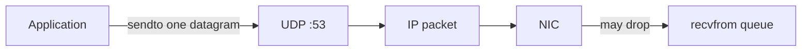
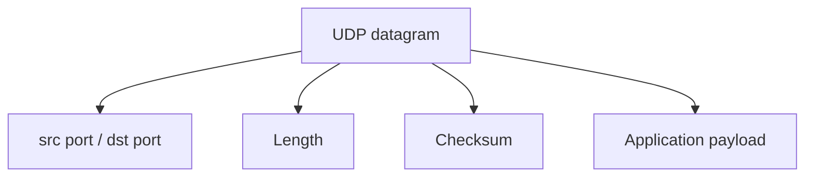
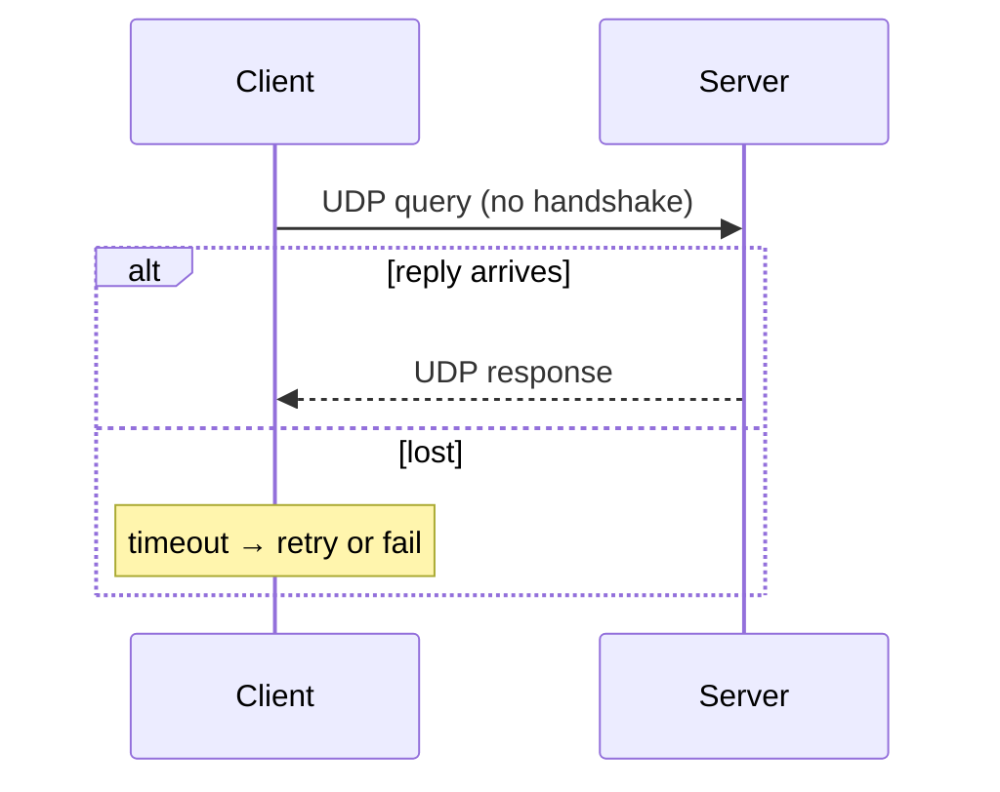

# UDP

## Overview

**UDP** (User Datagram Protocol) exposes **connectionless**, **unordered**, **unreliable** message delivery over IP. Each datagram is self-contained: UDP header (src/dst port, length, checksum) + payload. No handshake, no retransmission, no flow control — applications must add what they need (QUIC, RTP, custom protocols).

UDP fits when latency beats reliability, or when the app owns retry semantics.

## Learning Objectives

- Describe UDP header fields and maximum payload size constraints (MTU)
- Compare UDP to TCP for DNS, gaming, metrics, and video
- Implement a simple request/response protocol with timeout and retry
- Explain UDP amplification attack surface

## Prerequisites

- [[01-Computer-Science/07-Networking-Fundamentals/IP Addressing and Routing|IP Addressing and Routing]]
- [[01-Computer-Science/07-Networking-Fundamentals/Sockets Programming Model|Sockets Programming Model]]

## Difficulty

`intermediate`

## Estimated Time

2–3 hours reading; 2 hours lab (UDP echo + DNS-like query)

## History

UDP standardized in RFC 768 (1980) alongside TCP for IP. TCP won bulk data; UDP remained for DNS, SNMP, DHCP, NTP, VoIP. QUIC (HTTP/3) rebuilds reliability and encryption on UDP to escape middlebox TCP ossification.

## Problem It Solves

TCP's connection state and head-of-line blocking cost too much for single-shot queries (DNS) or loss-tolerant streams (live video). UDP lets apps send one packet without three-way handshake RTT.

## Internal Implementation

Socket `sendto(addr, buf)` → IP fragmentation if payload > path MTU − headers (avoid — use PMTUD or limit size). Receive queue drops on overflow — no backpressure like TCP window. Checksum optional in IPv4 historically; validates header+payload+pseudo-header.

NAT maps `(private IP, port)` ↔ `(public IP, port)`; UDP mappings expire quickly — problematic for long sessions.



## Mermaid Diagrams

### Structure



### Sequence / Lifecycle



## Examples

### Minimal Example

TypeScript (Node `dgram`):

```typescript
import dgram from "node:dgram";

const sock = dgram.createSocket("udp4");
sock.on("message", (msg, rinfo) => sock.send(msg, rinfo.port, rinfo.address));
sock.bind(9001);
```

Python:

```python
import socket

sock = socket.socket(socket.AF_INET, socket.SOCK_DGRAM)
sock.bind(("127.0.0.1", 9001))
while True:
    data, addr = sock.recvfrom(4096)
    sock.sendto(data, addr)
```

### Production-Shaped Example

Metrics agent: aggregate counters locally, emit **single** UDP packet per interval with max size 1400 B, accept loss; use TCP/gRPC for critical events. Include sequence numbers to detect gaps. See [[01-Computer-Science/code/README|code labs]] `runtime` UDP echo.

## Trade-offs

| Dimension | Upside | Downside | When it matters |
| --- | --- | --- | --- |
| Performance | No handshake; low latency | Loss visible to app | DNS, gaming |
| Complexity | Simple API | App rebuilds reliability | Custom RPC |
| Operability | Easy to spoof source | Amplification DDoS | Open resolvers |

### When to Use

- DNS, DHCP, NTP-style query/response
- Loss-tolerant telemetry and live media
- QUIC/HTTP3 foundation (with full stack on top)

### When Not to Use

- Large file transfer without custom protocol
- When firewalls block arbitrary UDP (corporate networks)

## Exercises

1. Measure DNS query time UDP vs TCP fallback for large responses.
2. Implement retry with exponential backoff; cap duplicates with request ID.
3. Calculate safe payload size given Ethernet MTU 1500, IPv4, UDP headers.

## Mini Project

**Reliable UDP mini-protocol**: seq/ack, sliding window of 4, simulate 20% loss in test harness.

## Portfolio Project

Add UDP discovery beacon to workbench; document NAT timeout behavior.

## Interview Questions

1. Why is DNS primarily UDP?
2. What is UDP amplification?
3. When would you choose QUIC over TCP+TLS?

### Stretch / Staff-Level

1. Design a globally distributed cache invalidation channel — UDP multicast vs pub/sub trade-offs?

## Common Mistakes

- Assuming delivery or ordering
- Sending jumbo datagrams without fragmentation awareness
- No rate limit on UDP services reflecting to clients

## Best Practices

- Bound recv buffer; drop policy explicit
- Authenticate requests (DNSSEC, QUIC crypto) — see [[18-Security/README|Security]]
- Prefer established stacks (QUIC) over bespoke reliable-UDP

## Summary

UDP delivers independent datagrams with minimal kernel state. It trades TCP's reliability for speed and simplicity, pushing loss recovery and ordering to applications or higher protocols like QUIC. Understanding UDP clarifies DNS, real-time media, and why the Internet is not "all TCP."

## Further Reading

- RFC 768, RFC 8085 (UDP usage guidelines)
- QUIC RFC 9000
- [[01-Computer-Science/07-Networking-Fundamentals/DNS Fundamentals|DNS Fundamentals]]

## Related Notes

- [[01-Computer-Science/07-Networking-Fundamentals/TCP|TCP]]
- [[01-Computer-Science/07-Networking-Fundamentals/DNS Fundamentals|DNS Fundamentals]]
- [[01-Computer-Science/07-Networking-Fundamentals/Sockets Programming Model|Sockets Programming Model]]
- [[01-Computer-Science/code/README|code labs]]

## Progress Checklist

- [ ] Explained from first principles
- [ ] Drew at least one Mermaid diagram
- [ ] Implemented a minimal version
- [ ] Documented trade-offs and non-goals
- [ ] Completed exercises
- [ ] Practiced interview questions aloud
- [ ] Linked prerequisites and dependents
