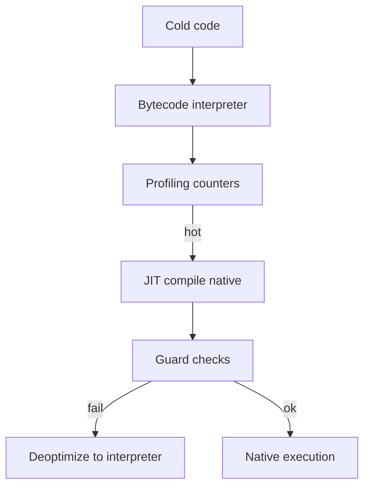
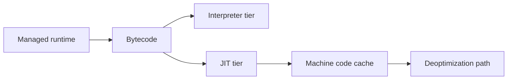
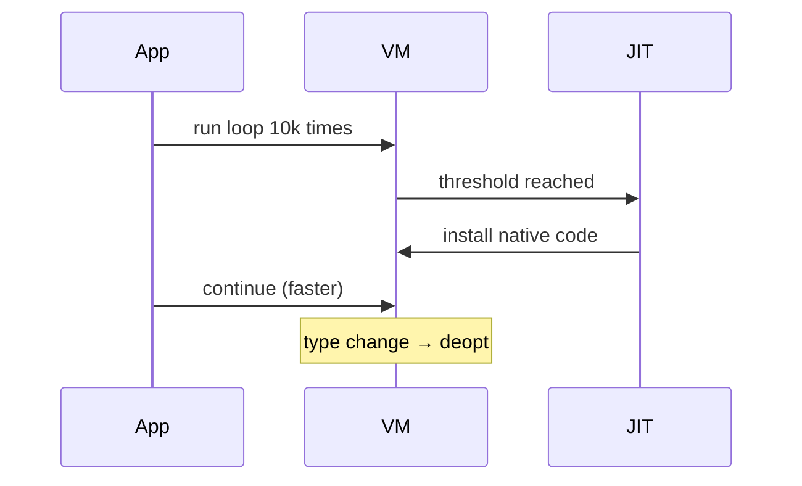

# Bytecode and JIT Compilation

## Overview

**Bytecode** is a compact, platform-neutral instruction set executed by a VM or compiled further. **Just-In-Time (JIT)** compilation identifies **hot** bytecode regions at runtime and emits native machine code. **Tiered** systems profile first (C1 quick compile) then optimize (C2/V8 TurboFan). **Deoptimization** returns to interpreter when assumptions break (wrong types, prototype change).

JIT explains why microbenchmarks lie and why warm-up matters in Java, JavaScript, and C#.

## Learning Objectives

- Describe profile-guided optimization and speculative inlining
- Explain deoptimization guards and hidden class stability (JS)
- Relate bytecode design to verifier safety and compactness
- Identify when AOT (Go, Rust) vs JIT trade-offs win

## Prerequisites

- [[01-Computer-Science/08-Languages-and-Computation/Compilers Interpreters and Virtual Machines|Compilers Interpreters and Virtual Machines]]
- [[01-Computer-Science/02-Machine-Model/Measuring Computer Performance|Measuring Computer Performance]]

## Difficulty

`advanced`

## Estimated Time

4 hours reading; 3 hours benchmark warm-up lab

## History

Self-modifying code ideas from 1960s. Smalltalk JIT experiments. Java HotSpot (1999) popularized adaptive optimization. V8 (2008) brought JIT to JavaScript at web scale. GraalVM and WASM AOT blur JIT/AOT boundary.

## Problem It Solves

Pure interpretation is too slow for UI and servers; pure AOT loses runtime type information and slows deployment iteration. JIT captures actual workloads — inline monomorphic call sites, eliminate dead branches — while preserving bytecode portability.

## Internal Implementation

**Counters** on bytecode back edges trigger OSR (on-stack replacement) compile. **Inline caches** at call sites remember target method addresses. **Speculation**: compile as if types fixed; insert guard checks branching to deopt stub rebuilding interpreter frames.

**GC + JIT interaction**: safe points, stack maps for roots during native code.



## Mermaid Diagrams

### Structure



### Sequence / Lifecycle



## Examples

### Minimal Example

Conceptual bytecode with back-edge counter:

```text
loop:
  LOAD i
  PUSH 1
  ADD
  STORE i
  LOAD i
  PUSH 1000
  LT
  JMP_IF loop    ; counter++ each taken branch
```

TypeScript — warm-up measurement sketch:

```typescript
function hot(n: number): number {
  let s = 0;
  for (let i = 0; i < n; i++) s += i;
  return s;
}

const t0 = performance.now();
hot(100); // cold
const t1 = performance.now();
hot(1_000_000); // likely optimized in JIT engines
const t2 = performance.now();
console.log(`cold=${t1 - t0} hot=${t2 - t1}`);
```

Python — `.pyc` bytecode inspect (CPython interpreter, not full JIT):

```python
import dis

def add(a, b):
    return a + b

dis.dis(add)  # survey LOAD_FAST, BINARY_OP, RETURN_VALUE
```

### Production-Shaped Example

Node/V8: avoid megamorphic object shapes; stable hidden classes speed property access. JVM: `-XX:+PrintCompilation` survey. WASM-AOT for predictable startup in edge — compare p99 cold start vs JIT warm service.

## Trade-offs

| Dimension | Upside | Downside | When it matters |
| --- | --- | --- | --- |
| Performance | Peak near native after warm | Warm-up latency; memory for code cache | Serverless cold start |
| Complexity | Transparent to dev mostly | Nondeterministic perf debugging | SLO tuning |
| Operability | Single artifact bytecode | JIT bugs rare but severe | Financial runtimes |

### When to Use

- Long-lived processes with hot loops (app servers)
- Dynamic languages needing runtime types

### When Not to Use

- Hard real-time (JIT pause/deopt unpredictability)
- Tiny edge functions prioritizing cold start (prefer AOT/WASM)

## Exercises

1. Run JVM or Node microbenchmark; chart first N iterations latency.
2. Change object shape mid-loop in JS; observe deopt in `--trace-deopt` (V8).
3. List bytecode verifier checks JVM performs before run.

## Mini Project

**Hotspot counter toy**: interpreter increments counter on backward jump; print when would trigger fictional JIT.

## Portfolio Project

Benchmark workbench VM with optional "native fast path" stub after N iterations — simulate tiered compilation.

## Interview Questions

1. Why JIT beats AOT for some dynamic patterns?
2. What is deoptimization?
3. Cold start problem in serverless JIT runtimes?

### Stretch / Staff-Level

1. Compare Graal native-image vs HotSpot for microservice deployment.

## Common Mistakes

- Single-iteration microbenchmark conclusions
- Megamorphic OO patterns defeating inline caches
- Ignoring compilation queue CPU during load tests

## Best Practices

- Warm up before benchmarking managed runtimes
- Keep object layouts stable in hot paths
- Measure production with real class/type mixes

## Summary

Bytecode provides portable IR; JIT compiles hot regions to native code using runtime profiles and guards deoptimization when assumptions fail. Tiered compilation balances startup and peak performance. Understand warm-up and shape stability before attributing slowness to algorithms — deeper complexity in [[05-Algorithms/README|Algorithms]], runtime specifics in language tracks.

## Further Reading

- Oracle HotSpot documentation
- V8 blog — TurboFan pipeline
- WebAssembly performance guides

## Related Notes

- [[01-Computer-Science/08-Languages-and-Computation/Compilers Interpreters and Virtual Machines|Compilers Interpreters and Virtual Machines]]
- [[01-Computer-Science/02-Machine-Model/Cache Hierarchy and Locality|Cache Hierarchy and Locality]]
- [[02-JavaScript/README|JavaScript]] / [[03-Python/README|Python]] — runtime depth
- [[01-Computer-Science/code/README|code labs]] — `vm`

## Progress Checklist

- [ ] Explained from first principles
- [ ] Drew at least one Mermaid diagram
- [ ] Implemented a minimal version
- [ ] Documented trade-offs and non-goals
- [ ] Completed exercises
- [ ] Practiced interview questions aloud
- [ ] Linked prerequisites and dependents
