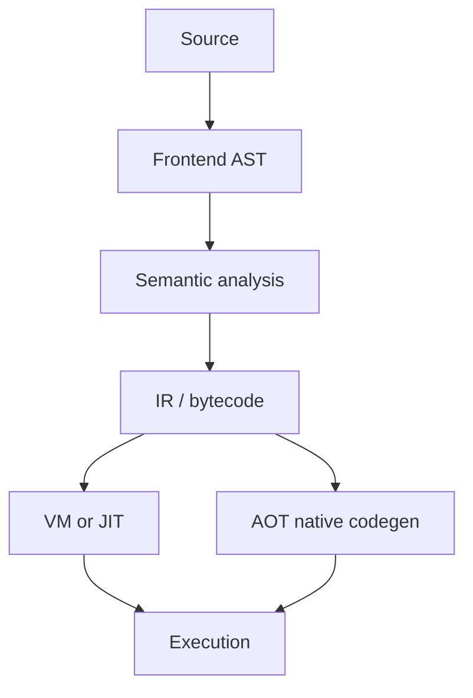
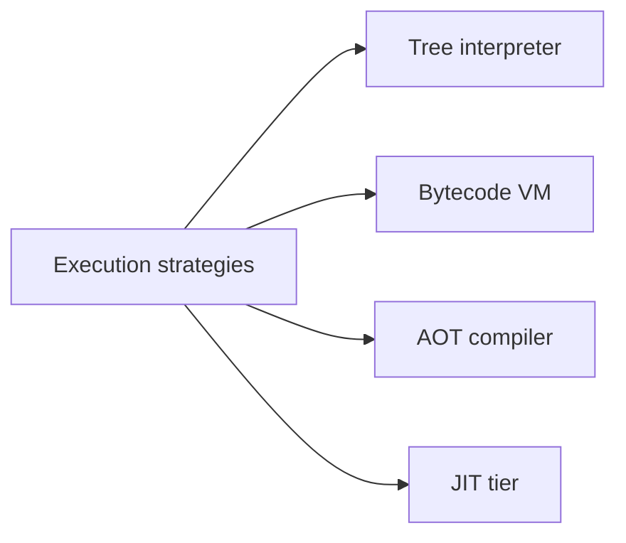
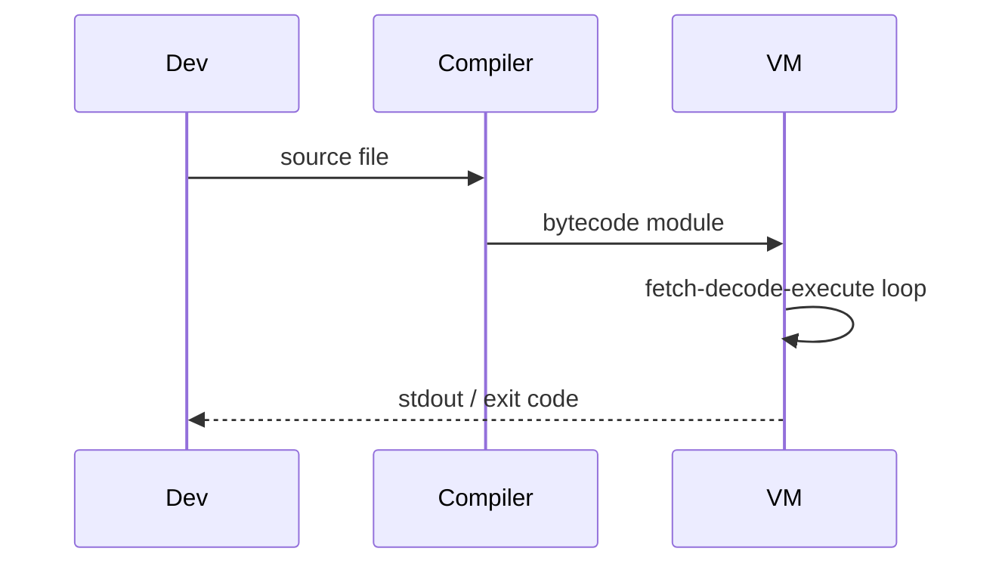

# Compilers Interpreters and Virtual Machines

## Overview

**Compilation** translates source to target (machine code, bytecode, another language) ahead of time. **Interpretation** executes AST or walks structure directly. **Virtual machines** execute **bytecode** with a fetch-decode-execute loop — portable, analyzable intermediate form. Modern runtimes blend tiers: interpreter → JIT hot paths ([[01-Computer-Science/08-Languages-and-Computation/Bytecode and JIT Compilation|Bytecode and JIT Compilation]]).

Understanding the pipeline demystifies language performance, stack traces, and debugging symbols.

## Learning Objectives

- Map lexer → parser → AST → semantic analysis → codegen → runtime
- Contrast tree-walking interpreter vs bytecode VM vs native compiler
- Implement minimal stack VM for arithmetic and variables
- Explain what "runtime" provides (GC, builtins, module loader)

## Prerequisites

- [[01-Computer-Science/08-Languages-and-Computation/Grammars and Parsing|Grammars and Parsing]]
- [[01-Computer-Science/02-Machine-Model/Fetch Decode Execute|Fetch Decode Execute]]

## Difficulty

`advanced`

## Estimated Time

5 hours reading; 6 hours VM lab

## History

Fortran compiler (1957) proved high-level languages viable. Pascal P-code VM (1970s) influenced Java JVM and Python bytecode. LLVM (2000s) separated optimizer/backends. WASM (2015) standardized portable safe bytecode for browsers.

## Problem It Solves

Developers need abstraction without giving up all performance. Intermediate representations enable optimization, portability, and sandboxing — one frontend, many backends.

## Internal Implementation

**Frontend**: parse + typecheck + desugar. **Middle**: SSA IR optimizations (constant fold, DCE). **Backend**: instruction selection, register allocation. **VM loop**:

```text
while true:
  op = code[ip++]
  dispatch op  // add, load, jmp, ...
```

**Environment model**: stack vs register bytecode; closure representation (flat env structs).



## Mermaid Diagrams

### Structure



### Sequence / Lifecycle



## Examples

### Minimal Example

Stack VM opcodes (conceptual):

```text
PUSH 3
PUSH 4
ADD
PRINT
HALT
```

TypeScript — tiny dispatch slice:

```typescript
type Op = { op: "push"; n: number } | { op: "add" } | { op: "halt" };

function run(program: Op[]): number {
  const stack: number[] = [];
  for (const ins of program) {
    if (ins.op === "push") stack.push(ins.n);
    else if (ins.op === "add") stack.push(stack.pop()! + stack.pop()!);
    else return stack.pop() ?? 0;
  }
  throw new Error("no halt");
}
```

Python — equivalent:

```python
def run(program):
    stack = []
    for ins in program:
        if ins["op"] == "push":
            stack.append(ins["n"])
        elif ins["op"] == "add":
            b, a = stack.pop(), stack.pop()
            stack.append(a + b)
        elif ins["op"] == "halt":
            return stack.pop() if stack else 0
    raise RuntimeError("no halt")
```

### Production-Shaped Example

Compile expr AST to bytecode with jump patching for control flow; disassembler for debugging. Full stack machine: [[01-Computer-Science/code/README|code labs]] `vm`. Compare Node/V8 (JIT) vs CPython (bytecode interpreter).

## Trade-offs

| Dimension | Upside | Downside | When it matters |
| --- | --- | --- | --- |
| Performance | AOT/JIT peak speed | Compile time, complexity | Games, HPC |
| Complexity | VM simpler than LLVM backend | Slower cold start | Teaching langs |
| Operability | Bytecode verifiable | Obfuscation harder | WASM sandbox |

### When to Use

- DSL execution inside product
- Teaching language implementation
- Sandboxed plugins (WASM)

### When Not to Use

- Simple templating — interpret strings directly
- When embedding existing language is cheaper

## Exercises

1. Compile `if` to conditional jump bytecode; draw ip flow.
2. Add global variable table to VM; measure lookup cost.
3. Compare tree-walk vs bytecode steps for same program.

## Mini Project

**Stack VM** with locals, calls, and disassembler — extend [[01-Computer-Science/code/README|code labs]] `vm`.

## Portfolio Project

Compile workbench DSL to bytecode; step debugger with stack trace UI.

## Interview Questions

1. Compiler vs interpreter vs VM — define each.
2. Where do type errors get caught in pipeline?
3. Why bytecode instead of direct machine code?

### Stretch / Staff-Level

1. Outline WASM sandbox guarantees vs native JIT for plugins.

## Common Mistakes

- Skipping semantic analysis ("parse success = run")
- Unbounded recursion in tree interpreter on deep input
- No verification pass before executing untrusted bytecode

## Best Practices

- Single IR for multiple backends when possible
- Golden tests: source → bytecode → result
- Cap stack depth and instruction count for untrusted code

## Summary

Language execution flows from parsing through IR to either direct interpretation or VM/JIT/native codegen. Bytecode VMs trade some speed for portability and control — the pattern behind Java, Python, and WASM. Build a complete minimal VM in [[01-Computer-Science/code/README|code labs]]; optimization tiers in [[01-Computer-Science/08-Languages-and-Computation/Bytecode and JIT Compilation|Bytecode and JIT Compilation]].

## Further Reading

- Nystrom, *Crafting Interpreters*
- Aho et al., *Dragon Book*
- WASM spec overview

## Related Notes

- [[01-Computer-Science/08-Languages-and-Computation/Grammars and Parsing|Grammars and Parsing]]
- [[01-Computer-Science/08-Languages-and-Computation/Bytecode and JIT Compilation|Bytecode and JIT Compilation]]
- [[01-Computer-Science/08-Languages-and-Computation/Type Systems Fundamentals|Type Systems Fundamentals]]
- [[01-Computer-Science/code/README|code labs]] — `vm`

## Progress Checklist

- [ ] Explained from first principles
- [ ] Drew at least one Mermaid diagram
- [ ] Implemented a minimal version
- [ ] Documented trade-offs and non-goals
- [ ] Completed exercises
- [ ] Practiced interview questions aloud
- [ ] Linked prerequisites and dependents
