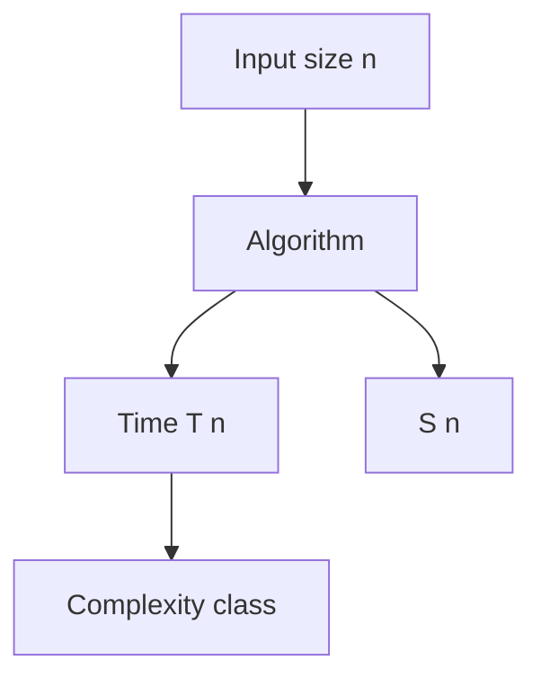
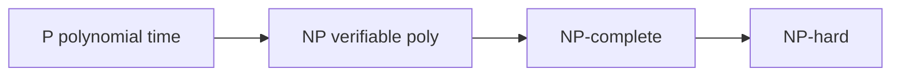
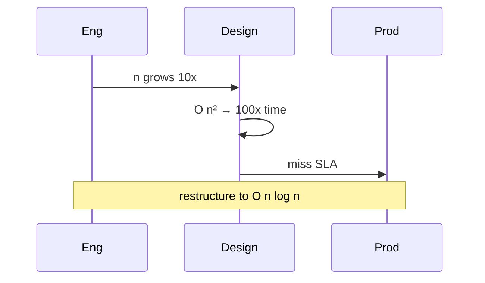

# Computational Complexity Primer

## Overview

**Computational complexity** classifies problems by resources required — **time** and **space** — as input size **n** grows. **Big-O notation** describes asymptotic upper bounds (O(n log n), O(n²)). **P** is problems solvable in polynomial time; **NP** is verifiable in polynomial time. **NP-complete** problems are hardest in NP; unlikely to have efficient exact algorithms.

This primer builds vocabulary for algorithm choice — full treatment in [[05-Algorithms/README|Algorithms]].

## Learning Objectives

- Express runtime and space in Big-O; distinguish best/average/worst case
- Identify polynomial vs exponential growth in practical input sizes
- Explain reduction intuition for NP-completeness (SAT, TSP decision)
- Connect complexity to production limits (batch windows, online SLAs)

## Prerequisites

- Basic loops and recursion from any programming language
- [[01-Computer-Science/02-Machine-Model/Measuring Computer Performance|Measuring Computer Performance]]

## Difficulty

`intermediate`

## Estimated Time

3 hours reading; 2 hours classification exercises

## History

Hartmanis & Stearns (1965) formalized complexity. Cook-Levin (1971) proved SAT NP-complete. Practical algorithms community balances worst-case proofs with heuristics and approximations. Modern ML reopens approximability debates at scale.

## Problem It Solves

Without complexity vocabulary, teams ship O(n²) joins at billion-row scale or chase optimal TSP for routing. Complexity guides when to approximate, index, parallelize, or change problem definition.

## Internal Implementation

**Turing machine model** (conceptual): finite control + tape → defines time/steps. **Reduction** A → B: solve A using oracle for B — if A hard, B at least as hard.

Common classes:

| Class | Meaning | Example |
| --- | --- | --- |
| O(1), O(log n) | Constant / logarithmic | Hash lookup, binary search |
| O(n), O(n log n) | Linear / linearithmic | scan, efficient sort |
| O(n²) | Quadratic | naive all-pairs |
| O(2^n) | Exponential | brute force subset |



## Mermaid Diagrams

### Structure



### Sequence / Lifecycle



## Examples

### Minimal Example

TypeScript — empirical vs asymptotic:

```typescript
function sum(arr: number[]): number {
  let s = 0; // O(1) space
  for (const x of arr) s += x; // O(n) time
  return s;
}
```

Python — nested loop quadratic:

```python
def has_duplicate_pair(xs: list[int]) -> bool:
    for i in range(len(xs)):
        for j in range(i + 1, len(xs)):
            if xs[i] == xs[j]:
                return True
    return False  # O(n²) — set approach O(n)
```

Better O(n):

```python
def has_duplicate_pair_fast(xs: list[int]) -> bool:
    seen = set()
    for x in xs:
        if x in seen:
            return True
        seen.add(x)
    return False
```

### Production-Shaped Example

Graph routing: exact TSP NP-hard — use heuristics OR-Tools, cap n. Database query planner chooses index O(log n) seek vs seq scan O(n). Hand off deep algorithm design to [[05-Algorithms/README|Algorithms]].

## Trade-offs

| Dimension | Upside | Downside | When it matters |
| --- | --- | --- | --- |
| Performance | Right class → scales | Over-optimizing constants early | Data growth |
| Complexity | Approximation simpler | Optimality lost | Logistics, scheduling |
| Operability | Big-O communicates risk | Misapplied informal O | Architecture reviews |

### When to Use

- Estimating scalability before building
- Choosing data structures ([[04-Data-Structures/README|Data Structures]])
- Recognizing NP-hard product features early

### When Not to Use

- Micro-optimizing hot 50-line loop before measurement
- Ignoring constants when n is always tiny (n < 20)

## Exercises

1. Prove nested loop `for i for j` on n is O(n²) informally.
2. Classify: binary search, merge sort, Fibonacci naive recursion.
3. Show 2-SAT poly vs general SAT NP-complete — survey reduction idea.

## Mini Project

**Complexity catalog**: 20 functions you write; tag Big-O; benchmark n=1e3..1e5 when feasible.

## Portfolio Project

Document complexity of workbench parser/VM ops; identify one optimization lowering class.

## Interview Questions

1. O(n log n) vs O(n²) at n=1 million — rough ratio?
2. Define P and NP informally.
3. Why might O(n) algorithm lose to O(n log n) for small n?

### Stretch / Staff-Level

1. BPP, PSPACE one-liners — where randomness and games appear?

## Common Mistakes

- Confusing worst-case with average on random data
- Dropping log factors in scalability discussions
- Claiming NP-hard = "cannot solve" (heuristics exist)

## Best Practices

- State n and dominant term in design docs
- Measure when n crosses thresholds
- Approximate or change spec when NPC proven

## Summary

Complexity classifies growth of time and space as input scales. Big-O guides algorithm and architecture choices; NP-completeness marks likely intractability for exact solutions. Use this primer with measurement and hand off deep algorithmics to [[05-Algorithms/README|Algorithms]] and data structure choice to [[04-Data-Structures/README|Data Structures]].

## Further Reading

- Sipser — complexity chapter
- CLRS — asymptotic analysis
- Garey & Johnson — NP-completeness catalog

## Related Notes

- [[05-Algorithms/README|Algorithms]] — depth, proofs, techniques
- [[04-Data-Structures/README|Data Structures]]
- [[01-Computer-Science/02-Machine-Model/Measuring Computer Performance|Measuring Computer Performance]]
- [[01-Computer-Science/code/README|code labs]]

## Progress Checklist

- [ ] Explained from first principles
- [ ] Drew at least one Mermaid diagram
- [ ] Implemented a minimal version
- [ ] Documented trade-offs and non-goals
- [ ] Completed exercises
- [ ] Practiced interview questions aloud
- [ ] Linked prerequisites and dependents
