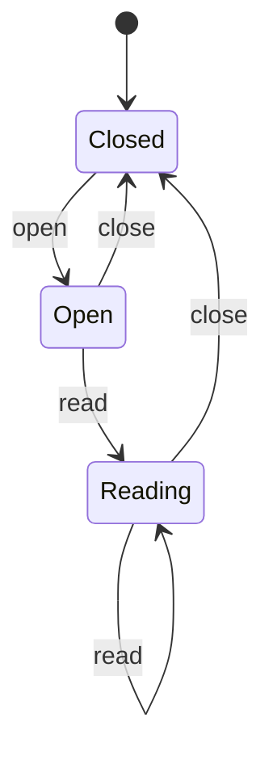
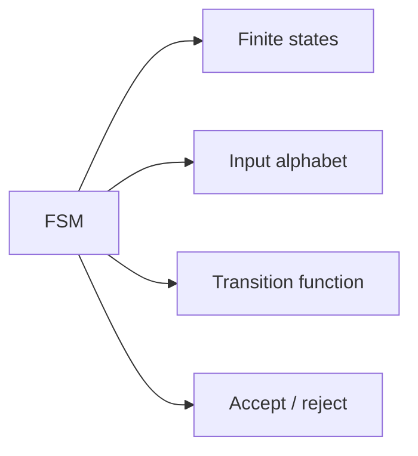
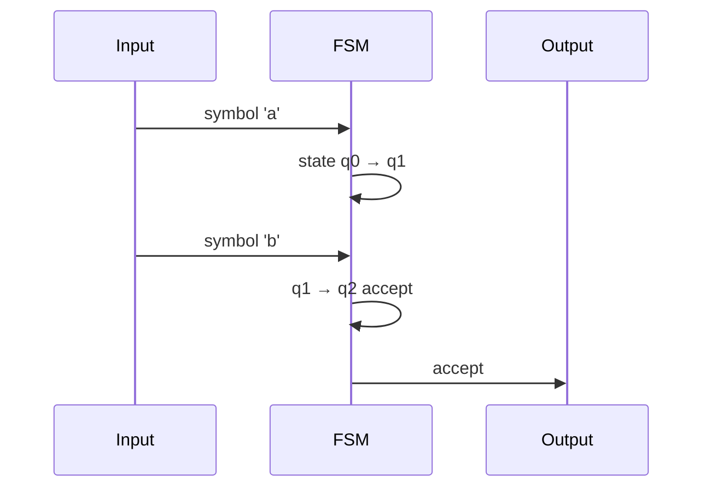

# Finite State Machines

## Overview

A **finite state machine (FSM)** consists of a finite set of **states**, an **alphabet** of input symbols, a **transition function** δ(state, symbol) → state, a **start state**, and **accept states**. A **deterministic finite automaton (DFA)** has at most one transition per (state, symbol). **NFAs** allow ε-transitions and multiple targets — equivalent power, convertible to DFA via subset construction.

FSMs model protocols, UI flows, lexical tokens, and any behavior with bounded memory of history.

## Learning Objectives

- Formalize FSMs and trace acceptance of input strings
- Implement table-driven and code-driven FSMs in TypeScript and Python
- Convert informal protocol rules into explicit states and edges
- Recognize when memory must grow beyond finite (pushdown needed)

## Prerequisites

- [[01-Computer-Science/01-Information-and-Representation/Bits Bytes and Information|Bits Bytes and Information]]

## Difficulty

`intermediate`

## Estimated Time

3 hours reading; 3 hours dual-language lab

## History

McCulloch-Pitts neurons (1943) inspired automata theory. Rabin-Scott (1959) formalized DFAs. FSMs appear in telecom protocols (SS7), TCP states, and UI (Redux reducers, Mealy/Moore machines in hardware).

## Problem It Solves

Ad-hoc boolean flags (`seenQuote`, `inComment`, `phase2`) explode combinatorially. Explicit states make invalid transitions unrepresentable and testable — critical for parsers and network protocols.

## Internal Implementation

**Table representation**: `Map<State, Map<Symbol, State>>`. **Event loop**: read symbol → lookup transition → update state → optional output (Mealy: output on transition; Moore: output on state).

**DFA minimization** merges equivalent states for smaller tables. **Product construction** builds intersection of two DFAs for protocol composition checks.



## Mermaid Diagrams

### Structure



### Sequence / Lifecycle



## Examples

### Minimal Example

TypeScript — HTTP line reader states:

```typescript
type State = "start" | "in_line" | "done";

function feedLineFsm(ch: string, state: State): { state: State; emit?: string } {
  if (state === "done") return { state };
  if (ch === "\n") return { state: "done", emit: "line" };
  return { state: "in_line" };
}
```

TypeScript — table-driven DFA for binary strings ending in `01`:

```typescript
const transitions: Record<string, Record<"0" | "1", string>> = {
  q0: { "0": "q0", "1": "q1" },
  q1: { "0": "q2", "1": "q1" },
  q2: { "0": "q0", "1": "q1" },
};

function accepts(input: string): boolean {
  let s = "q0";
  for (const c of input) s = transitions[s][c as "0" | "1"];
  return s === "q2";
}
```

Python — equivalent:

```python
TRANSITIONS = {
    "q0": {"0": "q0", "1": "q1"},
    "q1": {"0": "q2", "1": "q1"},
    "q2": {"0": "q0", "1": "q1"},
}

def accepts(input_str: str) -> bool:
    state = "q0"
    for ch in input_str:
        state = TRANSITIONS[state][ch]
    return state == "q2"
```

### Production-Shaped Example

TCP connection handling in app gateway: explicit enum states, illegal event → metric + reset. Property tests: no path from `Closed` to `Established` without handshake sequence. See [[01-Computer-Science/code/README|code labs]] `parser` FSM utilities.

## Trade-offs

| Dimension | Upside | Downside | When it matters |
| --- | --- | --- | --- |
| Performance | O(1) transition per symbol | Large alphabets blow table size | Lexers |
| Complexity | Clarity vs flag soup | Drawing all edges tedious | Protocol specs |
| Operability | Test each transition | State explosion in product | Order workflows |

### When to Use

- Lexical analysis, protocol parsers, UI wizards
- Connection/session lifecycle enforcement
- Input validation with sequential structure

### When Not to Use

- Nested structure (parentheses) — need pushdown automaton
- Unbounded counters — need Turing machine / general code

## Exercises

1. Draw DFA for identifiers `[a-zA-Z_][a-zA-Z0-9_]*`.
2. Implement Mealy machine emitting `+1` on each `1` read in run-length window.
3. Prove or disprove: two DFAs intersect emptiness decidable — what does it mean for protocols?

## Mini Project

**Traffic light controller FSM** with pedestrian button, timers as external events — TS + Python shared test scenarios.

## Portfolio Project

Formalize workbench connection protocol as FSM; generate Mermaid from table.

## Interview Questions

1. DFA vs NFA — equal power?
2. How would you model an HTTP parser's line states?
3. When does an FSM fail for JSON parsing?

### Stretch / Staff-Level

1. Model checkout flow with payment timeout — which states need idempotency keys?

## Common Mistakes

- Implicit states hidden in globals
- Missing error/reset transition on illegal input
- Confusing FSM with full parser (no stack)

## Best Practices

- Name states after what memory they represent
- Single `dispatch(event)` entry point
- Diagram + table kept in sync in docs

## Summary

FSMs capture behavior with finite memory via explicit states and transitions. DFAs are fast, testable models for lexers, protocols, and workflows. When nesting appears, graduate to [[01-Computer-Science/08-Languages-and-Computation/Grammars and Parsing|Grammars and Parsing]]. Implement core patterns in [[01-Computer-Science/code/README|code labs]] `parser`.

## Further Reading

- Sipser, *Introduction to the Theory of Computation* — regular languages
- UML statecharts (Harel) for hierarchical extensions
- TCP state diagram in RFC 9293

## Related Notes

- [[01-Computer-Science/08-Languages-and-Computation/Regular Expressions and Automata|Regular Expressions and Automata]]
- [[01-Computer-Science/08-Languages-and-Computation/Grammars and Parsing|Grammars and Parsing]]
- [[01-Computer-Science/07-Networking-Fundamentals/TCP|TCP]]
- [[01-Computer-Science/code/README|code labs]] — `parser`

## Progress Checklist

- [ ] Explained from first principles
- [ ] Drew at least one Mermaid diagram
- [ ] Implemented a minimal version
- [ ] Documented trade-offs and non-goals
- [ ] Completed exercises
- [ ] Practiced interview questions aloud
- [ ] Linked prerequisites and dependents
