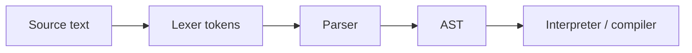
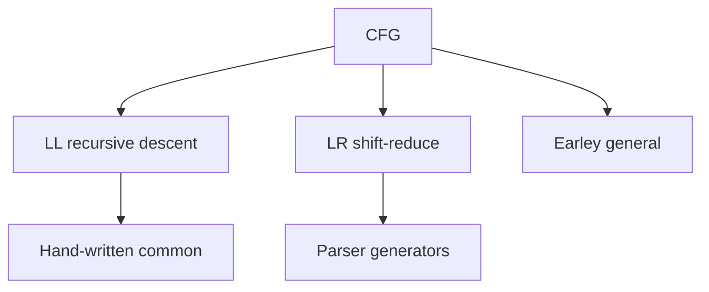
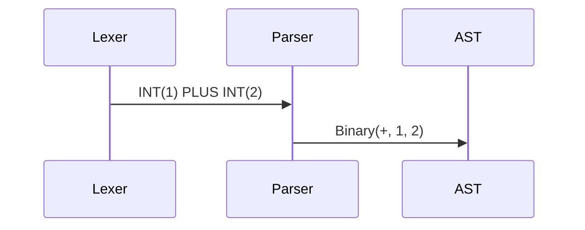

# Grammars and Parsing

## Overview

A **context-free grammar (CFG)** consists of terminals, nonterminals, production rules, and a start symbol. **Parsing** consumes token stream and builds a **parse tree** or **AST** proving membership in the language. Algorithms: **recursive descent** (LL), **shift-reduce** (LR), **Earley** (general CFG). **Precedence** and **associativity** resolve expression ambiguities (`1 + 2 * 3`).

Parsing bridges text and executable structure — configs, queries, DSLs, and full languages.

## Learning Objectives

- Write CFG for expressions, statements, and nested blocks
- Implement recursive-descent parser with precedence climbing in TS and Python
- Distinguish syntax errors from semantic errors
- Choose parser generator vs hand-written for a DSL

## Prerequisites

- [[01-Computer-Science/08-Languages-and-Computation/Regular Expressions and Automata|Regular Expressions and Automata]]

## Difficulty

`advanced`

## Estimated Time

5 hours reading; 6 hours dual-language parser lab

## History

Backus-Naur Form (1960) documented Algol syntax. Yacc (1975) automated LALR parsers. ANTLR, tree-sitter, and hand-written Rust parsers dominate modern tooling. JSON (2000s) popularized simple recursive-descent parsers in every language.

## Problem It Solves

Flat regex cannot validate nesting. Grammars define compositional structure; parsers provide actionable error locations and ASTs for interpreters, linters, and formatters.

## Internal Implementation

**Pipeline**: characters → lexer (regex/FSM) → tokens → parser → AST → downstream.

**Recursive descent**: one function per nonterminal; `parseExpr` calls `parseTerm` for precedence climbing. **Ambiguity**: if grammar allows two trees, rewrite grammar or use precedence declarations.



## Mermaid Diagrams

### Structure



### Sequence / Lifecycle



## Examples

### Minimal Example

Grammar sketch:

```text
expr   → term (('+' | '-') term)*
term   → factor (('*' | '/') factor)*
factor → INT | '(' expr ')'
```

TypeScript — recursive descent fragment:

```typescript
type Tok = { kind: "int"; value: number } | { kind: "plus" } | { kind: "eof" };

function parseExpr(tokens: Tok[], i: number): [number, number] {
  let [left, j] = parseTerm(tokens, i);
  while (tokens[j]?.kind === "plus") {
    const [right, k] = parseTerm(tokens, j + 1);
    left += right;
    j = k;
  }
  return [left, j];
}

function parseTerm(tokens: Tok[], i: number): [number, number] {
  const t = tokens[i];
  if (t?.kind !== "int") throw new Error("expected int");
  return [t.value, i + 1];
}
```

Python — matching evaluator:

```python
class Tok:
    __slots__ = ("kind", "value")
    def __init__(self, kind: str, value=None):
        self.kind, self.value = kind, value

def parse_expr(tokens, i=0):
    left, i = parse_term(tokens, i)
    while i < len(tokens) and tokens[i].kind == "plus":
        right, i = parse_term(tokens, i + 1)
        left += right
    return left, i

def parse_term(tokens, i):
    t = tokens[i]
    if t.kind != "int":
        raise SyntaxError("expected int")
    return t.value, i + 1
```

### Production-Shaped Example

Config DSL parser: rich `SyntaxError` with line/col, error recovery sync tokens, property tests generating random valid strings. Full expr parser in [[01-Computer-Science/code/README|code labs]] `parser`.

## Trade-offs

| Dimension | Upside | Downside | When it matters |
| --- | --- | --- | --- |
| Performance | Hand-tuned LL fast | LR tables obscure | IDE services |
| Complexity | Generators quick start | Debug conflicts painful | DSL projects |
| Operability | Good errors need design | Panic-mode recovery tricky | User-facing DSLs |

### When to Use

- DSLs, linters, code formatters, query languages
- Validating structured configs beyond JSON schema expressiveness

### When Not to Use

- Simple JSON/YAML — use existing parsers
- Binary protocols — use framing + schema ([[01-Computer-Science/01-Information-and-Representation/Data Serialization Fundamentals|Serialization]])

## Exercises

1. Add multiplication with higher precedence than addition without left recursion.
2. Emit AST instead of immediate eval; write pretty-printer.
3. Identify ambiguous grammar `E → E + E | int` and fix it.

## Mini Project

**Expression language**: variables, let bindings, boolean ops — parse to AST, interpret — TS/Python parity tests.

## Portfolio Project

Extend workbench mini language with parser error snapshots and golden AST fixtures.

## Interview Questions

1. LL vs LR — intuitive difference?
2. Why left recursion breaks naive recursive descent?
3. Lexer vs parser responsibility split?

### Stretch / Staff-Level

1. Design incremental parser for IDE (tree-sitter style goals).

## Common Mistakes

- Parsing without token stream (char-at-a-time for everything)
- Left-recursive grammars in recursive descent
- Conflating parse success with semantic validity

## Best Practices

- Test parser before interpreter
- Expose span/location on AST nodes
- Keep grammar close to language users' mental model

## Summary

CFGs define nested structure; parsers realize grammars as ASTs. Recursive descent with precedence climbing is the workhorse for small languages. Graduate to parser generators or LR when grammars grow. Dual implementations live in [[01-Computer-Science/code/README|code labs]]; compilation pipeline continues in [[01-Computer-Science/08-Languages-and-Computation/Compilers Interpreters and Virtual Machines|Compilers Interpreters and Virtual Machines]].

## Further Reading

- Aho, Lam, Sethi, Ullman — *Dragon Book* parsing chapters
- Crafting Interpreters (Nystrom)
- LALR/conflict documentation in Bison

## Related Notes

- [[01-Computer-Science/08-Languages-and-Computation/Regular Expressions and Automata|Regular Expressions and Automata]]
- [[01-Computer-Science/08-Languages-and-Computation/Compilers Interpreters and Virtual Machines|Compilers Interpreters and Virtual Machines]]
- [[01-Computer-Science/code/README|code labs]] — `parser`

## Progress Checklist

- [ ] Explained from first principles
- [ ] Drew at least one Mermaid diagram
- [ ] Implemented a minimal version
- [ ] Documented trade-offs and non-goals
- [ ] Completed exercises
- [ ] Practiced interview questions aloud
- [ ] Linked prerequisites and dependents
