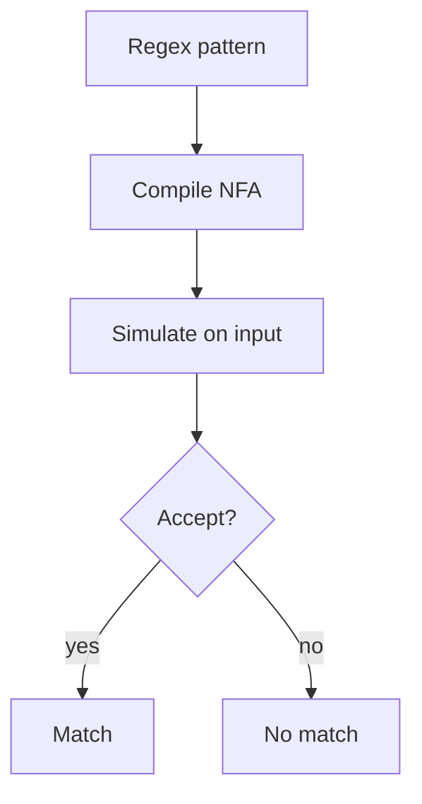
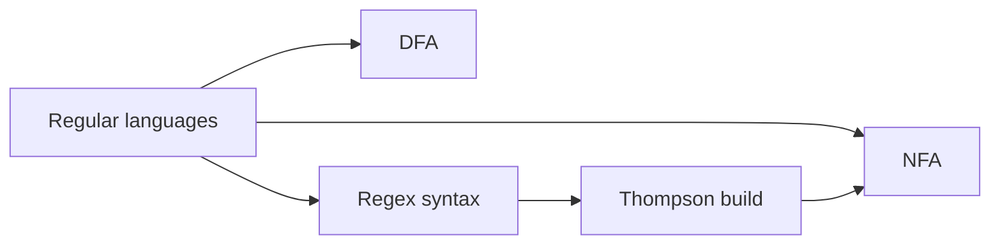
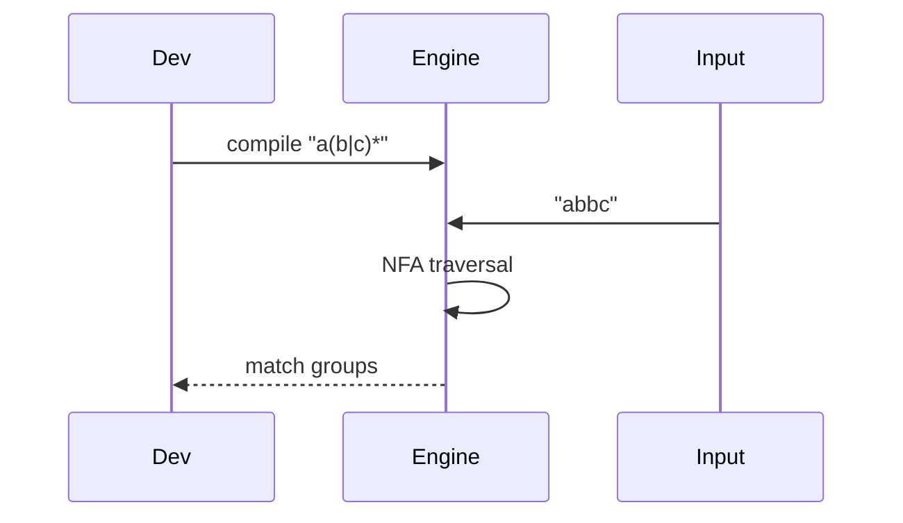

# Regular Expressions and Automata

## Overview

**Regular expressions** denote **regular languages** — those recognizable by finite automata. Operators: concatenation, union (`|`), Kleene star (`*`), optional `?`, plus `+`. A **regex engine** compiles pattern to **NFA**, optionally determinizes to **DFA**, or simulates NFA directly (Thompson construction). Most language `RegExp` libraries extend syntax (backreferences) that exceed true regular power.

Regex fits lexical tokens; not balanced parentheses or XML structure.

## Learning Objectives

- Relate regex syntax to NFA/DFA constructions
- Explain Thompson vs backtracking engines and catastrophic backtracking
- Implement subset of regex → NFA → simulate match
- Choose regex vs parser for validation tasks

## Prerequisites

- [[01-Computer-Science/08-Languages-and-Computation/Finite State Machines|Finite State Machines]]

## Difficulty

`intermediate`

## Estimated Time

4 hours reading; 4 hours mini regex lab (TS + Python)

## History

Kleene (1956) introduced regular operators. Thompson (1968) built Unix `grep` NFA construction. Perl/PCRE added features complicating theory. RE2 and Rust `regex` prioritize linear time via automata.

## Problem It Solves

Extract emails-ish tokens, split logs, validate fixed patterns (dates, hex IDs) without writing full parsers. Compilers use regex-generated lexers for keywords and literals.

## Internal Implementation

**Thompson NFA**: each symbol, alternation, star becomes fragment with ε-edges. **Subset construction**: DFA states are sets of NFA states — potentially exponential blowup in theory, often manageable in practice. **Backtracking engines** (Naive Perl-style) try alternatives recursively — can O(2^n) on pathological patterns.



## Mermaid Diagrams

### Structure



### Sequence / Lifecycle



## Examples

### Minimal Example

TypeScript — using built-in (survey + caution):

```typescript
const re = /^[a-z_][a-z0-9_]*$/i;
console.log(re.test("user_id")); // true
```

Python:

```python
import re
print(bool(re.fullmatch(r"[a-z_][a-z0-9_]*", "user_id", re.I)))
```

TypeScript — tiny matcher for `a*` only (educational):

```typescript
function matchAStar(s: string): boolean {
  for (const c of s) if (c !== "a") return false;
  return true;
}
```

Python — token lexer sketch:

```python
import re

TOKEN = re.compile(r"\d+|[a-z]+|\s+")

def lex(text: str) -> list[str]:
    return [m.group(0) for m in TOKEN.finditer(text) if not m.group(0).isspace()]
```

### Production-Shaped Example

Log parser: anchor patterns, possessive/atomic groups where supported, set match timeout, prefer RE2-style linear engine for untrusted patterns. Never parse HTML with regex alone — use proper parser ([[01-Computer-Science/08-Languages-and-Computation/Grammars and Parsing|Grammars and Parsing]]).

## Trade-offs

| Dimension | Upside | Downside | When it matters |
| --- | --- | --- | --- |
| Performance | DFA linear in input | Compile cost; blowup | High-volume logs |
| Complexity | Concise patterns | Unreadable nested regex | Code review |
| Operability | Ubiquitous | Engine differences | Security filters |

### When to Use

- Lexers, grep, input sanitization for fixed patterns
- Route/path matching with bounded patterns

### When Not to Use

- Nested/recursive structure
- Untrusted patterns without timeout (ReDoS)

## Exercises

1. Write regex for IPv4 (know limitations) vs justify parser instead.
2. Construct NFA for `(a|b)*abb` and trace input `aababb`.
3. Find ReDoS pattern example for backtracking engine; test safely.

## Mini Project

**Micro regex compiler**: support `|`, concat, `*` over single chars; NFA simulation; shared tests TS/Python — align with [[01-Computer-Science/code/README|code labs]] `parser`.

## Portfolio Project

Lexer generator emitting FSM tables from regex token specs for mini language.

## Interview Questions

1. Are regexes with backreferences regular languages?
2. Thompson vs backtracking — security implication?
3. Where do regex fit in compiler pipeline?

### Stretch / Staff-Level

1. Design WAF rule engine choosing automata vs RE2 vs custom parser.

## Common Mistakes

- Catastrophic backtracking on nested quantifiers
- Using `.*` greedily across structured text
- Assuming all engines behave identically

## Best Practices

- Prefer `fullmatch`/anchors for validation
- Limit pattern complexity from users
- Unit test edge cases and unicode categories explicitly

## Summary

Regular expressions describe regular languages compiled to finite automata. They power lexers and quick pattern matching but cannot express nested structure. Understand engine type (automata vs backtracking) for correctness and ReDoS safety. Build intuition in [[01-Computer-Science/code/README|code labs]] before relying on library regex.

## Further Reading

- Cox, "Regular Expression Matching Can Be Simple And Fast"
- Sipser — regular languages chapter
- RE2 design doc

## Related Notes

- [[01-Computer-Science/08-Languages-and-Computation/Finite State Machines|Finite State Machines]]
- [[01-Computer-Science/08-Languages-and-Computation/Grammars and Parsing|Grammars and Parsing]]
- [[01-Computer-Science/code/README|code labs]] — `parser`

## Progress Checklist

- [ ] Explained from first principles
- [ ] Drew at least one Mermaid diagram
- [ ] Implemented a minimal version
- [ ] Documented trade-offs and non-goals
- [ ] Completed exercises
- [ ] Practiced interview questions aloud
- [ ] Linked prerequisites and dependents
