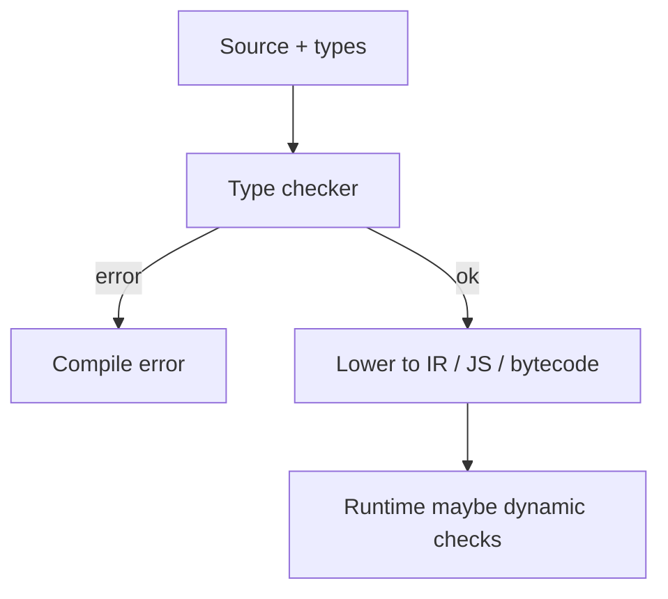
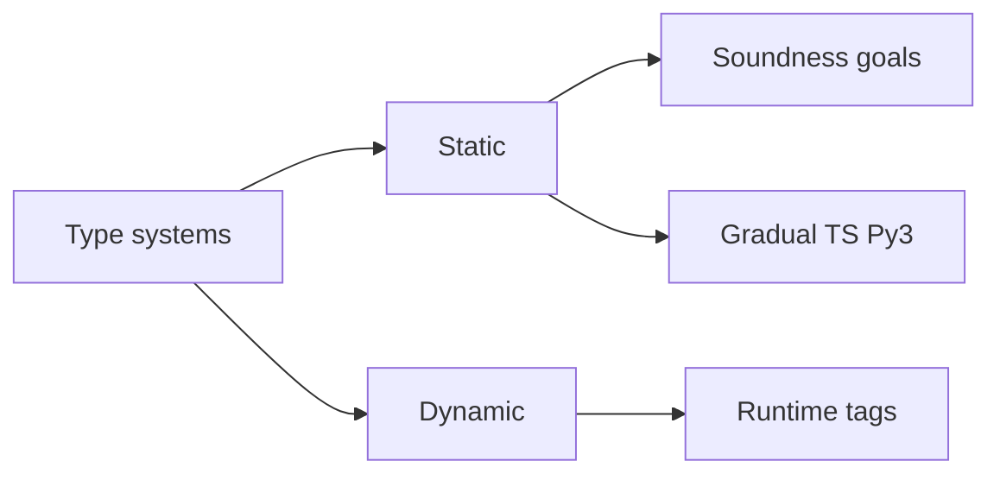
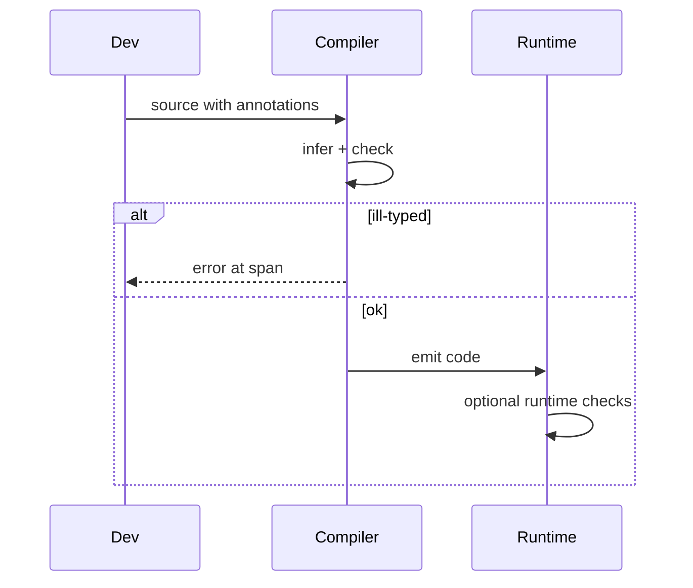

# Type Systems Fundamentals

## Overview

A **type system** assigns **types** to expressions and rules governing operations (`Int + Int → Int`). **Static** checking runs before execution (TypeScript, Rust, Java); **dynamic** checking at runtime (Python, JavaScript). **Soundness** (ideal): well-typed programs do not hit certain errors (e.g., calling non-functions). **Gradual typing** blends both (TypeScript `@ts-check`, Python type hints optional).

Types are not bureaucracy — they are machine-checked specifications compressing test obligations.

## Learning Objectives

- Distinguish syntax, types, and values; explain type erasure vs reification
- Classify type rules: functions, records, unions, generics
- Relate strong typing to memory safety and API contracts
- Read type errors as design feedback, not compiler nagging

## Prerequisites

- [[01-Computer-Science/08-Languages-and-Computation/Grammars and Parsing|Grammars and Parsing]]

## Difficulty

`intermediate`

## Estimated Time

3 hours reading; 2 hours typed refactor exercise

## History

Algol introduced type declarations. ML (1970s) added inference (Hindley-Milner). Java generics (2004) erasure compromise. TypeScript (2012) brought structural static types to JS. Rust's ownership types tie memory lifetimes to compile time.

## Problem It Solves

Categories of bugs — adding string to number, null dereference, wrong arity — explode combinatorially in large codebases. Types reject invalid programs early and document intent in APIs.

## Internal Implementation

**Type checking** walks AST applying inference rules. **Unification** solves type variables for inference. **Subtyping**: record width, function contravariance on args (varies by language). **Generics**: parametric polymorphism monomorphized (Rust/C++) or erased (Java).

Runtime may still check casts (downcast) or tag values (dynamic languages).



## Mermaid Diagrams

### Structure



### Sequence / Lifecycle



## Examples

### Minimal Example

TypeScript — structural typing:

```typescript
type User = { id: string; email: string };

function notify(u: User) {
  console.log(u.email);
}

notify({ id: "1", email: "a@b.com" }); // OK: extra fields allowed structurally
// notify({ id: "1" }); // error: missing email
```

Python — optional static hints (mypy/pyright):

```python
def notify(u: dict[str, str]) -> None:
    print(u["email"])

notify({"id": "1", "email": "a@b.com"})
```

Union narrowing:

```typescript
function len(x: string | string[]): number {
  return typeof x === "string" ? x.length : x.length;
}
```

### Production-Shaped Example

API boundary DTO types separate from domain models; validate at edge (zod/io-ts/Pydantic). Never trust JSON shape without runtime validation even with TS — types erase at compile time. Depth in [[07-Backend/README|Backend]] and language tracks.

## Trade-offs

| Dimension | Upside | Downside | When it matters |
| --- | --- | --- | --- |
| Performance | Static erase overhead; Rust zero-cost | Compile time, learning curve | Large monorepos |
| Complexity | Refactor safety | Generics complexity | Public SDKs |
| Operability | Errors before prod | False positives in gradual | CI gating |

### When to Use

- Public APIs, shared libraries, long-lived services
- Memory-unsafe domains (Rust/C++) for ownership

### When Not to Use

- Throwaway scripts (maybe) — still often worth minimal hints
- Extremely dynamic metaprogramming without payoff

## Exercises

1. Add union type `Result<T,E>` and exhaustiveness check in TS `switch`.
2. Explain why Java arrays are covariant but generics invariant — historical bug lesson.
3. Write same function in Python with hints; run mypy strict on intentional bug.

## Mini Project

**Typed expression AST**: phantom types tag well-formed vs raw AST nodes; only well-formed compiles to bytecode.

## Portfolio Project

Add optional type checker pass to workbench DSL before VM execution.

## Interview Questions

1. Static vs dynamic typing — trade-offs?
2. What is type erasure in Java generics?
3. Soundness vs completeness in type checkers?

### Stretch / Staff-Level

1. Dependent types intuition — why Idris/Coq for proofs not typical web apps?

## Common Mistakes

- Assuming TS types enforce at runtime without validation library
- Using `any`/`# type: ignore` defeating purpose
- Confusing strong typing with static typing

## Best Practices

- Validate external input at boundaries
- Prefer precise types over `string` for IDs/brands
- Treat compiler errors as spec contradictions

## Summary

Type systems classify values and reject invalid compositions before or during execution. Static types scale maintainability; dynamic types preserve flexibility; gradual typing bridges ecosystems. Types complement tests and connect to [[01-Computer-Science/09-Correctness-and-Reliability/Invariants Assertions and Contracts|Invariants]] — full language depth in [[02-JavaScript/README|JavaScript]] and [[03-Python/README|Python]] tracks.

## Further Reading

- Pierce, *Types and Programming Languages*
- TypeScript Handbook — structural typing
- Rust Book — ownership chapter

## Related Notes

- [[01-Computer-Science/08-Languages-and-Computation/Compilers Interpreters and Virtual Machines|Compilers Interpreters and Virtual Machines]]
- [[01-Computer-Science/09-Correctness-and-Reliability/Invariants Assertions and Contracts|Invariants Assertions and Contracts]]
- [[02-JavaScript/README|JavaScript]]
- [[03-Python/README|Python]]
- [[01-Computer-Science/code/README|code labs]]

## Progress Checklist

- [ ] Explained from first principles
- [ ] Drew at least one Mermaid diagram
- [ ] Implemented a minimal version
- [ ] Documented trade-offs and non-goals
- [ ] Completed exercises
- [ ] Practiced interview questions aloud
- [ ] Linked prerequisites and dependents
