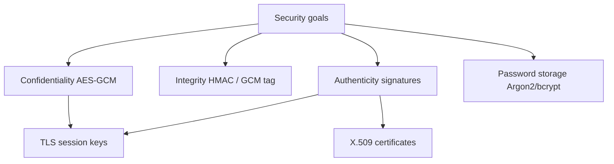
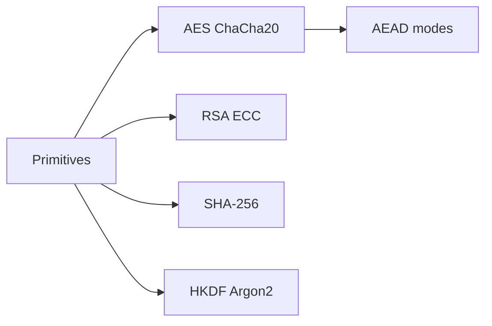
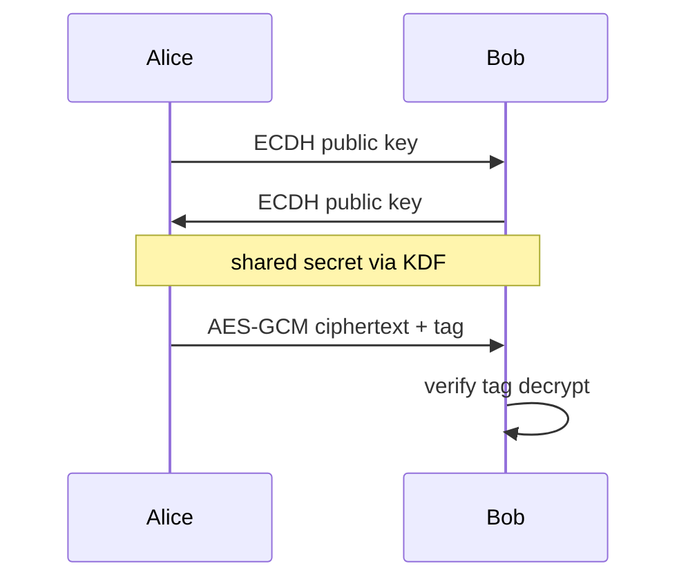

# Cryptographic Primitives Overview

## Overview

**Cryptographic primitives** are mathematical building blocks with precise security goals. **Hash functions** (SHA-256) map data to fixed digests — one-way, collision-resistant. **Symmetric encryption** (AES-GCM) uses shared keys for confidentiality + integrity. **Asymmetric** (RSA, ECDSA, ECDH) uses key pairs for key exchange and signatures. **Message authentication** (HMAC) verifies integrity with a secret.

Use libraries only — never invent ciphers. Operational use (key rotation, HSM, threat modeling) lives in [[18-Security/README|Security]]; TLS applies these in [[01-Computer-Science/07-Networking-Fundamentals/TLS Concepts|TLS Concepts]].

## Learning Objectives

- Match primitive to goal: confidentiality, integrity, authenticity, password storage
- Distinguish hash vs HMAC vs digital signature use cases
- Explain why ECB mode, MD5, and short keys are unsafe
- Read a cipher suite name and identify key exchange + AEAD

## Prerequisites

- [[01-Computer-Science/01-Information-and-Representation/Bits Bytes and Information|Bits Bytes and Information]]
- [[01-Computer-Science/01-Information-and-Representation/Checksums and Error Detection|Checksums and Error Detection]]

## Difficulty

`intermediate`

## Estimated Time

4 hours reading; survey exercises with openssl/libs

## History

DES (1970s) → AES (2001). SHA-2 family (2001). Heartbleed and RC4 deprecation reshaped TLS configs. Post-quantum algorithms (ML-KEM) entering standards (2024+).

## Problem It Solves

Checksums detect accidental bit flips; crypto addresses **malicious** adversaries who read, modify, or forge messages. Primitives compose into TLS, JWT signing, disk encryption, and password verification.

## Internal Implementation

**Hash**: padding + Merkle-Damgård or sponge construction — no key, not for encryption. **HMAC**: `H(K ⊕ opad, H(K ⊕ ipad, msg))`. **AES-GCM**: counter mode encryption + GMAC tag — **AEAD** (authenticated encryption). **ECDH**: scalar multiply on curve → shared secret → KDF → session keys. **Signatures**: sign hash with private key; verify with public.



## Mermaid Diagrams

### Structure



### Sequence / Lifecycle



## Examples

### Minimal Example

Survey — OpenSSL CLI (do not use MD5 for security):

```bash
openssl dgst -sha256 file.txt
openssl rand -hex 32
```

TypeScript (Node crypto — survey):

```typescript
import { createHash, randomBytes, createHmac } from "node:crypto";

const digest = createHash("sha256").update("hello").digest("hex");
const key = randomBytes(32);
const mac = createHmac("sha256", key).update("message").digest("hex");
```

Python (stdlib survey):

```python
import hashlib, hmac, secrets

digest = hashlib.sha256(b"hello").hexdigest()
key = secrets.token_bytes(32)
mac = hmac.new(key, b"message", hashlib.sha256).hexdigest()
```

Password storage (pattern — use library params):

```python
# conceptual — use argon2-cffi or bcrypt in production
# store: algorithm + salt + hash parameters
# verify: constant-time compare
```

### Production-Shaped Example

JWT: sign claims with RS256 or EdDSA; never `alg: none`. Encrypt PII at rest with AES-GCM per-record DEK wrapped by KMS. TLS 1.3 cipher `TLS_AES_256_GCM_SHA384` — AEAD + hash in suite name. Full ops: [[18-Security/README|Security]].

## Trade-offs

| Dimension | Upside | Downside | When it matters |
| --- | --- | --- | --- |
| Performance | AES-NI hardware fast | Asymmetric ops costly | Handshake heavy |
| Complexity | Composable primitives | Miscomposition common | Rolling your own |
| Operability | Standard algorithms | Key rotation burden | Compliance |

### When to Use

- TLS for transport ([[01-Computer-Science/07-Networking-Fundamentals/TLS Concepts|TLS Concepts]])
- Signed webhooks, JWT, code signatures
- Password hashing with Argon2id/bcrypt

### When Not to Use

- Hash for password storage without salt/KDF (use Argon2)
- Encryption without authentication (use AEAD)
- Crypto to fix broken authorization

## Exercises

1. Map each need to primitive: file integrity, API auth tag, HTTPS key exchange, password DB.
2. Why is AES-ECB with picture blocks insecure pattern?
3. Decode TLS cipher suite name from `openssl s_client` output.

## Mini Project

**Crypto survey doc**: diagram TLS 1.3 key schedule labels (ECDHE, HKDF, AEAD) — no custom crypto code.

## Portfolio Project

Threat model table for workbench: assets, adversaries, primitives applied, ops in Security track.

## Interview Questions

1. Hash vs HMAC vs signature?
2. Why salt passwords?
3. What does AEAD mean?

### Stretch / Staff-Level

1. Post-quantum hybrid key exchange in TLS 1.3 — why hybrid?

## Common Mistakes

- MD5/SHA1 for security purposes
- Hard-coded keys in repo
- Random `Math.random` for tokens

## Best Practices

- Use vetted libraries; follow OWASP cheat sheets
- Keys in KMS/HSM; rotate with overlap
- Constant-time compare for secrets

## Summary

Cryptographic primitives provide hashes, symmetric/asymmetric encryption, MACs, and signatures — each with narrow guarantees. Compose them via TLS and application protocols; never ad-hoc. Survey here; operations, threat modeling, and compliance in [[18-Security/README|Security]]; wire protocol in [[01-Computer-Science/07-Networking-Fundamentals/TLS Concepts|TLS Concepts]].

## Further Reading

- Schneier — *Applied Cryptography* (concepts; verify modern algorithms)
- RFC 8446 TLS 1.3
- OWASP Cryptographic Storage Cheat Sheet

## Related Notes

- [[01-Computer-Science/07-Networking-Fundamentals/TLS Concepts|TLS Concepts]]
- [[18-Security/README|Security]] — ops, PKI, threat models
- [[01-Computer-Science/01-Information-and-Representation/Checksums and Error Detection|Checksums and Error Detection]]
- [[01-Computer-Science/code/README|code labs]]

## Progress Checklist

- [ ] Explained from first principles
- [ ] Drew at least one Mermaid diagram
- [ ] Implemented a minimal version
- [ ] Documented trade-offs and non-goals
- [ ] Completed exercises
- [ ] Practiced interview questions aloud
- [ ] Linked prerequisites and dependents
