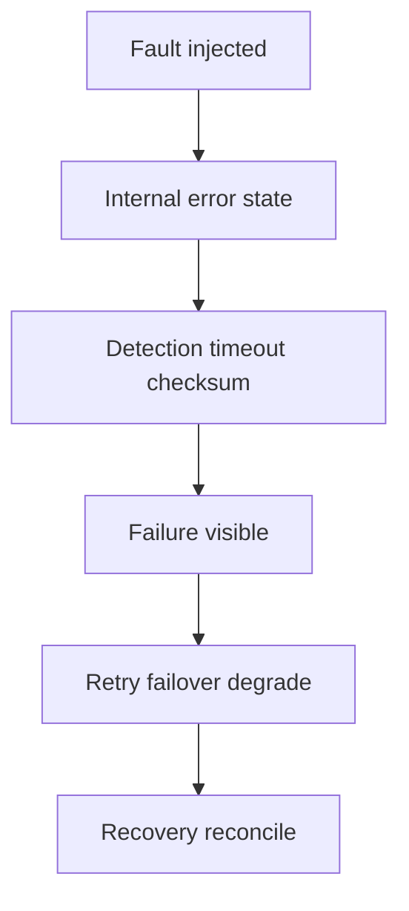
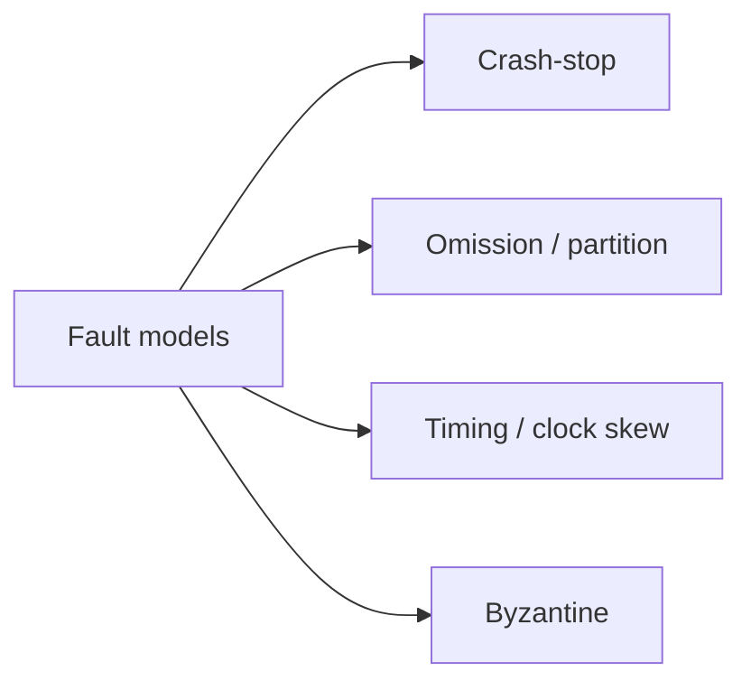
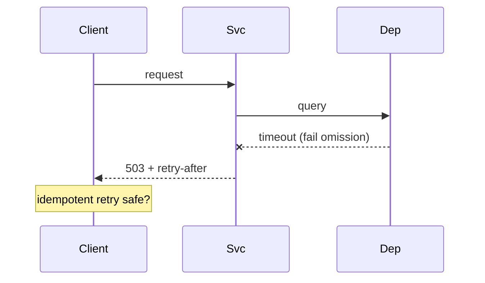

# Failure Modes and Fault Models

## Overview

**Faults** are root causes (bug, bad disk, misconfig). **Errors** are incorrect internal state. **Failures** are externally visible incorrect behavior (wrong response, timeout). **Fault models** define what systems assume about component behavior: **crash-stop** (process halts), **omission** (lost messages), **timing**, **Byzantine** (arbitrary malicious/incorrect behavior).

Designing reliability requires naming failures precisely — not everything is "random glitch."

## Learning Objectives

- Classify failures: hardware, software, operator, security
- Map crash-stop vs Byzantine to algorithm requirements (consensus, replication)
- Build FMEA-style tables for a small service
- Relate partial failures to timeouts, retries, and idempotency

## Prerequisites

- [[01-Computer-Science/04-Processes-and-Execution/Processes|Processes]]
- [[01-Computer-Science/06-IO-and-Persistence/Durability and Crash Consistency|Durability and Crash Consistency]]

## Difficulty

`intermediate`

## Estimated Time

3 hours reading; 2 hours failure injection exercise

## History

Avizienis et al. fault taxonomy. Lamport Byzantine Generals (1982). Large-scale ops (Google SRE, Netflix Chaos Monkey) institutionalized fault injection. Cloud AZ failures made partial outages normal.

## Problem It Solves

Teams over-engineer for Byzantine faults while ignoring crash-stop power loss, or retry without idempotency causing double charge. Explicit fault models justify design choices and test plans.

## Internal Implementation

**Fail-stop process**: alive or dead — simplifies leader election with heartbeats. **Network partition**: two halves think they are primary — need quorum ([[09-System-Design/README|System Design]]). **Cascading failure**: retry storm overloads dependency — need backpressure ([[01-Computer-Science/05-Concurrency-Fundamentals/Backpressure and Resource Contention|Backpressure]]).



## Mermaid Diagrams

### Structure



### Sequence / Lifecycle



## Examples

### Minimal Example

Failure mode table (fragment):

| Component | Mode | Detection | Mitigation |
| --- | --- | --- | --- |
| App process | Crash-stop | health check fail | restart, drain |
| TCP peer | Half-open | read timeout | close, retry |
| Disk | Torn write | checksum | WAL replay |

TypeScript — distinguish error types:

```typescript
class DependencyTimeout extends Error {
  readonly retryable = true;
}
class ValidationError extends Error {
  readonly retryable = false;
}
```

Python:

```python
class DependencyTimeout(Exception):
    retryable = True

class ValidationError(Exception):
    retryable = False
```

### Production-Shaped Example

Payment service: assume crash-stop for app, omission for network, Byzantine for external webhooks (verify signatures). Chaos tests kill pod mid-transaction; verify idempotency keys + [[08-Databases/README|Databases]] constraints prevent double capture.

## Trade-offs

| Dimension | Upside | Downside | When it matters |
| --- | --- | --- | --- |
| Performance | Simple crash model cheap | Wrong model → subtle bugs | Consensus choice |
| Complexity | Byzantine tolerance strong | 3f+1 replicas, crypto | Blockchains only |
| Operability | Clear runbooks per mode | Many modes to test | SRE maturity |

### When to Use

- Architecture reviews and postmortems
- Choosing replication protocol
- Defining retry/idempotency policy

### When Not to Use

- Blaming users for validation errors (not faults)
- Assuming all timeouts mean remote down

## Exercises

1. Split-brain scenario: two nodes both primary — list detection + prevention options.
2. Write idempotent handler for `POST /transfer` with idempotency key semantics.
3. Map AWS AZ outage to fault model labels.

## Mini Project

**Chaos toggle**: dependency wrapper randomly delays/fails; measure retry storm without backoff vs with jitter.

## Portfolio Project

Failure mode doc + injection tests for workbench runtime dependencies.

## Interview Questions

1. Crash-stop vs Byzantine — example each?
2. Why retries can worsen outages?
3. Network partition CAP intuition — one sentence each letter?

### Stretch / Staff-Level

1. Formalize exactly-once delivery impossibility and practical approximations.

## Common Mistakes

- Infinite retries on non-idempotent ops
- No distinction between client bug and server fault
- Missing health check that validates dependencies

## Best Practices

- Timeout budgets end-to-end
- Exponential backoff + jitter
- Fail closed on auth; fail degraded on optional features

## Summary

Fault models state what can go wrong; failure modes describe outward symptoms and mitigations. Most business systems assume crash-stop and omission, not Byzantine behavior. Align retries, durability, and observability with explicit models — distributed depth in [[09-System-Design/README|System Design]], ops in [[16-DevOps/README|DevOps]].

## Further Reading

- *DDIA* — faults and reliability chapter
- Google SRE — error budgets, cascading failures
- Lamport Byzantine Generals paper

## Related Notes

- [[01-Computer-Science/09-Correctness-and-Reliability/Invariants Assertions and Contracts|Invariants Assertions and Contracts]]
- [[01-Computer-Science/09-Correctness-and-Reliability/Observability Fundamentals|Observability Fundamentals]]
- [[09-System-Design/README|System Design]]
- [[01-Computer-Science/code/README|code labs]]

## Progress Checklist

- [ ] Explained from first principles
- [ ] Drew at least one Mermaid diagram
- [ ] Implemented a minimal version
- [ ] Documented trade-offs and non-goals
- [ ] Completed exercises
- [ ] Practiced interview questions aloud
- [ ] Linked prerequisites and dependents
