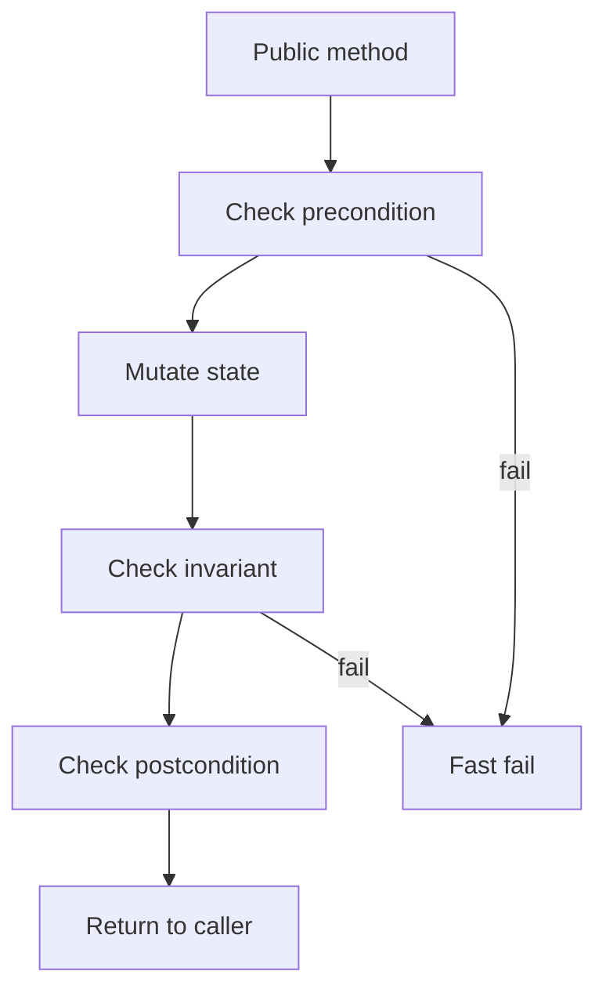
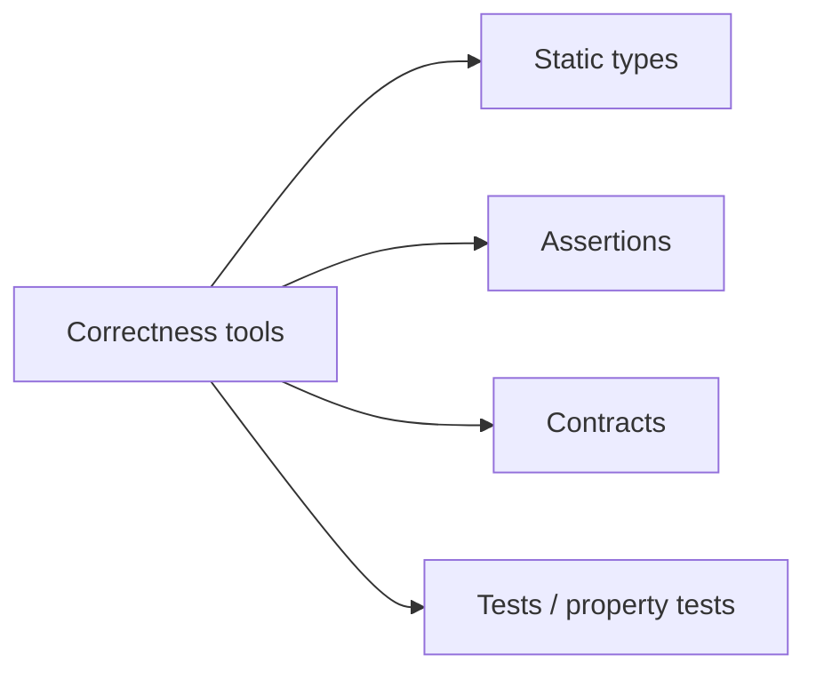
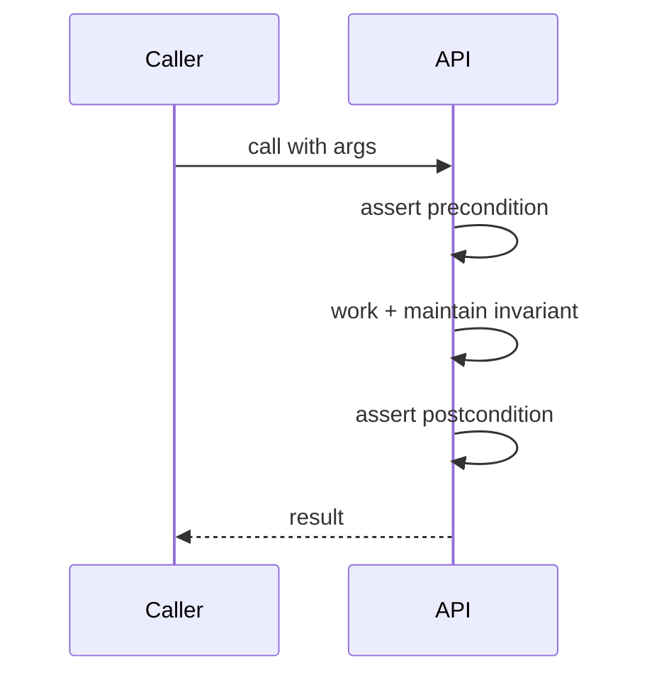

# Invariants Assertions and Contracts

## Overview

An **invariant** is a property that must always hold for a data structure or system (e.g., `balance >= 0`, sorted order, `size == len(items)`). **Assertions** check properties at runtime, often disabled in production hot paths or replaced with logging. **Design by Contract** (DbC) formalizes **preconditions** (caller obligations), **postconditions** (callee guarantees), and **invariants** across calls.

Invariants turn implicit assumptions into falsifiable statements — the bridge between types, tests, and production failures.

## Learning Objectives

- Write loop and class invariants for non-trivial structures
- Choose assertion vs error return vs exception by recoverability
- Apply contracts at module boundaries (APIs, repositories)
- Connect invariants to concurrent code and crash consistency

## Prerequisites

- [[01-Computer-Science/08-Languages-and-Computation/Type Systems Fundamentals|Type Systems Fundamentals]]
- [[01-Computer-Science/05-Concurrency-Fundamentals/Locks and Critical Sections|Locks and Critical Sections]]

## Difficulty

`intermediate`

## Estimated Time

3 hours reading; 3 hours refactor-with-contracts lab

## History

Hoare (1969) axiomatic semantics. Eiffel (1988) popularized DbC. C `assert` macro; Rust `debug_assert!`; Python `-O` strips `__debug__` asserts. Modern APIs use runtime validators (Protobuf, JSON Schema) as external contracts.

## Problem It Solves

Silent corruption propagates — negative inventory, broken BST, double-free. Early detection at violation site shrinks debug time versus mysterious downstream 500 errors.

## Internal Implementation

**Assertion** compiles to conditional branch + abort/throw. **Invariant checker** runs after public methods mutate state. **Formal methods** prove invariants for all paths — rare in app code, common in kernels/crypto.

Under concurrency, invariants hold **while lock held** or using atomic discipline — not necessarily between threads without synchronization.



## Mermaid Diagrams

### Structure



### Sequence / Lifecycle



## Examples

### Minimal Example

TypeScript:

```typescript
class BankAccount {
  private balance = 0;

  withdraw(amount: number): void {
    console.assert(amount > 0, "pre: amount positive");
    console.assert(this.balance >= amount, "pre: sufficient funds");
    this.balance -= amount;
    console.assert(this.balance >= 0, "inv: non-negative balance");
  }
}
```

Python:

```python
class BankAccount:
    def __init__(self):
        self.balance = 0

    def withdraw(self, amount: float) -> None:
        assert amount > 0, "pre: amount positive"
        assert self.balance >= amount, "pre: sufficient funds"
        self.balance -= amount
        assert self.balance >= 0, "inv: non-negative balance"
```

### Production-Shaped Example

Repository layer: precondition `id != null`; postcondition fetched row matches schema validator; invariant queue depth ≤ capacity between dequeue operations. Pair with metrics on contract violation, not silent clamp. Database constraints as persisted invariants — [[08-Databases/README|Databases]].

## Trade-offs

| Dimension | Upside | Downside | When it matters |
| --- | --- | --- | --- |
| Performance | Debug asserts catch early | Production overhead if always on | Hot loops |
| Complexity | Documents truth | Assert fatigue / ignored | Legacy modules |
| Operability | Clear crash site | Users see 500 vs soft degrade | Public APIs |

### When to Use

- Internal modules with complex state (parsers, schedulers, ledgers)
- Impossible states should halt dev/staging immediately
- Concurrent structures under lock

### When Not to Use

- User input validation (use structured errors, not assert)
- Expected failure cases (out of stock — not assert)

## Exercises

1. Specify invariant for min-heap; assert after each insert/delete.
2. Convert three `if throw` checks into pre/post/invariant table for stack API.
3. Show invariant violated by race without lock — fix with mutex.

## Mini Project

**Bounded queue** with explicit invariant checks and property tests (never negative count, never over capacity).

## Portfolio Project

Document invariants for workbench protocol parser FSM + VM stack; fail fast in debug builds.

## Interview Questions

1. Assertion vs exception vs error code?
2. Loop invariant example for binary search?
3. Can invariants hold globally under concurrency?

### Stretch / Staff-Level

1. How do formal verification tools (TLA+, Alloy) relate to runtime asserts?

## Common Mistakes

- Asserting on user-controlled input
- Leaving invariants only in comments
- Checking invariant only in constructor

## Best Practices

- Name invariants in module header comment
- Strip or downgrade asserts in prod per policy; never assert secrets
- Encode cheap invariants in types where possible

## Summary

Invariants state what must remain true; assertions and contracts enforce them at runtime boundaries. They complement types and tests by catching impossible states close to the bug. Concurrent and durable systems need explicit scope (lock held, transaction open) — tying to [[01-Computer-Science/06-IO-and-Persistence/Durability and Crash Consistency|Durability]] and [[01-Computer-Science/09-Correctness-and-Reliability/Failure Modes and Fault Models|Failure Modes]].

## Further Reading

- Meyer, *Object-Oriented Software Construction* (DbC)
- Hunt & Thomas, *The Pragmatic Programmer* — dead programs
- Rust documentation on debug_assert

## Related Notes

- [[01-Computer-Science/08-Languages-and-Computation/Type Systems Fundamentals|Type Systems Fundamentals]]
- [[01-Computer-Science/09-Correctness-and-Reliability/Failure Modes and Fault Models|Failure Modes and Fault Models]]
- [[08-Databases/README|Databases]] — constraints as invariants
- [[01-Computer-Science/code/README|code labs]]

## Progress Checklist

- [ ] Explained from first principles
- [ ] Drew at least one Mermaid diagram
- [ ] Implemented a minimal version
- [ ] Documented trade-offs and non-goals
- [ ] Completed exercises
- [ ] Practiced interview questions aloud
- [ ] Linked prerequisites and dependents
