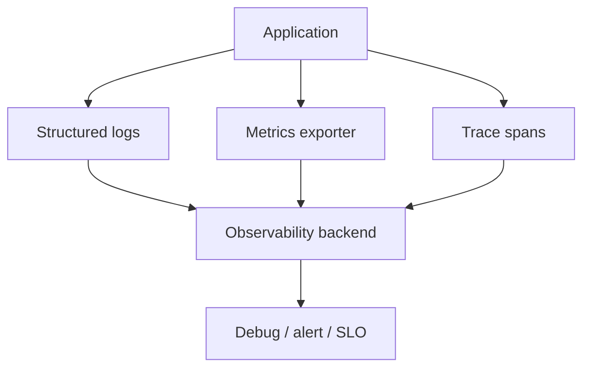
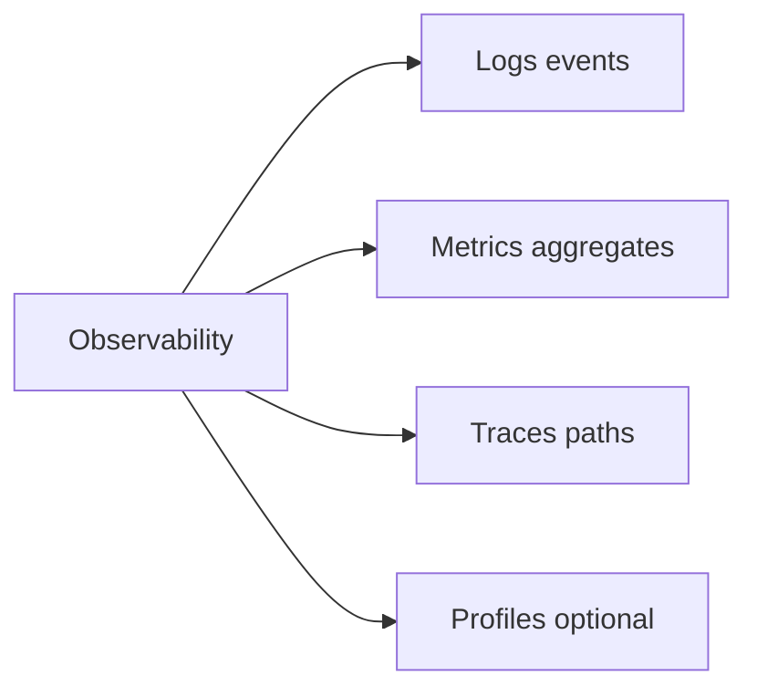
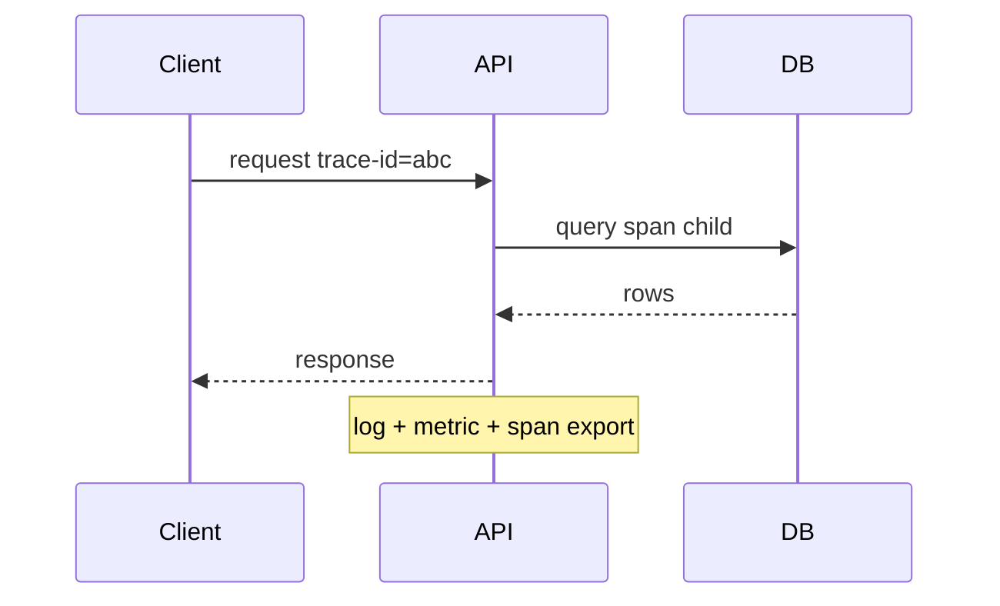

# Observability Fundamentals

## Overview

**Observability** is the ability to infer internal state from external outputs. The **three pillars**: **logs** (discrete events), **metrics** (aggregated time series), **traces** (request paths across services). **SLIs** measure user-visible behavior; **SLOs** set targets; **error budgets** balance velocity vs reliability.

Observability is not "more logging" — it is intentional telemetry design tied to failure modes and latency.

## Learning Objectives

- Choose log vs metric vs trace for a given debugging question
- Define SLI/SLO for a simple HTTP service
- Propagate correlation IDs across async boundaries
- Avoid cardinal explosion and PII leaks in telemetry

## Prerequisites

- [[01-Computer-Science/09-Correctness-and-Reliability/Failure Modes and Fault Models|Failure Modes and Fault Models]]
- [[01-Computer-Science/07-Networking-Fundamentals/HTTP as a Protocol|HTTP as a Protocol]]

## Difficulty

`intermediate`

## Estimated Time

3 hours reading; 3 hours instrument sample service

## History

Mainframe logs → syslog. Nagios metrics (1990s). Dapper (Google 2010) popularized distributed tracing. OpenTelemetry (2019+) standardizes vendor-neutral instrumentation. SRE framework codified SLO-driven ops.

## Problem It Solves

Production systems fail opaquely without structured signals. Dashboards answer "is it on fire?"; logs answer "what happened to request X?"; traces answer "which dependency added 800ms?"

## Internal Implementation

**Metrics**: counter (monotonic), gauge (current), histogram/summary (latency distribution). **Logs**: structured JSON preferred — `level`, `msg`, `trace_id`, fields. **Traces**: spans with parent span id, attributes, timing; sampled under load.

**RED method** (services): Rate, Errors, Duration. **USE** (resources): Utilization, Saturation, Errors.



## Mermaid Diagrams

### Structure



### Sequence / Lifecycle



## Examples

### Minimal Example

TypeScript — structured log + simple metric counter:

```typescript
function logRequest(traceId: string, method: string, status: number, ms: number) {
  console.log(JSON.stringify({ level: "info", traceId, method, status, durationMs: ms }));
}

let requestCount = 0;
function incRequests() {
  requestCount += 1;
}
```

Python — logging + correlation:

```python
import json, logging, uuid

log = logging.getLogger("api")

def handle_request(method: str) -> tuple[int, str]:
    trace_id = str(uuid.uuid4())
    log.info(json.dumps({"trace_id": trace_id, "method": method, "event": "start"}))
    # ... work ...
    log.info(json.dumps({"trace_id": trace_id, "status": 200, "event": "end"}))
    return 200, trace_id
```

### Production-Shaped Example

HTTP middleware: start span, record histogram `http_server_duration_ms` labels `{method,route,status}`, log errors with stack at `error` level only, propagate `traceparent` header. Alert on SLO burn rate — ops tooling in [[16-DevOps/README|DevOps]].

## Trade-offs

| Dimension | Upside | Downside | When it matters |
| --- | --- | --- | --- |
| Performance | Metrics cheap at scale | Traces/logs costly | High QPS |
| Complexity | Great debuggability | Cardinality explosions | Label design |
| Operability | SLO alignment | Alert fatigue | On-call health |

### When to Use

- Any production service with SLAs
- Debugging distributed flows ([[09-System-Design/README|System Design]])
- Post-incident analysis

### When Not to Use

- Logging secrets/PII without redaction
- High-cardinality labels (user id on every metric series)

## Exercises

1. Define SLI/SLO for 99.9% availability monthly — allowed downtime minutes?
2. Given symptom "p99 up, error rate flat," which pillar first?
3. Design log schema for payment failure with no PAN in logs.

## Mini Project

**Instrument echo HTTP server**: RED metrics, JSON logs with trace id, fake trace tree for two internal calls.

## Portfolio Project

Observability chapter for workbench README: dashboards, example queries, SLO table.

## Interview Questions

1. Logs vs metrics vs traces — when each?
2. What is cardinality in Prometheus-style metrics?
3. How do error budgets affect release decisions?

### Stretch / Staff-Level

1. Sampling strategy for traces at 50k RPS without losing errors?

## Common Mistakes

- printf debugging only in prod
- String parsing logs in alerts instead of metrics
- Missing correlation across async callbacks

## Best Practices

- Structured logs; one event per line JSON
- Histograms for latency, not averages alone
- OpenTelemetry semantic conventions where possible

## Summary

Observability combines logs, metrics, and traces to explain production behavior. Tie instrumentation to failure modes and SLOs, control cardinality, and propagate correlation IDs. Tooling and on-call practice extend through [[16-DevOps/README|DevOps]] and [[09-System-Design/README|System Design]].

## Further Reading

- Google SRE Book — monitoring chapters
- OpenTelemetry documentation
- Majors, Larson — *Observability Engineering*

## Related Notes

- [[01-Computer-Science/09-Correctness-and-Reliability/Failure Modes and Fault Models|Failure Modes and Fault Models]]
- [[01-Computer-Science/07-Networking-Fundamentals/Latency Bandwidth Throughput and Tail Latency|Latency Bandwidth Throughput and Tail Latency]]
- [[16-DevOps/README|DevOps]]
- [[01-Computer-Science/code/README|code labs]]

## Progress Checklist

- [ ] Explained from first principles
- [ ] Drew at least one Mermaid diagram
- [ ] Implemented a minimal version
- [ ] Documented trade-offs and non-goals
- [ ] Completed exercises
- [ ] Practiced interview questions aloud
- [ ] Linked prerequisites and dependents
