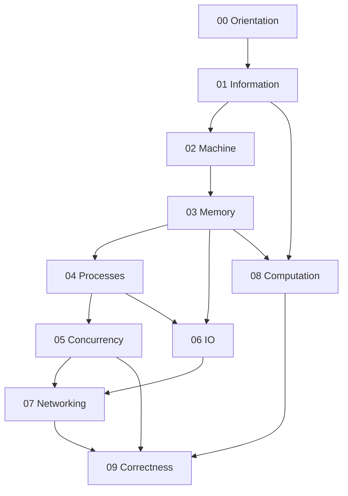

# 01 Computer Science

Foundational track for understanding how machines represent information, execute programs, manage memory, schedule work, move bytes, and fail under real constraints.

## Objectives

- Understand computation from bits through networked processes
- Learn internal mechanisms before APIs and frameworks
- Implement mechanism labs in TypeScript and Python
- Prepare for systems interviews with trade-off fluency
- Apply CS models to production debugging and design

## Why This Track Matters

Production failures are rarely “mystery bugs.” They are usually misunderstood representation, memory, concurrency, I/O, or networking. This track builds the mental models that make later language, backend, Linux, and system-design tracks intelligible.

## Scope Boundaries

| In scope | Hand off to |
| --- | --- |
| Bits, numerics, encodings, binary layout | — |
| CPU/memory models, locality, performance vocabulary | [[02-JavaScript/README\|JavaScript]], [[03-Python/README\|Python]] for language runtime depth |
| Processes, threads, syscalls, IPC as models | [[10-Linux/README\|Linux]] for operational tooling |
| Concurrency primitives and failure modes | [[06-NodeJS/README\|Node.js]], [[07-Backend/README\|Backend]] |
| Sockets, TCP/UDP, HTTP/DNS/TLS as protocols | Backend / Security tracks for product auth and TLS ops |
| Complexity primer and automata | [[04-Data-Structures/README\|Data Structures]], [[05-Algorithms/README\|Algorithms]] |
| Persistence and durability concepts | [[08-Databases/README\|Databases]] |
| Latency/failure vocabulary | [[09-System-Design/README\|System Design]] |

## Prerequisites

- Comfortable writing small programs in TypeScript or Python
- Willingness to read diagrams and implement from scratch
- [[00-Introduction/README|Introduction]] and [[00-Introduction/Roadmap|Master Roadmap]]

## Roadmap

## Topics

### 00 — Orientation

- [[01-Computer-Science/00-Orientation/How Computers Run Programs|How Computers Run Programs]]
- [[01-Computer-Science/00-Orientation/Abstraction Layers in Computing|Abstraction Layers in Computing]]

### 01 — Information and Representation

- [[01-Computer-Science/01-Information-and-Representation/Bits Bytes and Information|Bits Bytes and Information]]
- [[01-Computer-Science/01-Information-and-Representation/Number Systems|Number Systems]]
- [[01-Computer-Science/01-Information-and-Representation/Integer Representation|Integer Representation]]
- [[01-Computer-Science/01-Information-and-Representation/Floating Point|Floating Point]]
- [[01-Computer-Science/01-Information-and-Representation/Character Encoding|Character Encoding]]
- [[01-Computer-Science/01-Information-and-Representation/Endianness and Binary Layout|Endianness and Binary Layout]]
- [[01-Computer-Science/01-Information-and-Representation/Checksums and Error Detection|Checksums and Error Detection]]
- [[01-Computer-Science/01-Information-and-Representation/Data Serialization Fundamentals|Data Serialization Fundamentals]]

### 02 — Machine Model

- [[01-Computer-Science/02-Machine-Model/CPU and Instruction Set Architecture|CPU and Instruction Set Architecture]]
- [[01-Computer-Science/02-Machine-Model/Fetch Decode Execute|Fetch Decode Execute]]
- [[01-Computer-Science/02-Machine-Model/Registers and Calling Conventions|Registers and Calling Conventions]]
- [[01-Computer-Science/02-Machine-Model/Cache Hierarchy and Locality|Cache Hierarchy and Locality]]
- [[01-Computer-Science/02-Machine-Model/Pipelining and Speculative Execution|Pipelining and Speculative Execution]]
- [[01-Computer-Science/02-Machine-Model/Hardware Software Interface|Hardware Software Interface]]
- [[01-Computer-Science/02-Machine-Model/Measuring Computer Performance|Measuring Computer Performance]]

### 03 — Memory and Addressing

- [[01-Computer-Science/03-Memory-and-Addressing/Address Spaces|Address Spaces]]
- [[01-Computer-Science/03-Memory-and-Addressing/Stack and Heap|Stack and Heap]]
- [[01-Computer-Science/03-Memory-and-Addressing/Pointers References and Aliasing|Pointers References and Aliasing]]
- [[01-Computer-Science/03-Memory-and-Addressing/Virtual Memory|Virtual Memory]]
- [[01-Computer-Science/03-Memory-and-Addressing/Memory Hierarchy Trade-offs|Memory Hierarchy Trade-offs]]
- [[01-Computer-Science/03-Memory-and-Addressing/Memory Safety Fundamentals|Memory Safety Fundamentals]]
- [[01-Computer-Science/03-Memory-and-Addressing/Garbage Collection Models|Garbage Collection Models]]

### 04 — Processes and Execution

- [[01-Computer-Science/04-Processes-and-Execution/Processes|Processes]]
- [[01-Computer-Science/04-Processes-and-Execution/Threads|Threads]]
- [[01-Computer-Science/04-Processes-and-Execution/Context Switching|Context Switching]]
- [[01-Computer-Science/04-Processes-and-Execution/Scheduling Concepts|Scheduling Concepts]]
- [[01-Computer-Science/04-Processes-and-Execution/System Calls|System Calls]]
- [[01-Computer-Science/04-Processes-and-Execution/Interprocess Communication Fundamentals|Interprocess Communication Fundamentals]]

### 05 — Concurrency Fundamentals

- [[01-Computer-Science/05-Concurrency-Fundamentals/Concurrency vs Parallelism|Concurrency vs Parallelism]]
- [[01-Computer-Science/05-Concurrency-Fundamentals/Race Conditions|Race Conditions]]
- [[01-Computer-Science/05-Concurrency-Fundamentals/Locks and Critical Sections|Locks and Critical Sections]]
- [[01-Computer-Science/05-Concurrency-Fundamentals/Semaphores and Condition Variables|Semaphores and Condition Variables]]
- [[01-Computer-Science/05-Concurrency-Fundamentals/Deadlocks Livelocks and Starvation|Deadlocks Livelocks and Starvation]]
- [[01-Computer-Science/05-Concurrency-Fundamentals/Atomics and Memory Ordering|Atomics and Memory Ordering]]
- [[01-Computer-Science/05-Concurrency-Fundamentals/Asynchronous Event-Driven Models|Asynchronous Event-Driven Models]]
- [[01-Computer-Science/05-Concurrency-Fundamentals/Backpressure and Resource Contention|Backpressure and Resource Contention]]

### 06 — I/O and Persistence

- [[01-Computer-Science/06-IO-and-Persistence/Blocking Nonblocking and Multiplexed IO|Blocking Nonblocking and Multiplexed IO]]
- [[01-Computer-Science/06-IO-and-Persistence/Files as Abstractions|Files as Abstractions]]
- [[01-Computer-Science/06-IO-and-Persistence/Buffers Streams and Zero Copy|Buffers Streams and Zero Copy]]
- [[01-Computer-Science/06-IO-and-Persistence/Durability and Crash Consistency|Durability and Crash Consistency]]
- [[01-Computer-Science/06-IO-and-Persistence/Clocks Time and Ordering|Clocks Time and Ordering]]

### 07 — Networking Fundamentals

- [[01-Computer-Science/07-Networking-Fundamentals/Layered Network Models|Layered Network Models]]
- [[01-Computer-Science/07-Networking-Fundamentals/IP Addressing and Routing|IP Addressing and Routing]]
- [[01-Computer-Science/07-Networking-Fundamentals/UDP|UDP]]
- [[01-Computer-Science/07-Networking-Fundamentals/TCP|TCP]]
- [[01-Computer-Science/07-Networking-Fundamentals/DNS Fundamentals|DNS Fundamentals]]
- [[01-Computer-Science/07-Networking-Fundamentals/Sockets Programming Model|Sockets Programming Model]]
- [[01-Computer-Science/07-Networking-Fundamentals/TLS Concepts|TLS Concepts]]
- [[01-Computer-Science/07-Networking-Fundamentals/HTTP as a Protocol|HTTP as a Protocol]]
- [[01-Computer-Science/07-Networking-Fundamentals/Latency Bandwidth Throughput and Tail Latency|Latency Bandwidth Throughput and Tail Latency]]

### 08 — Languages and Computation

- [[01-Computer-Science/08-Languages-and-Computation/Finite State Machines|Finite State Machines]]
- [[01-Computer-Science/08-Languages-and-Computation/Regular Expressions and Automata|Regular Expressions and Automata]]
- [[01-Computer-Science/08-Languages-and-Computation/Grammars and Parsing|Grammars and Parsing]]
- [[01-Computer-Science/08-Languages-and-Computation/Compilers Interpreters and Virtual Machines|Compilers Interpreters and Virtual Machines]]
- [[01-Computer-Science/08-Languages-and-Computation/Bytecode and JIT Compilation|Bytecode and JIT Compilation]]
- [[01-Computer-Science/08-Languages-and-Computation/Type Systems Fundamentals|Type Systems Fundamentals]]
- [[01-Computer-Science/08-Languages-and-Computation/Computational Complexity Primer|Computational Complexity Primer]]

### 09 — Correctness and Reliability

- [[01-Computer-Science/09-Correctness-and-Reliability/Invariants Assertions and Contracts|Invariants Assertions and Contracts]]
- [[01-Computer-Science/09-Correctness-and-Reliability/Failure Modes and Fault Models|Failure Modes and Fault Models]]
- [[01-Computer-Science/09-Correctness-and-Reliability/Observability Fundamentals|Observability Fundamentals]]
- [[01-Computer-Science/09-Correctness-and-Reliability/Cryptographic Primitives Overview|Cryptographic Primitives Overview]]

## Suggested Study Order

1. Orientation → Information → Machine → Memory (Wave A)
2. Processes → Concurrency (Wave B)
3. I/O → Networking (Wave C)
4. Languages and Computation → Correctness (Wave D)
5. Complete mini projects after the modules they depend on
6. Finish the portfolio workbench after Networking + Concurrency + VM topics

Hard gates:

- Finish Information before trusting floats, encodings, or binary protocols
- Finish Memory before Concurrency
- Finish Processes before sockets and locks in production scenarios

## Mini Projects

- [[01-Computer-Science/projects/Binary Protocol Lab/README|Binary Protocol Lab]]
- [[01-Computer-Science/projects/UTF-8 and Float Inspector/README|UTF-8 and Float Inspector]]
- [[01-Computer-Science/projects/Stack Machine/README|Stack Machine]]
- [[01-Computer-Science/projects/Concurrency Zoo/README|Concurrency Zoo]]
- [[01-Computer-Science/projects/Socket Workshop/README|Socket Workshop]]

## Portfolio Project

- [[01-Computer-Science/projects/Concurrent Runtime and Protocol Workbench/README|Concurrent Runtime and Protocol Workbench]]

## Exercises

- [[01-Computer-Science/_exercises/Orientation Exercises|Orientation Exercises]]
- [[01-Computer-Science/_exercises/Information and Representation Exercises|Information and Representation Exercises]]
- [[01-Computer-Science/_exercises/Machine Model Exercises|Machine Model Exercises]]
- [[01-Computer-Science/_exercises/Memory and Addressing Exercises|Memory and Addressing Exercises]]
- [[01-Computer-Science/_exercises/Processes and Execution Exercises|Processes and Execution Exercises]]
- [[01-Computer-Science/_exercises/Concurrency Fundamentals Exercises|Concurrency Fundamentals Exercises]]
- [[01-Computer-Science/_exercises/IO and Persistence Exercises|IO and Persistence Exercises]]
- [[01-Computer-Science/_exercises/Networking Fundamentals Exercises|Networking Fundamentals Exercises]]
- [[01-Computer-Science/_exercises/Languages and Computation Exercises|Languages and Computation Exercises]]
- [[01-Computer-Science/_exercises/Correctness and Reliability Exercises|Correctness and Reliability Exercises]]

## Interview Questions

- [[01-Computer-Science/_interview/Orientation Interview Questions|Orientation Interview Questions]]
- [[01-Computer-Science/_interview/Information and Representation Interview Questions|Information and Representation Interview Questions]]
- [[01-Computer-Science/_interview/Machine Model Interview Questions|Machine Model Interview Questions]]
- [[01-Computer-Science/_interview/Memory and Addressing Interview Questions|Memory and Addressing Interview Questions]]
- [[01-Computer-Science/_interview/Processes and Execution Interview Questions|Processes and Execution Interview Questions]]
- [[01-Computer-Science/_interview/Concurrency Fundamentals Interview Questions|Concurrency Fundamentals Interview Questions]]
- [[01-Computer-Science/_interview/IO and Persistence Interview Questions|IO and Persistence Interview Questions]]
- [[01-Computer-Science/_interview/Networking Fundamentals Interview Questions|Networking Fundamentals Interview Questions]]
- [[01-Computer-Science/_interview/Languages and Computation Interview Questions|Languages and Computation Interview Questions]]
- [[01-Computer-Science/_interview/Correctness and Reliability Interview Questions|Correctness and Reliability Interview Questions]]

## Implementation Checklist

- [x] Bit/byte + endian utilities (TS + Python)
- [x] IEEE-754 inspector
- [x] UTF-8 codec with invalid-sequence handling
- [x] Checksum + framed serializer
- [x] Toy bytecode VM
- [x] Concurrency demos (race, mutex, CV, deadlock, bounded buffer)
- [x] TCP/UDP echo + tiny HTTP/1.0 parser
- [x] FSM + mini expression parser
- [x] Portfolio: Concurrent Runtime and Protocol Workbench
- [x] Module exercise + interview sets

## Code Labs

See [[01-Computer-Science/code/README|code labs README]].

## References

- [[00-References/Computer Science/README|Computer Science References]]

## Related Tracks

- [[00-Introduction/Roadmap|Master Roadmap]]
- [[02-JavaScript/README|JavaScript]]
- [[03-Python/README|Python]]
- [[04-Data-Structures/README|Data Structures]]
- [[05-Algorithms/README|Algorithms]]
- [[06-NodeJS/README|Node.js]]
- [[07-Backend/README|Backend]]
- [[08-Databases/README|Databases]]
- [[09-System-Design/README|System Design]]
- [[10-Linux/README|Linux]]
- [[16-DevOps/README|DevOps]]
- [[17-Architecture/README|Architecture]]
- [[18-Security/README|Security]]
- [[19-AI/README|AI]]
- [[Projects/README|Projects]]
- [[Career/README|Career]]

## Stage Gate Checklist

Before leaving this track:

- [ ] Can teach memory, processes, concurrency, and TCP from first principles
- [ ] Completed dual-language labs with tests green
- [ ] Finished at least three mini projects and one portfolio write-up
- [ ] Practiced module interview sets aloud with diagrams
- [ ] Cross-linked handoffs into language and systems tracks
