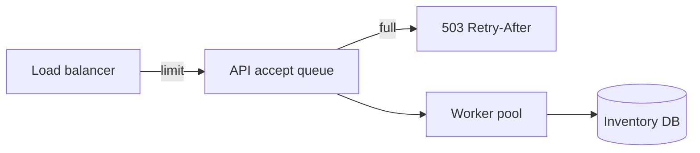

# Concurrency Fundamentals Exercises

Reproduce races, deadlocks, and backpressure in controlled labs before they appear in revenue paths.

## Linked Topic

- [[01-Computer-Science/05-Concurrency-Fundamentals/Concurrency vs Parallelism|Concurrency vs Parallelism]]
- [[01-Computer-Science/05-Concurrency-Fundamentals/Race Conditions|Race Conditions]]
- [[01-Computer-Science/05-Concurrency-Fundamentals/Locks and Critical Sections|Locks and Critical Sections]]
- [[01-Computer-Science/05-Concurrency-Fundamentals/Semaphores and Condition Variables|Semaphores and Condition Variables]]
- [[01-Computer-Science/05-Concurrency-Fundamentals/Deadlocks Livelocks and Starvation|Deadlocks Livelocks and Starvation]]
- [[01-Computer-Science/05-Concurrency-Fundamentals/Atomics and Memory Ordering|Atomics and Memory Ordering]]
- [[01-Computer-Science/05-Concurrency-Fundamentals/Asynchronous Event-Driven Models|Asynchronous Event-Driven Models]]
- [[01-Computer-Science/05-Concurrency-Fundamentals/Backpressure and Resource Contention|Backpressure and Resource Contention]]

## Warm-up

1. Define concurrency vs. parallelism with a kitchen analogy and a server analogy.
2. What three conditions are necessary for deadlock (Coffman)?
3. Why is `counter++` not atomic in most languages at the source level?

## Core Drills

### Exercise 1 — Understand

**Prompt:**

Analyze the bounded buffer pattern in [[01-Computer-Science/05-Concurrency-Fundamentals/Semaphores and Condition Variables|Semaphores and Condition Variables]]. Draw a Mermaid state diagram for buffer states (empty, partial, full) and label which condition waits fire for producers vs. consumers.

Identify one invariant that must hold under concurrent access.

**Acceptance criteria:**

- [ ] Invariant stated (`0 <= count <= capacity`)
- [ ] Wait/signal edges labeled with thread roles
- [ ] Lost wakeup scenario described if condition used incorrectly

### Exercise 2 — Implement

**Prompt:**

Use and extend the runtime labs in [[01-Computer-Science/code/README|code labs]]:

- `code/typescript/src/runtime.ts`
- `code/python/seb_cs/runtime.py`

Tasks:

1. Demonstrate a **race** on shared counter (test may flake or use seeded scheduling)—then fix with mutex.
2. Implement **bounded buffer** with condition variables (or threading.Condition in Python).
3. Implement a **deadlock** demo with two locks and a test that times out; then fix via lock ordering.
4. All tests must pass in both languages (`npm test`, `python -m unittest`).

**Acceptance criteria:**

- [ ] Race test fails without lock, passes with lock (or deterministic simulation mode)
- [ ] Bounded buffer tests cover full and empty blocking behavior
- [ ] Deadlock demo documents fix strategy in code comments
- [ ] TS/Python parity on public API names where practical

### Exercise 3 — Optimize

**Prompt:**

A read-heavy cache sees lock contention on a global `Mutex` protecting a `Map`. Readers block each other unnecessarily.

**Constraints:**

- Latency / memory / throughput target: ≥ 5× read throughput on 8 threads for read-only workload.
- What may not change: write correctness and visibility guarantees.

**Acceptance criteria:**

- [ ] Implement readers-writer lock or sharded locks in TS/Python demo
- [ ] Benchmark before/after with concurrent readers test

## Debugging Drill

**Broken behavior:**

Production inventory counts drift by 1–3 units nightly. Logs show no errors. Code path: `read()` → compute → `write()` without transaction; two checkout workers overlap on hot SKU.

**Expected investigation path:**

1. Classify as lost update race, not "database bug."
2. Reproduce with parallel integration test or stress harness.
3. Fix with optimistic locking (version column), pessimistic row lock, or atomic decrement with constraint.
4. Add metric for retry/conflict rate.

## Production Scenario

During a flash sale, checkout latency explodes. Thread pool queue depth grows unbounded; memory rises; eventually GC thrash. No explicit backpressure on accept loop.

- Apply [[01-Computer-Science/05-Concurrency-Fundamentals/Backpressure and Resource Contention|Backpressure]]: bounded queue, 503 with Retry-After, shed load at edge.
- Mermaid diagram: request flow with drop policies.
- Define SLO-based shedding vs. retry storms.

## Stretch

- Complete [[01-Computer-Science/projects/Concurrency Zoo/README|Concurrency Zoo]] with write-up.
- Implement seqlock or RCU primer demo and compare to mutex for read-heavy path.
- Study [[01-Computer-Science/05-Concurrency-Fundamentals/Atomics and Memory Ordering|Atomics and Memory Ordering]]—write a happens-before example with relaxed vs. acquire-release.

## Solutions Notes

- Flaky race tests should offer deterministic mode (single-thread interleaving scheduler) for CI stability.
- Lock ordering prevents deadlock; timeouts only mask design issues.
- Backpressure belongs at **every** queue boundary, not only at the database.

## Related Notes

- [[01-Computer-Science/code/README|code labs]]
- [[01-Computer-Science/projects/Concurrency Zoo/README|Concurrency Zoo]]
- [[06-NodeJS/README|Node.js]]
- [[01-Computer-Science/_interview/Concurrency Fundamentals Interview Questions|Concurrency Fundamentals Interview Questions]]
