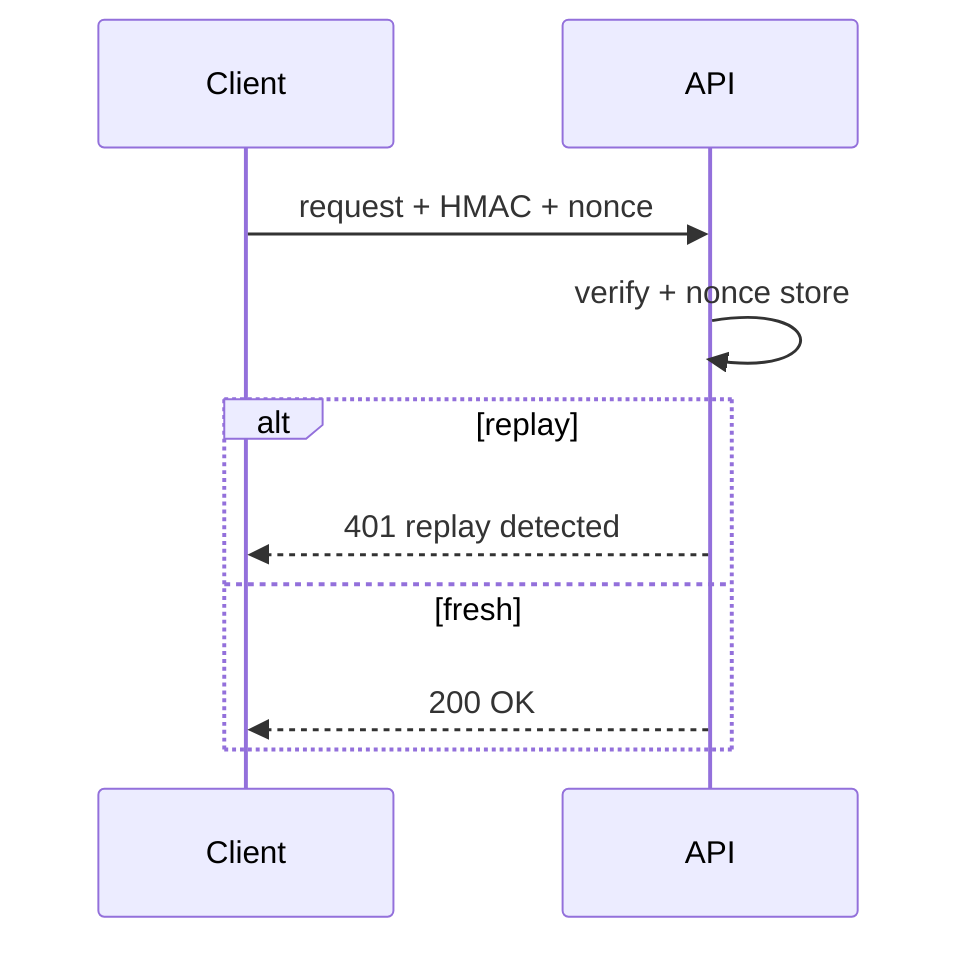

# Correctness and Reliability Exercises

Practice stating invariants, modeling failures, and instrumenting systems so bugs surface before customers do.

## Linked Topic

- [[01-Computer-Science/09-Correctness-and-Reliability/Invariants Assertions and Contracts|Invariants Assertions and Contracts]]
- [[01-Computer-Science/09-Correctness-and-Reliability/Failure Modes and Fault Models|Failure Modes and Fault Models]]
- [[01-Computer-Science/09-Correctness-and-Reliability/Observability Fundamentals|Observability Fundamentals]]
- [[01-Computer-Science/09-Correctness-and-Reliability/Cryptographic Primitives Overview|Cryptographic Primitives Overview]]

## Warm-up

1. Define invariant, precondition, postcondition—give one example from a transfer API.
2. Name three fault types in [[01-Computer-Science/09-Correctness-and-Reliability/Failure Modes and Fault Models|Failure Modes]]: crash, omission, timing, Byzantine (pick three).
3. Distinguish logs, metrics, and traces with one question each answers best.

## Core Drills

### Exercise 1 — Understand

**Prompt:**

Model a wallet transfer service with balance invariant `sum(balances) + sum(fees) = constant`.

Draw Mermaid state diagram for a transfer (pending → committed → failed) and mark where invariant could break under duplicate requests, partial failure, or crash after debit.

**Acceptance criteria:**

- [ ] Invariant written formally
- [ ] Idempotency key placement identified
- [ ] At least two failure points mapped to detection signals

### Exercise 2 — Implement

**Prompt:**

Implement a **reliable framed protocol client** in TypeScript and Python using labs:

- Use `framing.ts` / `framing.py` for checksum + length prefix from [[01-Computer-Science/code/README|code labs]].
- Client sends command `{op: "incr", key, idempotencyKey}`; server (in-memory mock) applies once per key.
- Client retries on timeout with same idempotency key; verify counter increments once.
- Emit structured logs (JSON lines) with `traceId`, `spanId`, `event`, `latencyMs`.
- Tests: duplicate delivery, corrupted frame rejection, success path.

**Acceptance criteria:**

- [ ] TS + Python tests pass
- [ ] Corrupt frame never mutates state
- [ ] Logs include required fields parseable by jq
- [ ] Idempotency verified under 3 duplicate sends

### Exercise 3 — Optimize

**Prompt:**

High-cardinality `userId` labels on Prometheus metrics crashed the metrics backend. Redesign observability for a checkout path.

**Constraints:**

- Latency / memory / throughput target: reduce active series by ≥ 90% while preserving SLO alerting.
- What may not change: ability to debug a single checkout via traceId.

**Acceptance criteria:**

- [ ] Document label cardinality budget and exemplars/traces strategy
- [ ] Sample metric schema before/after with RED/USE method applied

## Debugging Drill

**Broken behavior:**

Alerts silent during outage. Dashboards show green CPU. Requests fail with 503. On-call discovers health check hits `/health` static route while main dependency is down.

**Expected investigation path:**

1. Classify as observability gap + weak health semantics ([[01-Computer-Science/09-Correctness-and-Reliability/Observability Fundamentals|Observability]]).
2. Redefine readiness to check critical dependencies with timeout budget.
3. Add SLO burn rate alerts on error ratio, not CPU.
4. Game-day: kill dependency and verify alert fires < 2 min.

## Production Scenario

An attacker replays captured API requests; HMAC timestamps absent; server accepts duplicates within a 10-minute window.

- Apply [[01-Computer-Science/09-Correctness-and-Reliability/Cryptographic Primitives Overview|Cryptographic Primitives]]: nonce, timestamp skew, constant-time compare.
- Design request signing with replay window and key rotation.
- Sequence diagram: client sign → server verify → reject replay.

## Stretch

- Write property-based tests for framing round-trip (Hypothesis / fast-check).
- Chaos experiment: kill process mid-request; verify client retry safety.
- Cross-link portfolio [[01-Computer-Science/projects/Concurrent Runtime and Protocol Workbench/README|Concurrent Runtime and Protocol Workbench]] postmortem section.

## Solutions Notes

- Invariants belong in code (assertions) **and** ops (metrics on violation counters).
- Idempotency keys are correctness tools, not just HTTP niceties.
- Health checks must reflect **readiness to serve**, including dependencies.

## Related Notes

- [[01-Computer-Science/code/README|code labs]]
- [[01-Computer-Science/projects/Concurrent Runtime and Protocol Workbench/README|Concurrent Runtime and Protocol Workbench]]
- [[16-DevOps/README|DevOps]]
- [[18-Security/README|Security]]
- [[01-Computer-Science/_interview/Correctness and Reliability Interview Questions|Correctness and Reliability Interview Questions]]
