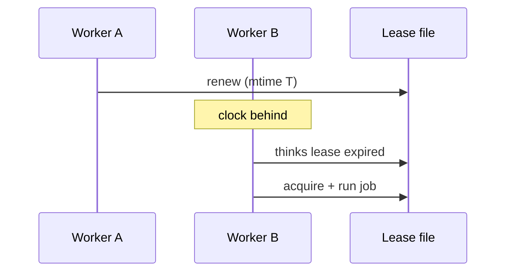

# IO and Persistence Exercises

Treat files, buffers, and fsync as mechanisms with failure modes—not magic persistence.

## Linked Topic

- [[01-Computer-Science/06-IO-and-Persistence/Blocking Nonblocking and Multiplexed IO|Blocking Nonblocking and Multiplexed IO]]
- [[01-Computer-Science/06-IO-and-Persistence/Files as Abstractions|Files as Abstractions]]
- [[01-Computer-Science/06-IO-and-Persistence/Buffers Streams and Zero Copy|Buffers Streams and Zero Copy]]
- [[01-Computer-Science/06-IO-and-Persistence/Durability and Crash Consistency|Durability and Crash Consistency]]
- [[01-Computer-Science/06-IO-and-Persistence/Clocks Time and Ordering|Clocks Time and Ordering]]

## Warm-up

1. Blocking vs. non-blocking I/O from the caller's perspective—who waits?
2. What does `fsync` guarantee? What does it not guarantee?
3. Why is wall-clock time a weak ordering primitive across machines?

## Core Drills

### Exercise 1 — Understand

**Prompt:**

Diagram a crash-safe write protocol using **write-ahead temp file + rename** per [[01-Computer-Science/06-IO-and-Persistence/Durability and Crash Consistency|Durability and Crash Consistency]].

Mermaid sequence: writer, page cache, disk, crash at three points (mid-write, post-fsync temp, post-rename). For each crash point, state what readers observe.

**Acceptance criteria:**

- [ ] Three crash points analyzed with reader outcome
- [ ] Role of `fsync` on directory entry if applicable (platform note)
- [ ] Partial write vs. torn read distinguished

### Exercise 2 — Implement

**Prompt:**

Implement a **crash-safe key-value store file** in TypeScript and Python:

- API: `put(key, value)`, `get(key)`, `delete(key)` persisting to a single JSON or length-framed file.
- Durability: atomic replace via temp file + `fsync` + rename (use platform APIs; document Windows vs. POSIX differences).
- Tests: simulate crash by throwing after write but before rename; on reopen, prior state intact.
- Optional: integrate framing checksum from `framing.ts` / `framing.py` in [[01-Computer-Science/code/README|code labs]].

**Acceptance criteria:**

- [ ] TS + Python tests pass including crash simulation
- [ ] No torn reads on startup after simulated failure
- [ ] Explicit errors on corrupt file with bad checksum/version

### Exercise 3 — Optimize

**Prompt:**

Your log append path does one `fsync` per record (1000 records/sec). Batch for throughput while bounding loss on crash.

**Constraints:**

- Latency / memory / throughput target: ≥ 10× records/sec with ≤ 100 ms data loss window on crash.
- What may not change: on-disk format must remain recoverable.

**Acceptance criteria:**

- [ ] Implement group commit with timer and size threshold
- [ ] Document durability window trade-off in README

## Debugging Drill

**Broken behavior:**

After server crash, config file is empty (0 bytes). Operators restore from backup; incident repeats weekly. Code uses `writeFileSync` without atomic replace.

**Expected investigation path:**

1. Confirm truncate-on-open behavior vs. write-in-place.
2. Implement atomic write pattern; verify with kill -9 during write test.
3. Add startup validation (schema version, min size, checksum).
4. Alert on failed config load before serving traffic.

## Production Scenario

A distributed job scheduler uses **file mtime** for lease renewal. Clock skew and NTP step cause double execution of financial reconciliation jobs.

- Tie to [[01-Computer-Science/06-IO-and-Persistence/Clocks Time and Ordering|Clocks Time and Ordering]].
- Replace mtime lease with fencing token in DB or compare-and-swap on object store.
- Diagram failure: two workers, skewed clocks, duplicate run.

## Stretch

- Build a zero-copy sendfile-style demo (where platform supports) and measure vs. read/write loop.
- Implement epoll/select toy multiplexer handling 100 idle connections.
- Read [[08-Databases/README|Databases]] WAL section and map to your atomic file protocol.

## Solutions Notes

- Atomic rename is the standard single-file crash safety pattern; group commit trades durability window for throughput.
- Never use wall clock alone for correctness across nodes—use logical clocks, leases with TTL, or consensus.
- Empty file after crash usually means **in-place truncate**, not mysterious disk failure.

## Related Notes

- [[01-Computer-Science/code/README|code labs]]
- [[08-Databases/README|Databases]]
- [[01-Computer-Science/_interview/IO and Persistence Interview Questions|IO and Persistence Interview Questions]]
