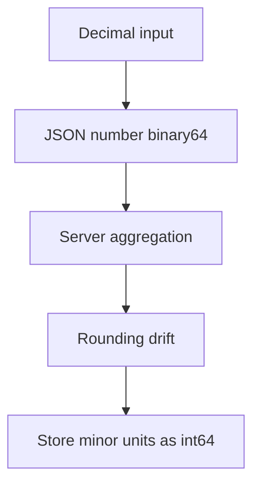

# Information and Representation Exercises

Practice turning real-world data into bits—and back—without silent corruption.

## Linked Topic

- [[01-Computer-Science/01-Information-and-Representation/Bits Bytes and Information|Bits Bytes and Information]]
- [[01-Computer-Science/01-Information-and-Representation/Number Systems|Number Systems]]
- [[01-Computer-Science/01-Information-and-Representation/Integer Representation|Integer Representation]]
- [[01-Computer-Science/01-Information-and-Representation/Floating Point|Floating Point]]
- [[01-Computer-Science/01-Information-and-Representation/Character Encoding|Character Encoding]]
- [[01-Computer-Science/01-Information-and-Representation/Endianness and Binary Layout|Endianness and Binary Layout]]
- [[01-Computer-Science/01-Information-and-Representation/Checksums and Error Detection|Checksums and Error Detection]]
- [[01-Computer-Science/01-Information-and-Representation/Data Serialization Fundamentals|Data Serialization Fundamentals]]

## Warm-up

1. How many distinct values can 48 bits represent? Show the calculation.
2. Convert `0xDEADBEEF` to binary; mark the byte boundaries for big-endian vs. little-endian wire order.
3. Why is `0.1 + 0.2 === 0.3` false in IEEE-754 binary64? Name the mechanism in one paragraph.

## Core Drills

### Exercise 1 — Understand

**Prompt:**

Given a hex dump of a 16-byte struct on disk:

```text
01 00 00 00  41 20 00 00  00 00 00 00  00 00 28 40
```

Fields (little-endian host): `uint32 id`, `float32 score`, `uint32 flags`, `float64 weight`.

Decode each field by hand. Then draw a Mermaid diagram showing how the same logical struct would appear on a big-endian wire if sent without conversion.

**Acceptance criteria:**

- [ ] Correct numeric values for all four fields
- [ ] Endianness mistake explicitly called out if you swap byte order incorrectly
- [ ] Diagram labels host vs. network byte order

### Exercise 2 — Implement

**Prompt:**

Extend or verify the existing labs in [[01-Computer-Science/code/README|code labs]]:

| Module | TS path | Python path |
| --- | --- | --- |
| Bits/endian | `code/typescript/src/bits.ts` | `code/python/seb_cs/bits.py` |
| Float inspect | `code/typescript/src/float.ts` | `code/python/seb_cs/float_inspect.py` |
| UTF-8 codec | `code/typescript/src/utf8.ts` | `code/python/seb_cs/utf8.py` |
| Framing + checksum | `code/typescript/src/framing.ts` | `code/python/seb_cs/framing.py` |

Tasks:

1. Implement `decodeUtf8(bytes)` that **rejects** invalid sequences (overlong, surrogate, truncated)—never substitute U+FFFD silently in strict mode.
2. Implement `frameMessage(payload, version)` returning length-prefixed bytes with CRC32 footer; `parseFrame` must verify checksum before returning payload.
3. Add cross-language test vectors in both test suites; run `npm test` and `python -m unittest discover`.

**Acceptance criteria:**

- [ ] All existing + new tests pass in TypeScript and Python
- [ ] Invalid UTF-8 raises explicit errors in strict mode
- [ ] Corrupted frames fail at checksum, not mid-parse with garbage payload
- [ ] Public function names match across languages per parity rules

### Exercise 3 — Optimize

**Prompt:**

Your UTF-8 encoder is hot-path in a logging pipeline (1M small strings/sec). Optimize throughput without changing semantics.

**Constraints:**

- Latency / memory / throughput target: ≥ 2× throughput on ASCII-heavy fixtures; no regression on mixed Unicode fixtures.
- What may not change: strict validation rules and error types.

**Acceptance criteria:**

- [ ] Benchmark script with warmup iterations documented
- [ ] Explain whether you optimized allocation, branch prediction, or table lookups—and measured cache effects

## Debugging Drill

**Broken behavior:**

A mobile client sends user names to your API. Names with emoji store correctly in staging but appear as `` or `???` in production. Staging uses UTF-8 end-to-end; production DB is UTF-8, but one service reads bytes with Latin-1.

**Expected investigation path:**

1. Capture raw bytes at API boundary (hex), DB column, and UI render path.
2. Identify where code page or encoding assumption diverges (HTTP header, driver, ORM).
3. Fix at the **earliest** layer that mis-decodes; add contract tests with emoji + combining marks.
4. Add monitoring for replacement-character rate in logs.

## Production Scenario

Payment amounts are serialized as JSON numbers. A finance report is off by `$0.01` on 3% of rows after aggregating millions of transactions.

- Explain the representation failure mode (binary64, decimal literals, aggregation order).
- Propose a production-safe representation (fixed-point integers, decimal library, schema change).
- Design a migration that does not double-charge during rollout.



## Stretch

- Implement a VarInt encoder (Protobuf-style) with overflow checks in TS + Python.
- Build the [[01-Computer-Science/projects/UTF-8 and Float Inspector/README|UTF-8 and Float Inspector]] mini project write-up.
- Hand-compute CRC32 for a 4-byte payload and verify against the framing lab.

## Solutions Notes

- Strict UTF-8 rejection is preferable at system boundaries; substitution belongs in presentation layers with explicit policy.
- Financial amounts should be **integers of minor units** or decimal types—not binary64.
- Endianness bugs often appear only on ARM ↔ x86 integration tests; always test cross-endian fixtures.

## Related Notes

- [[01-Computer-Science/code/README|code labs]]
- [[01-Computer-Science/projects/Binary Protocol Lab/README|Binary Protocol Lab]]
- [[01-Computer-Science/projects/UTF-8 and Float Inspector/README|UTF-8 and Float Inspector]]
- [[01-Computer-Science/_interview/Information and Representation Interview Questions|Information and Representation Interview Questions]]
