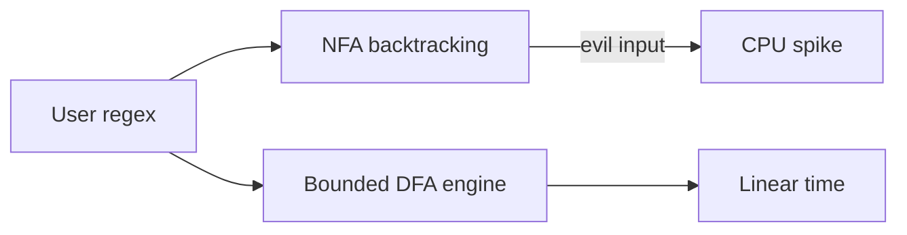

# Languages and Computation Exercises

Implement recognizers, parsers, and a tiny VM to connect syntax to machines that execute.

## Linked Topic

- [[01-Computer-Science/08-Languages-and-Computation/Finite State Machines|Finite State Machines]]
- [[01-Computer-Science/08-Languages-and-Computation/Regular Expressions and Automata|Regular Expressions and Automata]]
- [[01-Computer-Science/08-Languages-and-Computation/Grammars and Parsing|Grammars and Parsing]]
- [[01-Computer-Science/08-Languages-and-Computation/Compilers Interpreters and Virtual Machines|Compilers Interpreters and Virtual Machines]]
- [[01-Computer-Science/08-Languages-and-Computation/Bytecode and JIT Compilation|Bytecode and JIT Compilation]]
- [[01-Computer-Science/08-Languages-and-Computation/Type Systems Fundamentals|Type Systems Fundamentals]]
- [[01-Computer-Science/08-Languages-and-Computation/Computational Complexity Primer|Computational Complexity Primer]]

## Warm-up

1. Distinguish lexer, parser, and evaluator in a pipeline—inputs and outputs of each.
2. What languages can a finite state machine recognize? Give one regex example that needs more power.
3. Big-O of binary search vs. linear scan—when does constant factor dominate in production?

## Core Drills

### Exercise 1 — Understand

**Prompt:**

Given grammar for expressions: `E → E + T | T`, `T → T * F | F`, `F → num | ( E )`.

Draw a Mermaid parse tree for `3 + 4 * 5` and show how precedence emerges without explicit parentheses.

Explain shift/reduce or recursive descent steps for the first three tokens.

**Acceptance criteria:**

- [ ] Parse tree shows `*` deeper than `+`
- [ ] Evaluation order stated (15 vs. 35 trap explained)
- [ ] Left-recursion issue noted if using naive recursive descent

### Exercise 2 — Implement

**Prompt:**

Complete and verify labs in [[01-Computer-Science/code/README|code labs]]:

| Lab | TS | Python |
| --- | --- | --- |
| FSM + expr parser | `parser.ts` | `parser.py` |
| Stack VM | `vm.ts` | `vm.py` |

Tasks:

1. FSM accepts identifiers `[a-z][a-z0-9]*` with explicit reject states for invalid chars.
2. Parser evaluates `+`, `*`, parentheses on integers; throw on syntax error with position.
3. VM executes bytecode for push/add/mul/jmp/halt; round-trip: source → bytecode → result.
4. Shared test vectors in both languages; all tests green.

**Acceptance criteria:**

- [ ] Invalid input throws with index/message in TS and Python
- [ ] VM stack underflow/overflow detected explicitly
- [ ] At least one program compiled from parser runs on VM with matching result

### Exercise 3 — Optimize

**Prompt:**

Your expr parser allocates AST nodes for every literal in a hot config DSL parsed millions of times per day.

**Constraints:**

- Latency / memory / throughput target: ≥ 3× parse throughput on 1 KiB expressions.
- What may not change: parse errors and numeric results.

**Acceptance criteria:**

- [ ] Implement direct-eval recursive descent or Pratt parser without full AST
- [ ] Benchmark before/after on fixed corpus

## Debugging Drill

**Broken behavior:**

Config parser accepts `001 + 2` as valid but business rules forbid leading zeros. Lexer returns `NUM(001)` as single token.

**Expected investigation path:**

1. Separate lexical vs. semantic validation.
2. Add semantic pass or stricter lexer rule with tests for edge tokens.
3. Document grammar version in serialized output.
4. Add fuzz tests with radamsa or quickcheck-style random strings.

## Production Scenario

A user-supplied regex in a search feature causes catastrophic backtracking (ReDoS), stalling API workers.

- Map to [[01-Computer-Science/08-Languages-and-Computation/Regular Expressions and Automata|Regular Expressions and Automata]].
- Mitigations: RE2-style engine, timeout, length limits, precompile safe patterns only.
- Diagram: NFA backtracking vs. DFA linear scan.

## Stretch

- Add comparison operators to parser; discuss static vs. dynamic typing for comparisons ([[01-Computer-Science/08-Languages-and-Computation/Type Systems Fundamentals|Type Systems]]).
- Implement one bytecode peephole optimization in VM.
- Write complexity analysis for your parser—when does input size matter for SLA?

## Solutions Notes

- Pratt/precedence climbing avoids left recursion pain for expression grammars.
- ReDoS is a **computation** problem, not just "regex is slow"— bound work or restrict engine.
- Parser + VM labs teach the same pipeline production languages use at scale.

## Related Notes

- [[01-Computer-Science/code/README|code labs]]
- [[01-Computer-Science/projects/Stack Machine/README|Stack Machine]]
- [[04-Data-Structures/README|Data Structures]]
- [[05-Algorithms/README|Algorithms]]
- [[01-Computer-Science/_interview/Languages and Computation Interview Questions|Languages and Computation Interview Questions]]
