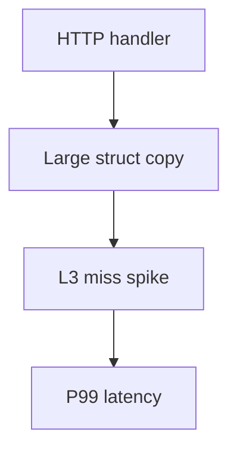

# Machine Model Exercises

Connect algorithmic code to registers, caches, and the hardware–software interface.

## Linked Topic

- [[01-Computer-Science/02-Machine-Model/CPU and Instruction Set Architecture|CPU and Instruction Set Architecture]]
- [[01-Computer-Science/02-Machine-Model/Fetch Decode Execute|Fetch Decode Execute]]
- [[01-Computer-Science/02-Machine-Model/Registers and Calling Conventions|Registers and Calling Conventions]]
- [[01-Computer-Science/02-Machine-Model/Cache Hierarchy and Locality|Cache Hierarchy and Locality]]
- [[01-Computer-Science/02-Machine-Model/Pipelining and Speculative Execution|Pipelining and Speculative Execution]]
- [[01-Computer-Science/02-Machine-Model/Hardware Software Interface|Hardware Software Interface]]
- [[01-Computer-Science/02-Machine-Model/Measuring Computer Performance|Measuring Computer Performance]]

## Warm-up

1. Name L1/L2/L3 caches and one latency order-of-magnitude difference between them and DRAM.
2. What is temporal vs. spatial locality? Give a code example of each.
3. In one sentence, what is a branch misprediction penalty and why does it matter in hot loops?

## Core Drills

### Exercise 1 — Understand

**Prompt:**

Study two matrix-transpose implementations (row-major access vs. naive i-j swap). Draw a Mermaid flowchart of memory access patterns and annotate expected cache behavior for a 4096×4096 `float64` matrix.

Read [[01-Computer-Science/02-Machine-Model/Cache Hierarchy and Locality|Cache Hierarchy and Locality]] and predict which version wins and by what factor (order of magnitude is enough).

**Acceptance criteria:**

- [ ] Access pattern diagram shows stride through memory
- [ ] Prediction ties to cache line size and TLB pressure
- [ ] You state measurement method (perf counters or wall clock with pinned CPU)

### Exercise 2 — Implement

**Prompt:**

Implement a **cache-friendly vs. cache-hostile** micro-benchmark in TypeScript and Python:

- `sumRowMajor(matrix)` and `sumColumnMajor(matrix)` on a flat `number[]` / `list` of size `N×N`.
- Report median nanoseconds per element for `N ∈ {256, 1024, 4096}`.
- Include warmup, multiple iterations, and printed ratio column-major / row-major.

No external perf libraries required; document clock resolution limits in Python vs. Node.

**Acceptance criteria:**

- [ ] Both languages produce ratio tables for three sizes
- [ ] README snippet explains why results differ using locality vocabulary
- [ ] Tests verify correctness (same sum) for small deterministic matrices

### Exercise 3 — Optimize

**Prompt:**

Optimize row-major sum to within 20% of a blocked (tile) algorithm for `N=4096` without using SIMD intrinsics.

**Constraints:**

- Latency / memory / throughput target: blocked version ≥ 3× faster than column-major at N=4096 on your machine.
- What may not change: numerical result (exact equality for integer matrices).

**Acceptance criteria:**

- [ ] Document tile size chosen and why (L1/L2 fit)
- [ ] Optional: read `perf stat` cache-miss counters before/after

## Debugging Drill

**Broken behavior:**

After enabling `-O2`, a embedded service returns wrong checksums intermittently on ARM but never on x86. Source uses `uint32` aliasing through a `float` pointer for "fast zeroing."

**Expected investigation path:**

1. Identify undefined behavior / strict aliasing / alignment requirements.
2. Compare disassembly or IR for x86 vs. ARM reassociation.
3. Replace type punning with `memcpy` or compiler-safe zeroing; add sanitizer CI job.
4. Postmortem: why tests missed it (UB, platform-only CI).

## Production Scenario

P99 API latency spiked after a deploy that added a **spectre mitigation** kernel flag and increased cache pressure from a new feature logging large structs by value.

- Separate CPU frequency scaling, cache misses, and syscall overhead using [[01-Computer-Science/02-Machine-Model/Measuring Computer Performance|Measuring Computer Performance]] vocabulary.
- Propose three mitigations ranked by risk (pass by reference, struct padding audit, batch logging).
- Diagram request path with likely bottleneck layer.

## Stretch

- Implement a toy FDE simulator for 5 opcodes (ADD, LOAD, STORE, JMP, HALT) per [[01-Computer-Science/projects/Stack Machine/README|Stack Machine]].
- Use `objdump -d` on a tiny C function; map registers to calling convention doc.
- Read [[01-Computer-Science/02-Machine-Model/Pipelining and Speculative Execution|Pipelining and Speculative Execution]] and explain Spectre at a high level.

## Solutions Notes

- Column-major traversal of row-major storage is the classic cache miss tutorial—ratios often 5–20×.
- Blocking improves reuse in L1/L2; optimal tile size is hardware-dependent—measure.
- Never treat "optimizer bug" as first hypothesis; verify UB and measurement methodology.

## Related Notes

- [[01-Computer-Science/code/README|code labs]]
- [[01-Computer-Science/projects/Stack Machine/README|Stack Machine]]
- [[01-Computer-Science/_interview/Machine Model Interview Questions|Machine Model Interview Questions]]
- [[05-Algorithms/README|Algorithms]]
