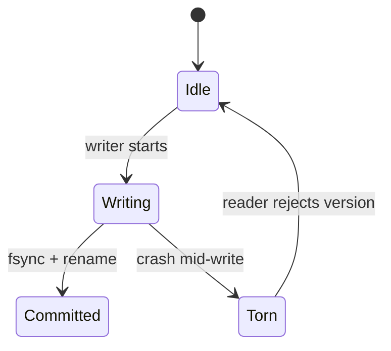

# Memory and Addressing Exercises

Reason about address spaces, lifetimes, aliasing, and safety before debugging segfaults in production.

## Linked Topic

- [[01-Computer-Science/03-Memory-and-Addressing/Address Spaces|Address Spaces]]
- [[01-Computer-Science/03-Memory-and-Addressing/Stack and Heap|Stack and Heap]]
- [[01-Computer-Science/03-Memory-and-Addressing/Pointers References and Aliasing|Pointers References and Aliasing]]
- [[01-Computer-Science/03-Memory-and-Addressing/Virtual Memory|Virtual Memory]]
- [[01-Computer-Science/03-Memory-and-Addressing/Memory Hierarchy Trade-offs|Memory Hierarchy Trade-offs]]
- [[01-Computer-Science/03-Memory-and-Addressing/Memory Safety Fundamentals|Memory Safety Fundamentals]]
- [[01-Computer-Science/03-Memory-and-Addressing/Garbage Collection Models|Garbage Collection Models]]

## Warm-up

1. Sketch a process address space: text, data, heap, stack, mmap regions—direction of stack vs. heap growth.
2. What is a page fault? Distinguish major vs. minor faults.
3. In JavaScript, `const obj = {a:1}; obj.a = 2` is legal—what does `const` mean at the memory/reference level?

## Core Drills

### Exercise 1 — Understand

**Prompt:**

Given this pseudocode, draw a Mermaid diagram of stack frames and heap objects after line 6, marking aliases and dangling risks:

```text
1  function makePair(x):
2    return { first: x, second: ref(x) }
3  a = 10
4  pair = makePair(a)
5  a = 20
6  pair.second = 99
```

Answer: what values are read from `pair.first`, `pair.second`, and `a` in a language with reference semantics vs. value semantics for integers?

**Acceptance criteria:**

- [ ] Diagram shows separate stack slots and heap object edges
- [ ] Aliasing between `pair.second` and `a` explained correctly per semantics
- [ ] Dangling pointer scenario described for a C++ equivalent

### Exercise 2 — Implement

**Prompt:**

Implement a **mini bump allocator** and **mark-sweep toy GC** in TypeScript and Python (no native extensions):

- Bump allocator: `alloc(size)` returns offset into `Uint8Array` / `bytearray`; `reset()` reclaims all; detect overflow.
- Toy GC: graph of `{ id, refs: id[] }` nodes; `collect(rootIds)` returns unreachable ids; preserve cycles reachable from roots.
- Unit tests: allocation exhaustion, GC retains cycle, GC frees DAG branch.

Link conceptually to [[01-Computer-Science/code/README|code labs]] VM heap if you extend `vm.ts` / `vm.py` later.

**Acceptance criteria:**

- [ ] TS + Python APIs mirror each other (`alloc`, `reset`, `collect`)
- [ ] Tests cover overflow and cyclic retention
- [ ] No silent wrap on overflow—throw explicit error

### Exercise 3 — Optimize

**Prompt:**

Your service allocates millions of small objects per request. Reduce GC pause or allocation rate by 50% without changing external API responses.

**Constraints:**

- Latency / memory / throughput target: median pause or allocation count cut in half on a fixed workload replay.
- What may not change: response JSON schema.

**Acceptance criteria:**

- [ ] Before/after allocation profiles (V8 `--expose-gc` or Python `tracemalloc` snapshot)
- [ ] Document object pooling, struct flattening, or generational hypothesis

## Debugging Drill

**Broken behavior:**

Node service RSS grows until OOMKilled. Heap dumps show millions of identical `{ traceId, spanId }` strings retained in a module-level `Map` cache with no TTL.

**Expected investigation path:**

1. Confirm leak vs. high watermark (RSS vs. heap used, GC logs).
2. Find retaining path (Chrome DevTools heap snapshot or `clinic heapprofiler`).
3. Fix lifecycle: weak refs, LRU cap, or request-scoped cache.
4. Add regression test that asserts map size bound under load test.

## Production Scenario

Two microservices share a memory-mapped file for "fast config." One writer crashes mid-write; readers see torn values and parse errors.

- Map failure to [[01-Computer-Science/03-Memory-and-Addressing/Virtual Memory|Virtual Memory]] and durability notes in I/O module.
- Propose crash-safe update protocol (write temp + fsync + atomic rename, or versioned snapshot).
- Mermaid state machine for reader/writer coordination.



## Stretch

- Compare tracing vs. generational GC from [[01-Computer-Science/03-Memory-and-Addressing/Garbage Collection Models|Garbage Collection Models]] with a synthetic benchmark.
- Explain ASLR and why stack overflows are security-critical in C.
- Use `valgrind` or ASan on a 20-line C program with use-after-free.

## Solutions Notes

- Reference vs. value semantics must be stated explicitly—interview answers often conflate them.
- Module-level caches are a top production leak source in long-lived interpreted runtimes.
- mmap config needs atomic publish semantics; readers should validate checksum/version.

## Related Notes

- [[01-Computer-Science/code/README|code labs]]
- [[02-JavaScript/README|JavaScript]]
- [[03-Python/README|Python]]
- [[01-Computer-Science/_interview/Memory and Addressing Interview Questions|Memory and Addressing Interview Questions]]
