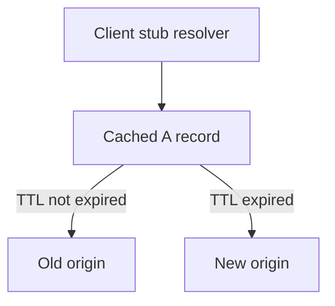

# Networking Fundamentals Exercises

Build socket-level intuition for latency, reliability, and protocol parsing before frameworks hide the bytes.

## Linked Topic

- [[01-Computer-Science/07-Networking-Fundamentals/Layered Network Models|Layered Network Models]]
- [[01-Computer-Science/07-Networking-Fundamentals/IP Addressing and Routing|IP Addressing and Routing]]
- [[01-Computer-Science/07-Networking-Fundamentals/UDP|UDP]]
- [[01-Computer-Science/07-Networking-Fundamentals/TCP|TCP]]
- [[01-Computer-Science/07-Networking-Fundamentals/DNS Fundamentals|DNS Fundamentals]]
- [[01-Computer-Science/07-Networking-Fundamentals/Sockets Programming Model|Sockets Programming Model]]
- [[01-Computer-Science/07-Networking-Fundamentals/TLS Concepts|TLS Concepts]]
- [[01-Computer-Science/07-Networking-Fundamentals/HTTP as a Protocol|HTTP as a Protocol]]
- [[01-Computer-Science/07-Networking-Fundamentals/Latency Bandwidth Throughput and Tail Latency|Latency Bandwidth Throughput and Tail Latency]]

## Warm-up

1. Name the TCP three-way handshake steps and what each side learns.
2. UDP vs. TCP: delivery, ordering, congestion control—three contrasts.
3. Define bandwidth vs. throughput vs. latency; which does RTT dominate for small requests?

## Core Drills

### Exercise 1 — Understand

**Prompt:**

A client sends HTTP/1.1 `POST` with `Content-Length: 1000` but disconnects after 400 bytes. Draw Mermaid sequence across client, server socket, application read loop, and TCP stack. When does the server know the request is incomplete vs. aborted?

Reference [[01-Computer-Science/07-Networking-Fundamentals/HTTP as a Protocol|HTTP as a Protocol]] and [[01-Computer-Science/07-Networking-Fundamentals/TCP|TCP]] half-close behavior.

**Acceptance criteria:**

- [ ] FIN/RST distinction noted
- [ ] Application-level timeout vs. TCP close explained
- [ ] Idempotency implication for retried POST mentioned

### Exercise 2 — Implement

**Prompt:**

Extend networking labs in [[01-Computer-Science/code/README|code labs]]:

- `code/typescript/src/netdemo.ts`
- `code/python/seb_cs/netdemo.py`

Tasks:

1. TCP echo server/client with graceful shutdown and connection limit.
2. UDP datagram loss demo (optional drop %) with application-level retry idempotency key.
3. Minimal HTTP/1.0 parser: parse request line + headers, return 400 on malformed input, 200 on `GET /health`.
4. Tests run without binding privileged ports (use ephemeral port helper).

**Acceptance criteria:**

- [ ] TS + Python tests pass in CI-friendly mode (no manual server start)
- [ ] Malformed HTTP returns 400, not hang
- [ ] Echo server rejects excess connections with explicit error policy documented

### Exercise 3 — Optimize

**Prompt:**

Your HTTP parser allocates a new string per header line. Optimize for 50k small requests/sec on one core.

**Constraints:**

- Latency / memory / throughput target: ≥ 2× throughput on `GET /health` benchmark.
- What may not change: visible HTTP semantics and error codes.

**Acceptance criteria:**

- [ ] Benchmark script with keep-alive connections
- [ ] Document buffer reuse or zero-copy strategy

## Debugging Drill

**Broken behavior:**

Intermittent `ECONNRESET` under load. LB idle timeout is 60s; server keep-alive 120s; NAT table 30s. Clients reuse connections.

**Expected investigation path:**

1. Correlate resets with idle duration and connection reuse metrics.
2. Align TCP keepalive, HTTP keep-alive, and LB/NAT timeouts (shortest wins).
3. Verify retry idempotency on GET; caution on POST.
4. Load test before/after alignment.

## Production Scenario

DNS TTL change during migration leaves 5% of clients hitting old IP for hours. TLS cert valid only on new edge.

- Map to [[01-Computer-Science/07-Networking-Fundamentals/DNS Fundamentals|DNS Fundamentals]] caching layers (stub, OS, browser).
- Migration plan: lower TTL early, dual-stack period, monitor SNI errors.
- Mermaid: client resolver cache vs. authoritative TTL.

## Stretch

- Complete [[01-Computer-Science/projects/Socket Workshop/README|Socket Workshop]] write-up.
- Capture packets with Wireshark for handshake + TLS ClientHello (local only).
- Simulate tail latency with delayed ACKs and write about [[01-Computer-Science/07-Networking-Fundamentals/Latency Bandwidth Throughput and Tail Latency|Tail Latency]].

## Solutions Notes

- HTTP parsing must handle partial reads—never assume one `read()` equals one request.
- Timeout alignment prevents mysterious mid-request resets.
- DNS is a cache problem during migrations—plan TTL and observability first.

## Related Notes

- [[01-Computer-Science/code/README|code labs]]
- [[01-Computer-Science/projects/Socket Workshop/README|Socket Workshop]]
- [[07-Backend/README|Backend]]
- [[01-Computer-Science/_interview/Networking Fundamentals Interview Questions|Networking Fundamentals Interview Questions]]
