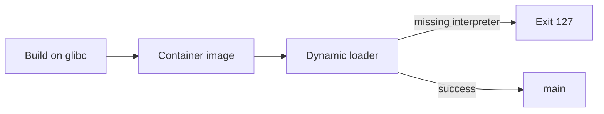

# Orientation Exercises

Build the mental map from source code to a running process before diving into bits, memory, and concurrency.

## Linked Topic

- [[01-Computer-Science/00-Orientation/How Computers Run Programs|How Computers Run Programs]]
- [[01-Computer-Science/00-Orientation/Abstraction Layers in Computing|Abstraction Layers in Computing]]

## Warm-up

1. Name the four phases of the fetch-decode-execute cycle and state what hardware component participates in each.
2. List five artifacts produced between saving a `.ts` file and seeing `console.log` output (e.g., AST, bytecode, object file).
3. In one sentence each, distinguish compile-time, link-time, load-time, and run-time.

## Core Drills

### Exercise 1 — Understand

**Prompt:**

Draw a Mermaid sequence diagram tracing `hello.ts` → Node.js → kernel → terminal output. Label at least eight steps: lexer/parser, bytecode or native code generation, module load, process creation, address-space setup, syscall for write, scheduler involvement, and user-visible output.

**Acceptance criteria:**

- [ ] Diagram includes both user space and kernel boundary
- [ ] Each step names a concrete artifact (file, segment, register, fd)
- [ ] You can explain where a syntax error vs. runtime error is detected

### Exercise 2 — Implement

**Prompt:**

Implement a **program lifecycle tracer** in TypeScript and Python that simulates stages without executing real machine code:

- Input: path to a source file and a `runtime` flag (`node`, `python`, `native`).
- Output: ordered list of `{ stage, artifact, location }` records from source read through exit code.
- Stages must include at least: parse/compile, link/load (or import resolution), process start, main entry, I/O syscall abstraction, clean exit.
- Include unit tests with a tiny fixture file and assert stage order and artifact names.

Reference the lab layout in [[01-Computer-Science/code/README|code labs]]; place code under `projects/` or a scratch folder—parity tests are required in both languages.

**Acceptance criteria:**

- [ ] TypeScript: Vitest tests pass
- [ ] Python: `unittest` tests pass
- [ ] Same stage names and ordering in both implementations
- [ ] Invalid runtime flag throws an explicit error (no silent default)

### Exercise 3 — Optimize

**Prompt:**

Your tracer runs on CI for thousands of files. Optimize **cold-start latency** of the tracer itself (not the simulated pipeline).

**Constraints:**

- Latency / memory / throughput target: parse & emit trace for 1 KiB fixture in < 5 ms median on a laptop; RSS increase < 10 MB vs. baseline.
- What may not change: external observable stage list and test vectors.

**Acceptance criteria:**

- [ ] Document baseline vs. optimized timings with a repeatable benchmark script
- [ ] Explain which layer of abstraction you optimized (I/O, parsing, object allocation) and why that was the bottleneck

## Debugging Drill

**Broken behavior:**

A teammate claims: "Our TypeScript service is slow because the CPU fetch-decode-execute loop is inefficient." Production p99 latency doubled after a deploy that added heavy JSON logging at request start.

**Expected investigation path:**

1. Separate **translation/startup** cost from **steady-state request** cost (cold start vs. warm).
2. Profile one request: where is time spent—serialization, sync I/O, lock contention, or actual CPU-bound work?
3. Map findings to abstraction layers (language runtime, libc, kernel, disk/network)—reject the FDE-loop hypothesis unless profiling supports it.
4. Propose a fix with measurable before/after (e.g., async logging, sampling, structured log batching).

## Production Scenario

Your on-call alert fires: deploy succeeded but **health checks fail** for a new microservice. Logs show the process exits with code 127 immediately. The container image built on Alpine; the Dockerfile copies a binary compiled on Ubuntu glibc.

Using the orientation model:

- Identify which lifecycle stage fails (load-time vs. run-time).
- List three diagnostic commands or artifacts you would inspect (`ldd`, `readelf`, entrypoint, `strace` first lines).
- Write a postmortem outline: root cause, detection gap, prevention (multi-stage build, distro match, smoke test gate).

## Stretch

- Disassemble or decompile a 10-line C program and map each instruction back to source lines.
- Compare JIT (V8) vs. AOT (Go) startup: measure time-to-first-request for identical HTTP handlers.
- Read [[01-Computer-Science/02-Machine-Model/Fetch Decode Execute|Fetch Decode Execute]] and extend your tracer with optional "virtual FDE steps" for interpreted runtimes.

## Solutions Notes

- Exit code 127 on Linux often means "command not found" or **missing dynamic linker/interpreter**—a load-time failure, not application logic.
- Stage tracers should be **data-driven** (table of stages) so tests stay in sync across languages.
- Optimization wins usually come from avoiding repeated file reads and regex on hot paths—not from micro-tuning loop unrolling in the tracer.

## Related Notes

- [[01-Computer-Science/README|Computer Science]]
- [[01-Computer-Science/code/README|code labs]]
- [[01-Computer-Science/projects/Stack Machine/README|Stack Machine]]
- [[01-Computer-Science/_interview/Orientation Interview Questions|Orientation Interview Questions]]
