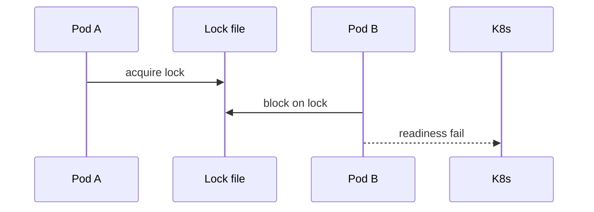

# Processes and Execution Exercises

Practice the OS view: processes, threads, scheduling, syscalls, and IPC as mechanisms—not just `fork()` trivia.

## Linked Topic

- [[01-Computer-Science/04-Processes-and-Execution/Processes|Processes]]
- [[01-Computer-Science/04-Processes-and-Execution/Threads|Threads]]
- [[01-Computer-Science/04-Processes-and-Execution/Context Switching|Context Switching]]
- [[01-Computer-Science/04-Processes-and-Execution/Scheduling Concepts|Scheduling Concepts]]
- [[01-Computer-Science/04-Processes-and-Execution/System Calls|System Calls]]
- [[01-Computer-Science/04-Processes-and-Execution/Interprocess Communication Fundamentals|Interprocess Communication Fundamentals]]

## Warm-up

1. Define process vs. thread using address space and kernel scheduling objects.
2. What is saved and restored on a context switch?
3. Name three syscalls your HTTP server likely invokes per request.

## Core Drills

### Exercise 1 — Understand

**Prompt:**

Draw a Mermaid sequence diagram for `parent` spawning `child` via `fork`/`exec` (or `CreateProcess` on Windows conceptual equivalent), through first user instruction in child, including copy-on-write mention for address space.

Annotate where file descriptors are inherited and where `CLOEXEC` matters.

**Acceptance criteria:**

- [ ] Parent and child timelines are distinct
- [ ] COW explained for heap pages until write
- [ ] FD inheritance pitfall stated (leaked socket to child)

### Exercise 2 — Implement

**Prompt:**

Implement a **syscall trace summarizer** in TypeScript and Python:

- Input: text log lines mimicking `strace` / `dtrace` (`read(3, ...) = 512`, etc.).
- Output: histogram of syscall name → count, plus top 5 by total inferred latency if timestamps present.
- Include parser tests for malformed lines (skip with warning counter, never crash).

Optional extension: wrap a real subprocess running `echo hello` under trace on Linux/macOS in a guarded integration test (skip on Windows).

**Acceptance criteria:**

- [ ] Identical histogram output for shared fixture in TS and Python
- [ ] Malformed line handling tested
- [ ] README documents security note: never trace untrusted binaries in prod

### Exercise 3 — Optimize

**Prompt:**

A worker pool processes 10k jobs/sec; profiling shows 30% time in `write` syscalls logging one line per job.

**Constraints:**

- Latency / memory / throughput target: cut syscall count by ≥ 80% on benchmark workload.
- What may not change: log fields required for audit.

**Acceptance criteria:**

- [ ] Implement buffered/batched logging in TS or Python demo
- [ ] Measure syscall count before/after (strace `-c` or equivalent)

## Debugging Drill

**Broken behavior:**

After deploy, zombie processes accumulate until the host hits `pid_max`. The parent service uses `subprocess.Popen` without `wait()` in a callback path.

**Expected investigation path:**

1. Confirm zombie state (`ps`, `STAT Z`).
2. Trace parent code path missing `waitpid` / promise completion on child exit.
3. Fix reap loop or async wait; add metric `zombie_children`.
4. Document signal handling (`SIGCHLD`) if using raw POSIX.

## Production Scenario

Kubernetes liveness probe passes but readiness fails intermittently. The app binds quickly but blocks on a **filesystem lock** during init while another pod on the same node holds the lock.

- Map to process startup, file locks, and IPC ([[01-Computer-Science/04-Processes-and-Execution/Interprocess Communication Fundamentals|IPC Fundamentals]]).
- Propose deployment fix (leader election, distributed lock, init container ordering).
- Sequence diagram: two pods, one lock, probe outcomes.

## Stretch

- Implement a pipe or socket IPC demo echo server parent/child in Python `multiprocessing` and Node `child_process`.
- Read [[01-Computer-Science/02-Machine-Model/Hardware Software Interface|Hardware Software Interface]] and correlate one syscall to VFS layer.
- Compare CFS vs. real-time scheduling policies for a mixed workload blog post outline.

## Solutions Notes

- Zombies are a **parent lifecycle bug**, not a kernel leak—the parent must reap.
- Batching logs is the lowest-risk syscall reduction for high-throughput workers.
- Readiness must reflect **ability to serve traffic**, not merely process alive.

## Related Notes

- [[01-Computer-Science/code/README|code labs]]
- [[10-Linux/README|Linux]]
- [[01-Computer-Science/_interview/Processes and Execution Interview Questions|Processes and Execution Interview Questions]]
