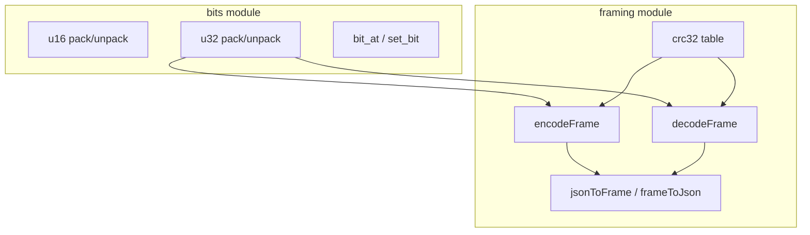
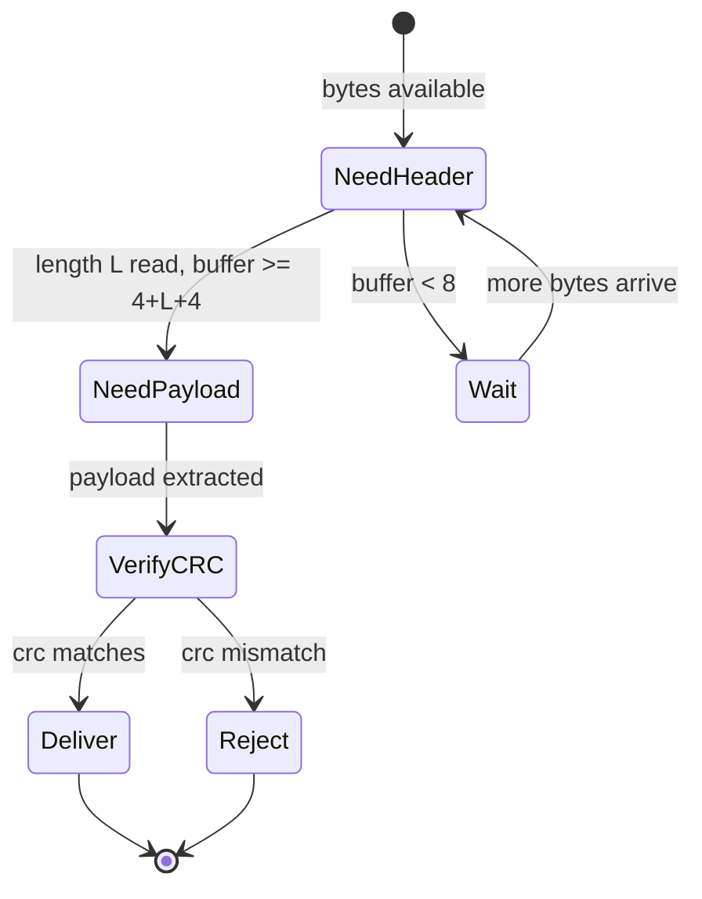

# Architecture — Binary Protocol Lab

## Wire Frame Layout

```text
 0                   4                   4+length
 |--- length u32be ---|--- payload -------|--- crc32 u32be ---|
```

| Field | Size | Endian | Semantics |
| --- | --- | --- | --- |
| `length` | 4 bytes | big-endian | Payload byte count (not including header or CRC) |
| `payload` | `length` bytes | opaque | Application data (JSON UTF-8 in helper paths) |
| `crc32` | 4 bytes | big-endian | IEEE CRC-32 over payload only |

## Component Diagram



## Decode State Machine



## Error Taxonomy

| Condition | Exception / error | Recovery |
| --- | --- | --- |
| Buffer shorter than 8 bytes | `RangeError: frame too short` | Buffer more bytes |
| Declared length exceeds buffer | `RangeError: incomplete frame` | Wait or reset stream |
| CRC mismatch | `Error: crc mismatch` | Drop frame; log peer |
| Invalid JSON in payload helper | JSON parse error | Application-level reject |

## Integer Packing

Multi-byte integers use explicit endian parameters (`"be"` | `"le"`). The **frame length and CRC fields are always big-endian** regardless of host order—a deliberate wire-spec choice documented in [[01-Computer-Science/projects/Concurrent Runtime and Protocol Workbench/ADR/0001-framing-protocol|ADR-0001]].

## Related Documents

- [[01-Computer-Science/projects/Binary Protocol Lab/README|README]]
- [[01-Computer-Science/code/typescript/src/framing.ts|framing.ts]]
- [[01-Computer-Science/code/python/seb_cs/framing.py|framing.py]]
