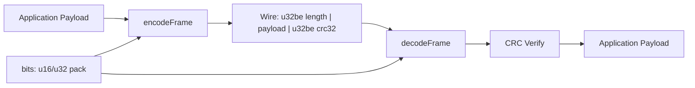

# Binary Protocol Lab

## Purpose

Build intuition for **wire formats** by implementing integer packing, endian conversion, CRC32 checksums, and **length-prefixed framed messages**. You will encode and decode binary payloads without JSON or protobuf—only bytes, explicit layout, and verifiable integrity. This lab mirrors how RPC frames, game packets, and log segments are structured in production systems.

## Prerequisites

Read and complete exercises for:

- [[01-Computer-Science/01-Information-and-Representation/Bits Bytes and Information|Bits Bytes and Information]]
- [[01-Computer-Science/01-Information-and-Representation/Number Systems|Number Systems]]
- [[01-Computer-Science/01-Information-and-Representation/Integer Representation|Integer Representation]]
- [[01-Computer-Science/01-Information-and-Representation/Endianness and Binary Layout|Endianness and Binary Layout]]
- [[01-Computer-Science/01-Information-and-Representation/Checksums and Error Detection|Checksums and Error Detection]]
- [[01-Computer-Science/01-Information-and-Representation/Data Serialization Fundamentals|Data Serialization Fundamentals]]

## Architecture



See [[01-Computer-Science/projects/Binary Protocol Lab/Architecture|Architecture]] for field layout and error paths.

## Acceptance Criteria

- [ ] `u16_to_bytes` / `bytes_to_u16` and `u32_to_bytes` / `bytes_to_u32` work for both **big-endian** and **little-endian** with shared test vectors
- [ ] `crc32` returns a consistent 32-bit value for known inputs
- [ ] `encodeFrame` produces `[u32be length][payload][u32be crc32(payload)]`
- [ ] `decodeFrame` rejects truncated buffers, length overflows, and CRC mismatches with explicit errors
- [ ] `jsonToFrame` / `frameToJson` round-trip JSON payloads through the binary layer
- [ ] TypeScript (`vitest`) and Python (`unittest`) suites pass for bits and framing modules
- [ ] You can explain why length-prefixing beats delimiter scanning on byte streams

## Run and Test

Implementation lives under [[01-Computer-Science/code/README|01-Computer-Science/code/]].

| Language | Source modules | Test focus |
| --- | --- | --- |
| TypeScript | `code/typescript/src/bits.ts`, `code/typescript/src/framing.ts` | `tests/labs.test.ts` |
| Python | `code/python/seb_cs/bits.py`, `code/python/seb_cs/framing.py` | `tests/test_labs.py` |

### TypeScript

```bash
cd 01-Computer-Science/code/typescript
npm install
npm test
```

### Python

```bash
cd 01-Computer-Science/code/python
python -m unittest discover -s tests -v
```

Filter mentally to `test_bits` and `test_framing` cases when validating this lab.

## Trade-offs

| Choice | Benefit | Cost | When to prefer |
| --- | --- | --- | --- |
| Length-prefixed framing | O(1) boundary detection on streams | Must cap max length to prevent DoS | TCP RPC, file segments |
| CRC32 trailing checksum | Cheap integrity check | Not authentication; collisions exist | Local IPC, dev tools |
| Big-endian length field | Network byte order convention | Host conversion on LE machines | Cross-platform wire specs |
| Hand-rolled codec | Full visibility into bytes | More bugs than mature libraries | Learning, constrained embed |

## Engineering Reflection Prompts

1. Where would a **max frame size** guard sit, and what error should the peer receive?
2. How does partial read (`read()` returning fewer bytes than a full frame) change your decoder API?
3. Why is CRC32 insufficient for adversarial tampering? What would you add for untrusted networks?
4. Compare this frame layout to Protocol Buffers or MessagePack on the wire—what did you gain and lose?
5. If two implementations disagree on endianness for one field, how would you detect it in integration tests?

## Related Notes

- [[01-Computer-Science/projects/Concurrent Runtime and Protocol Workbench/README|Concurrent Runtime and Protocol Workbench]] — integrates framing over TCP
- [[01-Computer-Science/projects/Socket Workshop/README|Socket Workshop]] — transports framed bytes
- [[01-Computer-Science/01-Information-and-Representation/Endianness and Binary Layout|Endianness and Binary Layout]]
- [[01-Computer-Science/code/README|Computer Science Code Labs]]
- [[01-Computer-Science/README|Computer Science]]
