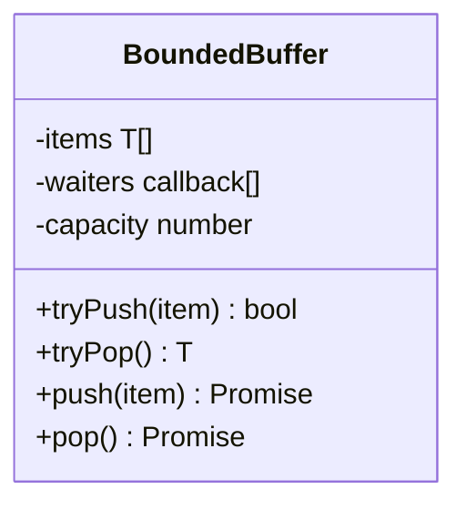
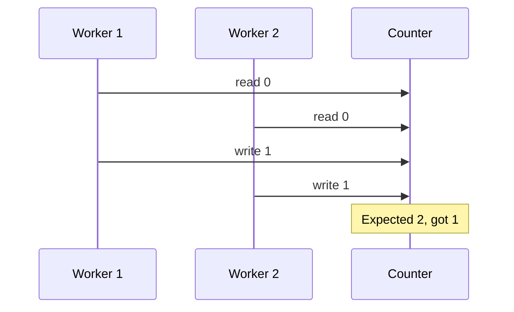

# Architecture — Concurrency Zoo

## Bounded Buffer Internals

| Operation | Precondition | Postcondition |
| --- | --- | --- |
| `tryPush` | — | Returns false if `size >= capacity` |
| `tryPop` | — | Returns undefined if empty |
| `push` | — | Blocks until slot available, then enqueues |
| `pop` | — | Blocks until item available, then dequeues |

Waiters are FIFO callbacks resolved when the opposite operation frees capacity or supplies data.

## Lost-Update Simulation

The TypeScript implementation interleaves read-modify-write steps deterministically because true parallel mutation is unavailable in single-threaded JS—document this limitation when interpreting results.

## Deadlock Detection Helper

`would_deadlock_orders(a, b)` returns true when two lock acquisition orders are cyclic (A→B vs B→A). This is a **static ordering check**, not runtime deadlock recovery.

## Related Documents

- [[01-Computer-Science/projects/Concurrency Zoo/README|README]]
- [[01-Computer-Science/projects/Concurrent Runtime and Protocol Workbench/ADR/0002-concurrency-model|ADR-0002]]
- [[01-Computer-Science/code/typescript/src/runtime.ts|runtime.ts]]
