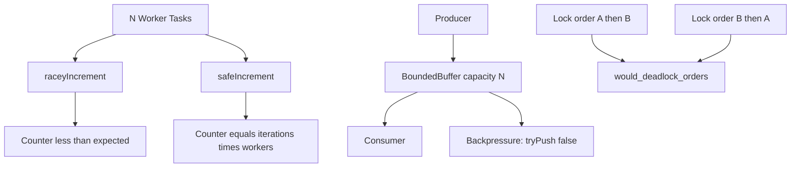

# Concurrency Zoo

## Purpose

Explore **concurrency failure modes and mitigations** in a controlled zoo: lost updates from racy increments, correct counting with synchronization, **bounded buffers** with backpressure, and **deadlock ordering** detection. The lab uses deterministic simulations where true parallel races are hard to reproduce (e.g. single-threaded JS), so you learn to reason about interleavings—not just hope for flaky test luck.

## Prerequisites

- [[01-Computer-Science/04-Processes-and-Execution/Threads|Threads]]
- [[01-Computer-Science/05-Concurrency-Fundamentals/Concurrency vs Parallelism|Concurrency vs Parallelism]]
- [[01-Computer-Science/05-Concurrency-Fundamentals/Race Conditions|Race Conditions]]
- [[01-Computer-Science/05-Concurrency-Fundamentals/Locks and Critical Sections|Locks and Critical Sections]]
- [[01-Computer-Science/05-Concurrency-Fundamentals/Semaphores and Condition Variables|Semaphores and Condition Variables]]
- [[01-Computer-Science/05-Concurrency-Fundamentals/Deadlocks Livelocks and Starvation|Deadlocks Livelocks and Starvation]]
- [[01-Computer-Science/05-Concurrency-Fundamentals/Backpressure and Resource Contention|Backpressure and Resource Contention]]

## Architecture



See [[01-Computer-Science/projects/Concurrency Zoo/Architecture|Architecture]] for buffer and waiter model.

## Acceptance Criteria

- [ ] `raceyIncrement` demonstrates counter less than `iterations * workers` under simulated lost updates
- [ ] `safeIncrement(iterations, workers)` returns `iterations * workers`
- [ ] `BoundedBuffer(1)` rejects second `tryPush` until a pop makes room
- [ ] Async `push` / `pop` unblock waiters when capacity or data becomes available
- [ ] `would_deadlock_orders(("A","B"),("B","A"))` returns true
- [ ] TypeScript and Python tests pass `test_runtime` concurrency cases
- [ ] You can sketch a lock-ordering graph for a two-mutex scenario

## Run and Test

| Language | Source module | Tests |
| --- | --- | --- |
| TypeScript | `code/typescript/src/runtime.ts` | `tests/labs.test.ts` |
| Python | `code/python/seb_cs/runtime.py` | `tests/test_labs.py` |

### TypeScript

```bash
cd 01-Computer-Science/code/typescript
npm install
npm test
```

### Python

```bash
cd 01-Computer-Science/code/python
python -m unittest discover -s tests -v
```

## Trade-offs

| Technique | Benefit | Cost |
| --- | --- | --- |
| Deterministic race simulation | Reproducible teaching | Not a substitute for TSAN/helgrind |
| Bounded buffer with async wait | Models real backpressure | Complex waiter bookkeeping |
| Global lock ordering rule | Prevents deadlock class | Requires discipline across codebase |
| tryPush non-blocking API | Easy saturation tests | Callers must handle false |

## Engineering Reflection Prompts

1. Why do race bugs often disappear under a debugger?
2. How would you size a worker pool queue given p99 job duration?
3. What invariant does the bounded buffer maintain at all times?
4. When is lock ordering insufficient (e.g. try-lock loops)?
5. How does backpressure propagate from a slow consumer to an HTTP client?

## Related Notes

- [[01-Computer-Science/projects/Concurrency Zoo/Architecture|Architecture]]
- [[01-Computer-Science/projects/Concurrent Runtime and Protocol Workbench/README|Concurrent Runtime and Protocol Workbench]]
- [[01-Computer-Science/05-Concurrency-Fundamentals/Race Conditions|Race Conditions]]
- [[01-Computer-Science/code/README|Computer Science Code Labs]]
