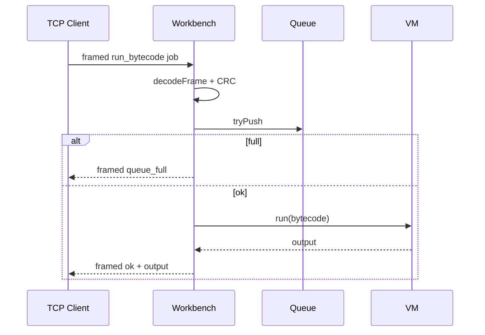

# API — Concurrent Runtime and Protocol Workbench

## Style

**Custom binary framing** over TCP for job submission; **HTTP/1.0** for human-readable status. No REST framework—hand-written parsers from [[01-Computer-Science/projects/Socket Workshop/README|Socket Workshop]].

## Auth Model

- **Authentication:** None (loopback-only lab)
- **Authorization:** N/A
- **Tenancy boundary:** Single developer process

## TCP Framed Job Protocol

Wire format per [[01-Computer-Science/projects/Concurrent Runtime and Protocol Workbench/ADR/0001-framing-protocol|ADR-0001]]:

```text
[u32be length][payload bytes][u32be crc32(payload)]
```

### Job Request Payload (JSON UTF-8)

```json
{
  "type": "run_bytecode",
  "bytecode": [1, 2, 0, 1, 2, 0, 2, 4, 6, 7]
}
```

`bytecode` is a decimal byte array matching `assemble()` output from [[01-Computer-Science/projects/Stack Machine/README|Stack Machine]].

### Job Response Payload (JSON UTF-8)

Success:

```json
{
  "status": "ok",
  "output": [20],
  "stack": [20]
}
```

Error:

```json
{
  "status": "error",
  "code": "queue_full",
  "message": "bounded buffer at capacity"
}
```

| `code` | Meaning |
| --- | --- |
| `crc_mismatch` | Frame failed integrity check |
| `queue_full` | Backpressure reject |
| `vm_fault` | Bytecode execution error |
| `invalid_payload` | JSON or schema error |

## HTTP/1.0 Status Interface

| Method | Path | Purpose | Authz | Idempotent |
| --- | --- | --- | --- | --- |
| GET | `/status` | Queue and worker stats | open | yes |

### Request

```http
GET /status HTTP/1.0
Host: 127.0.0.1
```

### Response

```http
HTTP/1.0 200 OK
Content-Type: application/json

{"queue_depth":0,"queue_capacity":8,"workers":2,"active_workers":0}
```

## Error Model

| Condition | TCP response | HTTP equivalent |
| --- | --- | --- |
| Bad CRC | framed `crc_mismatch` | N/A |
| Queue saturated | framed `queue_full` | N/A |
| VM error | framed `vm_fault` | N/A |
| Unknown HTTP path | N/A | `404` plain text |

## Versioning and Compatibility

- Protocol version **1** implied by frame layout; no version field in v1
- Breaking changes require ADR and dual decode window

## Sequence — Core Write Path



## Related Documents

- [[01-Computer-Science/projects/Concurrent Runtime and Protocol Workbench/Requirements|Requirements]]
- [[01-Computer-Science/projects/Concurrent Runtime and Protocol Workbench/Security|Security]]
- [[01-Computer-Science/projects/Concurrent Runtime and Protocol Workbench/Testing|Testing]]
- [[01-Computer-Science/code/typescript/src/framing.ts|framing.ts]]
