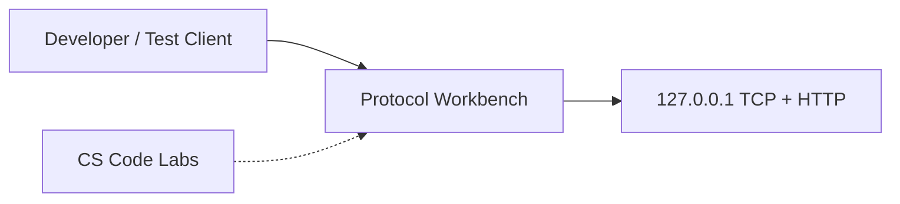
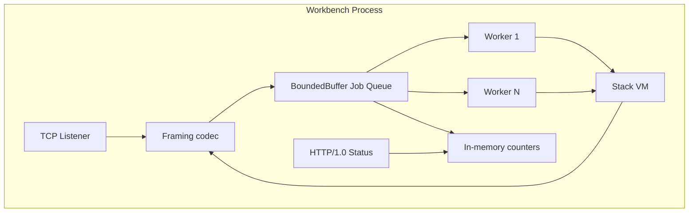
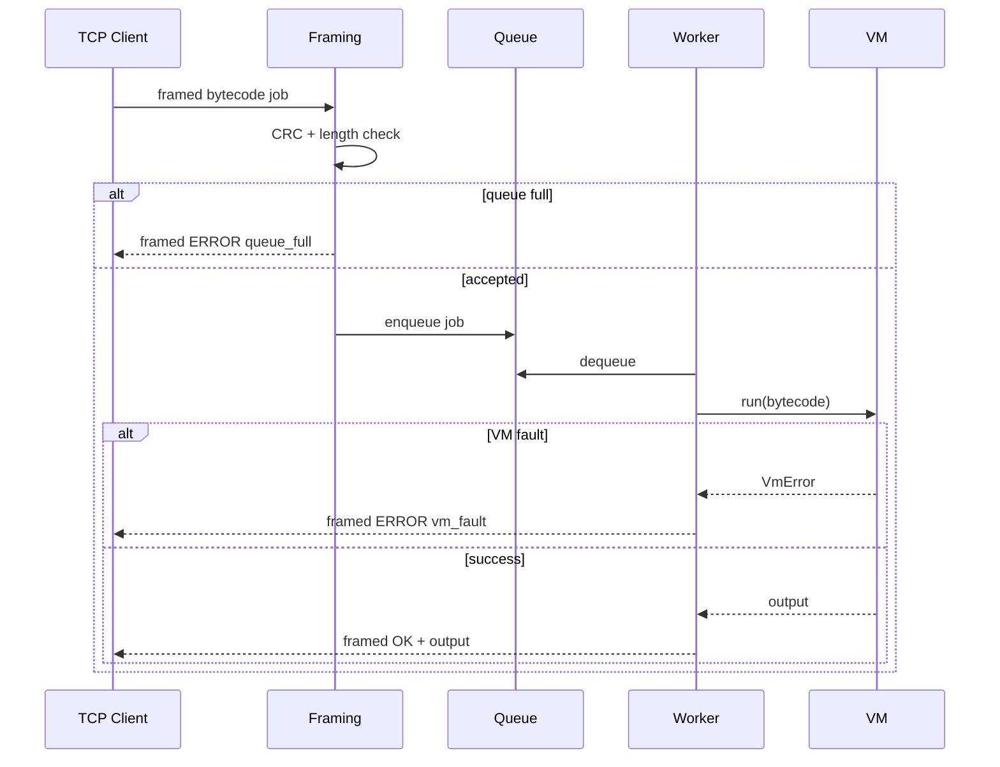

# Architecture — Concurrent Runtime and Protocol Workbench

## Summary

Single-process **workbench server** combining four mechanism labs: **CRC32 length-prefixed framing** on TCP, **stack VM** job execution, **bounded-buffer worker pool** with backpressure, and **HTTP/1.0** status. Architectural style: **layered monolith** with explicit error channels—no DI framework, no ORM, no message broker.

## Context Diagram

## Container Diagram

## Key Components

| Component | Responsibility | Source lab |
| --- | --- | --- |
| Framing codec | Encode/decode jobs; CRC verify | [[01-Computer-Science/projects/Binary Protocol Lab/README\|Binary Protocol Lab]] |
| Job queue | Absorb burst; reject when full | [[01-Computer-Science/projects/Concurrency Zoo/README\|Concurrency Zoo]] |
| Worker pool | Fixed concurrency; pull jobs | Concurrency Zoo |
| Stack VM | Execute bytecode; surface VmError | [[01-Computer-Science/projects/Stack Machine/README\|Stack Machine]] |
| TCP transport | Stream bytes; handle partial reads | [[01-Computer-Science/projects/Socket Workshop/README\|Socket Workshop]] |
| HTTP status | Human-readable health | Socket Workshop |

## Data Flow — Job Execution

## Cross-Cutting Concerns

- **Authn / authz:** None — loopback-only; see [[01-Computer-Science/projects/Concurrent Runtime and Protocol Workbench/Security|Security]]
- **Consistency model:** Single process; no cross-node consistency
- **Caching:** None
- **Idempotency:** Client-generated job IDs optional; not required for lab
- **Failure isolation:** VM faults contained per job; worker continues
- **Multi-tenancy:** N/A

## Quality Attribute Scenarios

| Attribute | Scenario | Response measure |
| --- | --- | --- |
| Availability | Worker crash on bad bytecode | Other workers continue; error frame returned |
| Latency | Queue depth 0, 1 worker | Job p95 under test harness threshold |
| Durability | Process kill | Jobs in queue lost — accepted non-goal |
| Scalability | Burst exceeds queue | `tryPush` false; client backs off |

## Trade-offs

| Decision | Benefit | Cost | Alternative rejected |
| --- | --- | --- | --- |
| Length-prefixed + CRC32 | Simple stream parsing | Not authenticated | TLS + HMAC (overkill for lab) |
| Fixed worker pool | Predictable saturation | No auto-scale | Unbounded goroutines |
| HTTP/1.0 status only | Trivial parser | No metrics export standard | Prometheus sidecar |
| In-memory queue | Zero ops burden | No crash recovery | Redis queue |

## Open Questions

- Should job payloads be raw bytecode or JSON wrapper with metadata?
- Maximum frame size default: 64 KiB vs 1 MiB?

## Related Documents

- [[01-Computer-Science/projects/Concurrent Runtime and Protocol Workbench/Requirements|Requirements]]
- [[01-Computer-Science/projects/Concurrent Runtime and Protocol Workbench/API|API]]
- [[01-Computer-Science/projects/Concurrent Runtime and Protocol Workbench/ADR/0001-framing-protocol|ADR-0001]]
- [[01-Computer-Science/projects/Concurrent Runtime and Protocol Workbench/ADR/0002-concurrency-model|ADR-0002]]
