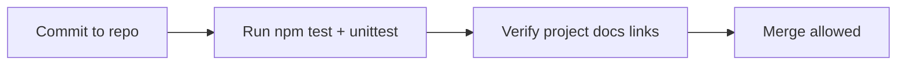

# Deployment — Concurrent Runtime and Protocol Workbench

## Environments

| Environment | Purpose | Promotion rule |
| --- | --- | --- |
| local | Developer machine; loopback bind | Default for all work |
| CI | Automated test runner | Green tests on push |
| production | **Not applicable** | Explicit non-goal |

## Release Pipeline



No container build, no artifact registry, no staged rollout.

## Runtime Topology

- **Compute:** Single Node or Python process on developer host
- **Networking:** `127.0.0.1` TCP job port + HTTP status port (configurable)
- **Secrets delivery:** None required
- **Config management:** Environment variables or CLI flags (`PORT`, `QUEUE_CAP`, `WORKERS`)

## Local Bootstrap

### TypeScript tests (validates lab modules)

```bash
cd 01-Computer-Science/code/typescript
npm install
npm test
```

### Python tests

```bash
cd 01-Computer-Science/code/python
python -m unittest discover -s tests -v
```

Future long-lived server entrypoint (Roadmap P1) will live beside lab modules—still no Docker.

## Rollback

- **Trigger:** Broken tests or documented regression
- **Procedure:** Revert git commit; re-run test suites
- **Data compatibility:** N/A — no persistent data

## Infrastructure as Code

**Not used.** Containers and orchestration are explicit non-goals for this portfolio.

## Checklist

- [x] No secrets in git
- [x] Health checks defined via HTTP `/status` spec
- [x] Tests runnable without external services
- [ ] Long-lived server smoke script (Roadmap P1)

## Related Documents

- [[01-Computer-Science/projects/Concurrent Runtime and Protocol Workbench/Monitoring|Monitoring]]
- [[01-Computer-Science/projects/Concurrent Runtime and Protocol Workbench/Security|Security]]
- [[01-Computer-Science/projects/Concurrent Runtime and Protocol Workbench/Architecture|Architecture]]
