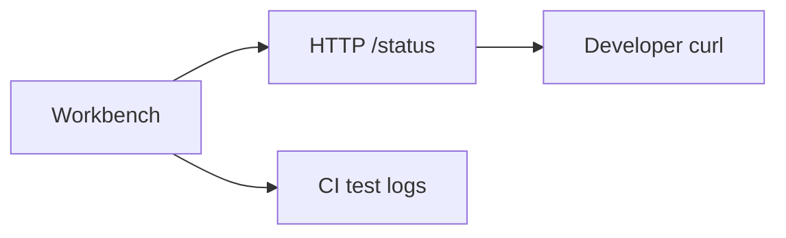

# Monitoring — Concurrent Runtime and Protocol Workbench

## Service Level Objectives

Educational SLOs — not production commitments:

| SLO | Target | Window | Burn-alert idea |
| --- | --- | --- | --- |
| Test availability | 100% green CI | per commit | CI failure blocks merge |
| Local job success | Happy path passes | manual session | N/A |
| Status endpoint | Returns valid JSON | manual curl | N/A |

## Golden Signals

- **Latency:** Time from framed job send to framed response (log in tests)
- **Traffic:** Jobs submitted counter (in-memory)
- **Errors:** `crc_mismatch`, `queue_full`, `vm_fault` counts
- **Saturation:** `queue_depth / queue_capacity`, `active_workers / workers`

## Instrumentation Plan

| Event / metric | Type | Labels | Why |
| --- | --- | --- | --- |
| `jobs_submitted` | counter | — | Load understanding |
| `jobs_rejected_queue_full` | counter | — | Backpressure visibility |
| `vm_faults` | counter | `code` | Bytecode quality |
| `job_duration_ms` | histogram | — | Latency teaching |

Lab implementation: counters exposed via HTTP `/status` JSON (see [[01-Computer-Science/projects/Concurrent Runtime and Protocol Workbench/API|API]]). No Prometheus exporter in v1.

## Logging

- **Structured fields:** `job_id`, `status`, `duration_ms`, `error_code`
- **PII policy:** None expected
- **Correlation IDs:** Optional client-supplied string in job JSON

## Tracing

Not implemented. Future: span per decode → enqueue → VM → encode.

## Alerting

| Alert | Condition | Severity | Runbook |
| --- | --- | --- | --- |
| CI test failure | `npm test` or unittest red | high | Fix regression; see [[01-Computer-Science/projects/Concurrent Runtime and Protocol Workbench/Debug Diary\|Debug Diary]] |

## Dashboards

- **Overview:** Manual `curl http://127.0.0.1:<port>/status`
- **Dependency health:** N/A — no external deps
- **Business KPIs:** N/A

## Related Documents

- [[01-Computer-Science/projects/Concurrent Runtime and Protocol Workbench/Deployment|Deployment]]
- [[01-Computer-Science/projects/Concurrent Runtime and Protocol Workbench/Postmortem|Postmortem]]
- [[01-Computer-Science/09-Correctness-and-Reliability/Observability Fundamentals|Observability Fundamentals]]
