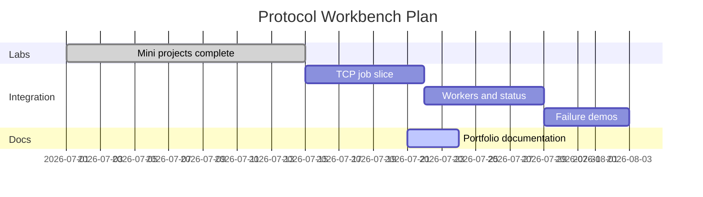

# Planning — Concurrent Runtime and Protocol Workbench

## Problem Statement

CS learners implement isolated labs (framing, VM, concurrency, sockets) but lack a **single integration surface** that exercises composition, backpressure, and failure propagation—the skills needed when debugging real services.

## Success Definition

- A developer can submit a bytecode job over TCP and receive a framed result or explicit error code
- Queue saturation and CRC failures are observable and tested
- `GET /status HTTP/1.0` reports queue depth and active workers
- TypeScript and Python implementations remain in parity
- Documentation set is complete enough to onboard without oral tradition

## Scope

### In Scope

- Toy bytecode VM execution path
- Checksummed length-prefixed TCP protocol ([[01-Computer-Science/projects/Concurrent Runtime and Protocol Workbench/ADR/0001-framing-protocol|ADR-0001]])
- Bounded concurrent workers with backpressure ([[01-Computer-Science/projects/Concurrent Runtime and Protocol Workbench/ADR/0002-concurrency-model|ADR-0002]])
- HTTP/1.0 status interface
- Failure-mode demos (CRC bad, queue full, VM fault)
- Dual-language tests in [[01-Computer-Science/code/README|code labs]]

### Out of Scope

- Databases and durable queues
- Web frameworks (Express, FastAPI, etc.)
- Docker/Kubernetes deployment
- Distributed consensus, sharding, replication
- Production authentication, TLS termination, WAF

## Milestones

| Milestone | Outcome | Exit criteria |
| --- | --- | --- |
| M0 | Lab modules complete | All mini-project acceptance criteria met |
| M1 | Vertical slice | Single job round-trip over TCP in tests |
| M2 | Concurrency + status | Queue saturation + HTTP `/status` tested |
| M3 | Failure demos | Documented repro for each fault class |
| M4 | Docs + ADRs | This documentation set active |

## Risks

| Risk | Likelihood | Impact | Mitigation |
| --- | --- | --- | --- |
| Partial TCP reads break framing | Medium | High | Buffering decoder; tests with split frames |
| JS single-thread limits race demos | High | Low | Document simulation limits; Python threads optional |
| Scope creep into prod features | Medium | Medium | Non-goals in README; ADR gate |
| TS/Python drift | Medium | Medium | Shared test vectors; parity rules in code README |

## Dependencies

- [[01-Computer-Science/projects/Binary Protocol Lab/README|Binary Protocol Lab]]
- [[01-Computer-Science/projects/Stack Machine/README|Stack Machine]]
- [[01-Computer-Science/projects/Concurrency Zoo/README|Concurrency Zoo]]
- [[01-Computer-Science/projects/Socket Workshop/README|Socket Workshop]]
- Node.js and Python 3 on developer machine

## Estimation Notes

Long-lived server binary is optional for M1—loopback one-shot tests (`tcpEchoOnce` pattern) prove transport first. Worker orchestrator adds ~1–2 sessions beyond lab code.

## Related Documents

- [[01-Computer-Science/projects/Concurrent Runtime and Protocol Workbench/Requirements|Requirements]]
- [[01-Computer-Science/projects/Concurrent Runtime and Protocol Workbench/Roadmap|Roadmap]]
- [[01-Computer-Science/projects/Concurrent Runtime and Protocol Workbench/README|README]]
